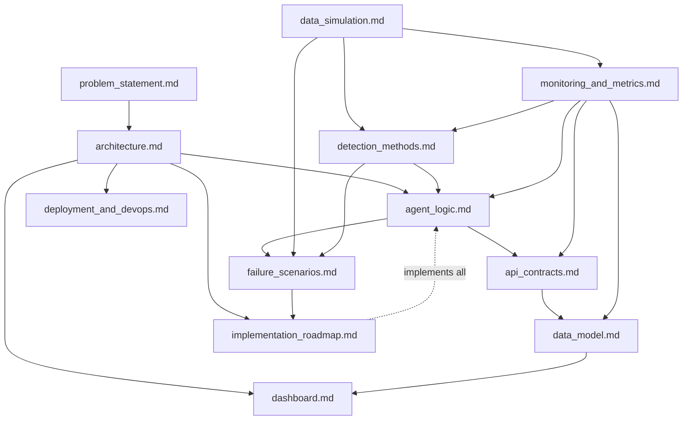

# 📚 Documentation Index

## Autonomous ML Monitoring & Auto-Recovery Agent

This folder holds the complete design documentation for the platform — a
**closed-loop agent** that continuously monitors deployed ML models, detects
degradation (data drift, concept drift, anomalies, system faults), autonomously
**decides** corrective actions, **executes** recovery, and **verifies** the
result, closing the loop:

```
Monitor → Detect → Decide → Act → Verify → Monitor
```

> The repository is currently a **scaffold** (the source tree exists but files
> are empty placeholders). These documents are the authoritative design that
> the implementation will follow. See `../problem_statement.md` for the brief.

---

## 🗺️ How to read these docs

If you're new to the project, read in this order:

1. **[architecture.md](architecture.md)** — start here. The big picture: the
   four planes (inference, control plane, execution, observability), the
   monorepo layout, runtime topology (ports/containers/venvs), and an
   end-to-end walkthrough of one Observe→Detect→Decide→Act→Verify cycle.
2. **[agent_logic.md](agent_logic.md)** — the "brain". The continuous loop,
   the severity rubric, the policy decision table, anti-flapping/hysteresis,
   the agent state machine, and safety guarantees.
3. **[data_simulation.md](data_simulation.md)** — the data foundation. The
   anchored ML task, reference/training data, the live-stream simulator, and
   the drift-injection recipes (data drift, concept drift, corruption) plus the
   delayed-label model. *Most other docs depend on this.*
4. **[detection_methods.md](detection_methods.md)** — the algorithms: threshold,
   anomaly, and drift detection (PSI, KS, etc.) with formulas and thresholds.
5. **[monitoring_and_metrics.md](monitoring_and_metrics.md)** — what is measured
   and how it's collected (the metric catalogue and the `MetricSnapshot`).
6. **[api_contracts.md](api_contracts.md)** — the HTTP contracts between every
   service (model services, Django control plane, Jenkins) and the agent's
   internal pydantic schemas.
7. **[data_model.md](data_model.md)** — the Django persistence schema (ERD,
   tables, audit/reversibility guarantees).
8. **[failure_scenarios.md](failure_scenarios.md)** — the failure catalogue /
   demo script / test matrix: each scenario walked through the full loop.
9. **[dashboard.md](dashboard.md)** — the observability UI specification.
10. **[deployment_and_devops.md](deployment_and_devops.md)** — Docker,
    docker-compose, `.env`, Makefile, and Jenkins-based recovery execution.
11. **[implementation_roadmap.md](implementation_roadmap.md)** — the phased,
    inward-out build plan, MVP definition, and testing strategy. Read this when
    you're ready to start coding.

---

## 📂 Document catalogue

| Document | What it covers | Primary audience |
| -------- | -------------- | ---------------- |
| [architecture.md](architecture.md) | System architecture, planes, topology, end-to-end flow | Everyone |
| [agent_logic.md](agent_logic.md) | The closed-loop decision engine, severity, policy, state machine, safety | Agent developers |
| [data_simulation.md](data_simulation.md) | ML task, reference/live data, drift injection, delayed labels | ML/data developers |
| [detection_methods.md](detection_methods.md) | Threshold/anomaly/drift algorithms, formulas, thresholds | ML/agent developers |
| [monitoring_and_metrics.md](monitoring_and_metrics.md) | Metric catalogue, collection pipeline, `MetricSnapshot`, health status | All developers |
| [api_contracts.md](api_contracts.md) | HTTP contracts (models, Django, Jenkins) + pydantic schemas | All developers |
| [data_model.md](data_model.md) | Django DB schema, ERD, audit/reversibility | Backend developers |
| [failure_scenarios.md](failure_scenarios.md) | Failure catalogue, demo script, test matrix | QA / demo / everyone |
| [dashboard.md](dashboard.md) | Dashboard UI spec (pages, widgets, wireframes) | Frontend/backend developers |
| [deployment_and_devops.md](deployment_and_devops.md) | Docker, compose, `.env`, Makefile, Jenkins recovery jobs | DevOps |
| [implementation_roadmap.md](implementation_roadmap.md) | Phased build plan, MVP, testing strategy | Project lead / everyone |

---

## 🔗 How the documents relate



- **`data_simulation.md`** is the upstream foundation — the feature schema and
  drift recipes it defines are consumed by `detection_methods.md`,
  `monitoring_and_metrics.md`, and `failure_scenarios.md`.
- **`monitoring_and_metrics.md`** defines the `MetricSnapshot`, which must stay
  consistent across **`api_contracts.md`** (the JSON wire format) and
  **`data_model.md`** (the stored schema).
- **`agent_logic.md`** consumes detection signals and emits decisions/actions
  that are logged via the contracts in `api_contracts.md` into the tables in
  `data_model.md`.
- **`failure_scenarios.md`** is the integration view — each scenario exercises
  the whole stack and doubles as a demo script and automated test spec.
- **`implementation_roadmap.md`** sequences the build that realizes all of the
  above.

---

## 🧭 Shared vocabulary (consistent across all docs)

| Term | Meaning |
| ---- | ------- |
| **model_a** | Active model service — FastAPI, port **8001** |
| **model_b** | Backup/fallback model service — FastAPI, port **8002** |
| **backend** | Django + DRF control plane — port **8000** |
| **agent_core** | The autonomous agent — runs the continuous loop, no web server |
| **Jenkins** | The recovery executor — runs `deploy/switch/rollback` jobs |
| **Severity** | `LOW` / `MEDIUM` / `HIGH` |
| **Health status** | `HEALTHY` / `DEGRADED` / `CRITICAL` / `UNKNOWN` |
| **Actions** | `NO_OP` / `ALERT` / `SWITCH` / `ROLLBACK` / `RETRAIN` / `DISABLE` |
| **MetricSnapshot** | The per-tick observation record the agent emits and stores |
| **Loop phases** | Observe → Detect → Decide → Act → Verify |

---

## ✅ Design principles (all docs adhere to these)

- **Agent, not dashboard** — autonomous closed-loop control, rule/statistics
  based (no LLM reasoning).
- **HTTP everywhere** — services are independent and communicate over HTTP.
- **Safe by default** — all recovery actions are **auditable**, **reversible**,
  and rate-limited; the agent escalates to a human when it cannot resolve.
- **Correctness over scale** — simulated data and batch processing are
  acceptable; the focus is correct behavior.
- **Separation of concerns** — each service owns one responsibility and one
  isolated environment.
