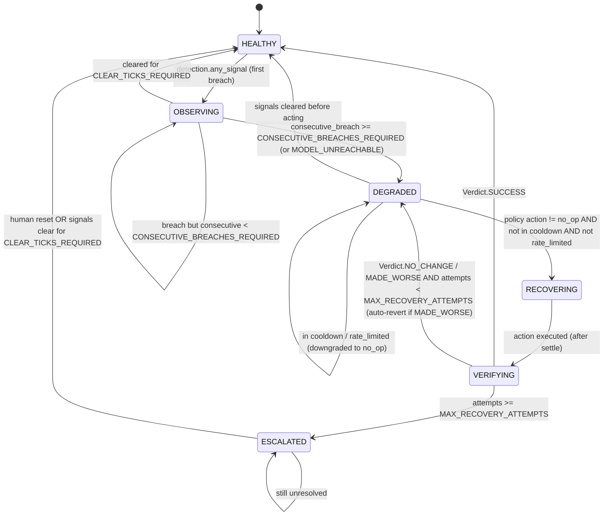

# Agent Logic — The Brain of the Autonomous ML Monitoring & Auto-Recovery Agent

> Scope: This document describes **how the agent thinks and acts** — its control loop, its
> decision engine, its state machine, and its safety guarantees. It is the authoritative
> reference for everything inside `control-plane/agent_core/`.
>
> The **detection algorithms** (drift math, anomaly statistics, threshold derivation) live in a
> separate document, [`detection_methods.md`](./detection_methods.md). This document only
> describes the *signals consumed* by the decision engine, not how those signals are computed.
>
> Related docs: [`architecture.md`](./architecture.md) (system layout),
> [`api_contracts.md`](./api_contracts.md) (HTTP contracts),
> [`failure_scenarios.md`](./failure_scenarios.md) (end-to-end incident walk-throughs).

---

## Table of Contents

1. [Agent Philosophy — Agent vs. Monitor](#1-agent-philosophy--agent-vs-monitor)
2. [The Main Loop (`agent.py`)](#2-the-main-loop-agentpy)
3. [Phase 1 — OBSERVE](#3-phase-1--observe)
4. [Phase 2 — DETECT](#4-phase-2--detect)
5. [Phase 3 — DECIDE (the heart)](#5-phase-3--decide-the-heart)
6. [Phase 4 — ACT](#6-phase-4--act)
7. [Phase 5 — VERIFY](#7-phase-5--verify)
8. [The Agent as a State Machine](#8-the-agent-as-a-state-machine)
9. [Safety Guarantees](#9-safety-guarantees)
10. [Configurable Parameters (`config.py`)](#10-configurable-parameters-configpy)
11. [Fully Worked Example](#11-fully-worked-example)
12. [Appendix — Module Responsibility Map](#12-appendix--module-responsibility-map)

---

## 1. Agent Philosophy — Agent vs. Monitor

A **monitor** observes a system and *emits signals* (graphs, alerts, dashboards). A human is
always the actuator: the monitor never changes the world. Its loop is open — observation goes
out, nothing comes back in.

An **agent** closes the loop. It observes, **decides on its own**, **acts on the world**, and then
**verifies that its action achieved the intended effect** — correcting itself if not. The human is
moved from the inner loop (every incident) to the outer loop (policy + escalation only).

This project is explicitly an **agent**, not a dashboard. Three properties make it so:

| Property | Monitor | This Agent |
|---|---|---|
| **Autonomy** | Emits alerts; human decides | Decides corrective action itself, from rules + statistics |
| **Closed loop** | Open loop (observe → alert → stop) | Observe → Detect → Decide → Act → **Verify** → repeat |
| **Self-correction** | None | Auto-rolls-back its own recovery if it made things worse |
| **Statefulness** | Stateless per scrape | Maintains rolling windows, incident state, cooldowns |
| **Accountability** | Logs metrics | Every decision + action is audited (before *and* after) |

**Crucially, this is NOT an LLM agent.** There is no language model in the decision path. Every
decision is produced by **deterministic rules over statistical signals** (thresholds, rolling
windows, debounce counters, a static policy table). This makes the agent **predictable,
testable, and auditable** — the same inputs always produce the same decision. "Agentic" here
means *autonomous closed-loop control*, not *generative reasoning*.

### The continuous control loop

The agent runs an unbounded control loop modeled on classic **closed-loop process control**
(sense → compare-to-setpoint → actuate → re-sense). Each pass through the loop is a **tick**.
On every tick the agent moves through five phases:

```
        ┌────────────────────────────────────────────────────────────┐
        │                                                            │
        ▼                                                            │
   ┌─────────┐   ┌─────────┐   ┌─────────┐   ┌─────────┐   ┌──────────┐
   │ OBSERVE │──▶│ DETECT  │──▶│ DECIDE  │──▶│  ACT    │──▶│  VERIFY  │
   │ (probe) │   │(signals)│   │(policy) │   │(execute)│   │(confirm) │
   └─────────┘   └─────────┘   └─────────┘   └─────────┘   └──────────┘
        ▲                                                            │
        │                    sleep(LOOP_INTERVAL_SECONDS)            │
        └────────────────────────────────────────────────────────────┘
```

The loop never terminates on its own. It is **safe-by-default**: in the absence of a clear,
persistent problem, the chosen action is always `no_op` (keep watching). The agent does the
*least* disruptive thing that resolves the situation.

---

## 2. The Main Loop (`agent.py`)

### 2.1 Responsibilities

`agent.py` is the orchestrator. It owns:

- The **wall-clock cadence** (one tick every `LOOP_INTERVAL_SECONDS`, default **30 s**).
- **Graceful start/stop** (signal handling, in-flight tick completion, clean shutdown).
- **Per-tick fault isolation** — a single bad tick (network blip, malformed response,
  unexpected exception) must **never crash the agent**. The loop catches everything, logs it,
  and proceeds to the next tick.
- Holding the **AgentRuntime** — the long-lived in-memory state that survives across ticks
  (rolling windows, debounce counters, cooldown timers, current state-machine state,
  pre-failure baseline). Note: detection windows and cooldowns are *stateful*, so the loop
  body is **not** pure; it mutates `runtime`.

### 2.2 Tick cadence and timing

- One tick = one full Observe→Detect→Decide→Act→Verify pass.
- After each tick the agent sleeps `LOOP_INTERVAL_SECONDS`.
- The interval is the **sampling period** of the control loop. It must be short enough to react
  promptly but long enough that the rolling windows and debounce counters represent meaningful
  history (see [§5.2](#52-temporary-noise-vs-persistent-failure-debounce--hysteresis)).
- Tick budget: a tick should complete well within the interval. If a tick *overruns* the
  interval (slow probes), the agent logs a `TICK_OVERRUN` warning and starts the next tick
  immediately (it does **not** queue up backlog).

### 2.3 Graceful start / stop

- **Start:** load `config`, construct clients (`DjangoClient`, `JenkinsClient`), construct
  `AgentRuntime` with empty windows, register `SIGINT`/`SIGTERM` handlers, set state `HEALTHY`,
  log an `AGENT_STARTED` audit record.
- **Stop:** on signal, set `runtime.stop_requested = True`. The loop finishes the **current**
  tick (never interrupts mid-action — an action half-applied is dangerous), then exits cleanly
  and logs `AGENT_STOPPED`. No `os._exit`; we always unwind.

### 2.4 Fault isolation

Each phase call is wrapped so that any exception is converted into a **degraded observation**
rather than a crash:

- If **OBSERVE** throws (model unreachable), that *is* a signal — it becomes a synthetic
  observation with health status `UNKNOWN` (unreachable maps to HealthStatus `UNKNOWN`), which
  the detector treats as a threshold breach.
- If **DETECT / DECIDE** throws, the tick is aborted *defensively*: the agent emits a `no_op`
  for this tick and logs `TICK_ERROR`. Safe-by-default means an internal bug never triggers a
  destructive action.
- If **ACT / VERIFY** throws, the action is marked `outcome="failed"` in the audit log and the
  agent transitions toward `ESCALATED` if retries are exhausted.

### 2.5 Detailed pseudocode

```python
# control-plane/agent_core/agent.py  (pseudocode — implementation-ready)

def main():
    cfg      = load_config()                 # config.py
    django   = DjangoClient(cfg)             # clients/django_client.py
    jenkins  = JenkinsClient(cfg)            # clients/jenkins_client.py
    runtime  = AgentRuntime(cfg)             # rolling windows, counters, cooldowns, state
    install_signal_handlers(runtime)         # SIGINT/SIGTERM -> runtime.stop_requested

    # AGENT_STARTED / AGENT_STOPPED / TICK_ERROR (severity="INFO") are operational
    # lifecycle log events for observability — NOT recovery actions, so they are not
    # subject to the ActionType / Severity enums in conventions.md.
    log_audit(django, action="AGENT_STARTED", severity="INFO", outcome="success")
    runtime.state = State.HEALTHY

    while not runtime.stop_requested:
        tick_start = now()
        try:
            run_one_tick(cfg, runtime, django, jenkins)
        except Exception as exc:
            # GLOBAL SAFETY NET — a bad tick must never kill the loop
            log.exception("TICK_ERROR")
            log_audit(django, action="TICK_ERROR", severity="LOW",
                      outcome="failed", reason=str(exc))
            # NOTE: no corrective action taken on internal error (safe-by-default)

        elapsed = now() - tick_start
        if elapsed > cfg.LOOP_INTERVAL_SECONDS:
            log.warning("TICK_OVERRUN elapsed=%.2fs", elapsed)
        else:
            sleep(cfg.LOOP_INTERVAL_SECONDS - elapsed)

    log_audit(django, action="AGENT_STOPPED", severity="INFO", outcome="success")


def run_one_tick(cfg, runtime, django, jenkins):
    # ---- PHASE 1: OBSERVE -------------------------------------------------
    observation = observe(cfg, runtime, django)          # monitoring/*
    runtime.push_observation(observation)                # update rolling windows

    # ---- PHASE 2: DETECT --------------------------------------------------
    detection = detect(cfg, runtime, observation)        # detection/* -> list[DetectionResult] folded into DetectionSummary

    # ---- PHASE 3: DECIDE --------------------------------------------------
    decision = decide(cfg, runtime, detection)           # decision_engine/* -> Decision
    runtime.advance_state(decision)                       # state-machine transition

    # ---- COOLDOWN / RATE-LIMIT GATE --------------------------------------
    if decision.action != Action.NO_OP:
        if runtime.in_cooldown() or runtime.rate_limited():
            decision = decision.downgrade_to_no_op(reason="cooldown_or_rate_limit")

    # ---- PHASE 4: ACT -----------------------------------------------------
    if decision.action == Action.NO_OP:
        execute_no_op(decision, django)                  # logs, returns
        return

    audit_id = log_audit_before(django, decision)        # AUDIT *BEFORE* acting
    runtime.mark_action_started(decision)                # cooldown + rate-limit clocks
    act_result = act(cfg, decision, django, jenkins)     # actions/*
    log_audit_after(django, audit_id, act_result)        # AUDIT *AFTER* acting

    # ---- PHASE 5: VERIFY --------------------------------------------------
    verdict = verify(cfg, runtime, decision, django)     # verification/*
    handle_verdict(cfg, runtime, decision, verdict, django, jenkins)
```

`runtime.push_observation` is what makes detection *stateful*: it maintains the rolling windows
that the debounce/hysteresis logic in [§5.2](#52-temporary-noise-vs-persistent-failure-debounce--hysteresis) consumes.

---

## 3. Phase 1 — OBSERVE

**Goal:** turn the live state of the deployed model(s) into one normalized, validated
**`Observation`** object per tick. Three probes contribute, all under `monitoring/`.

### 3.1 Probes and what they collect

| Probe (`monitoring/`) | Calls | Collects each tick |
|---|---|---|
| `model_probe.py` | `GET /health`, `GET /metrics` on the active model (port 8001) | `health` (HealthStatus: HEALTHY/DEGRADED/CRITICAL/UNKNOWN; unreachable maps to UNKNOWN), `latency_p50_ms`, `latency_p95_ms`, `error_rate`, `requests_per_sec`, model `version` |
| `prediction_probe.py` | `POST /predict` with a probe payload | `prediction_confidence` (mean score of the batch), `predict_latency_ms`, `predict_ok` (did the call succeed), the raw prediction vector |
| `data_loader.py` | Loads recent inputs (CSV / simulated stream) | `recent_inputs` (the feature batch fed to drift detection downstream), `n_rows`, `feature_summary` (per-feature mean/std) |

The active model is resolved via `GET /api/active-model` on the Django registry, so the agent
always probes whichever model is currently live (model_a *or* model_b after a switch).

### 3.2 Normalization into the internal schema

Raw HTTP responses are heterogeneous and untrusted. Each probe **parses and validates** its
slice into a pydantic model (`schemas.py`), and the loop assembles them into one `Observation`.
Validation here is a safety boundary: a malformed `/metrics` payload becomes a validation error,
which is treated as a degraded observation rather than silently mis-parsed.

```python
# schemas.py  (pydantic — illustrative)

class ModelHealth(BaseModel):
    health: Literal["HEALTHY", "DEGRADED", "CRITICAL", "UNKNOWN"]   # HealthStatus; "unreachable" maps to UNKNOWN
    version: str
    latency_p50_ms: float
    latency_p95_ms: float
    error_rate: float = Field(ge=0.0, le=1.0)
    requests_per_sec: float

class PredictionSignal(BaseModel):
    predict_ok: bool
    prediction_confidence: float = Field(ge=0.0, le=1.0)
    predict_latency_ms: float
    prediction: list[float]

class DataSignal(BaseModel):
    n_rows: int
    feature_summary: dict[str, FeatureStat]      # mean/std per feature
    recent_inputs: list[list[float]]             # consumed by drift detection

class Observation(BaseModel):
    ts: datetime
    active_model: str                            # "model_a" / "model_b"
    model: ModelHealth
    prediction: PredictionSignal
    data: DataSignal
    probe_errors: list[str] = []                 # non-empty => degraded observe
```

**Degraded-observe rule:** if any probe raises (timeout, connection refused, validation error),
the loop synthesizes an `Observation` with `model.health="UNKNOWN"` (unreachable maps to
HealthStatus `UNKNOWN`) and records the cause in `probe_errors`. Unreachability is a *first-class
signal*, not an exception to swallow.

`runtime.push_observation(obs)` appends the observation to the **rolling windows** keyed by
metric (latency window, error-rate window, confidence window, health window), each of length
`ROLLING_WINDOW_SIZE` (default **10** ticks ≈ 5 minutes at a 30 s interval).

---

## 4. Phase 2 — DETECT

**Goal:** reduce the current observation + rolling history into a `list[DetectionResult]` (one
per detector evaluation), folded into one normalized per-tick **`DetectionSummary`** of named
signals. **The algorithms are out of scope here** (see `detection_methods.md`); the decision
engine only consumes the *outputs* below.

### 4.1 Signals consumed by the decision engine

| Signal | Source detector | Type | Meaning |
|---|---|---|---|
| `threshold_breaches` | `threshold_detector.py` | `set[str]` | Named breaches: `LATENCY_HIGH`, `ERROR_RATE_HIGH`, `CONFIDENCE_LOW`, `MODEL_UNREACHABLE` |
| `anomaly_flag` | `anomaly_detector.py` | `bool` | Current observation is a statistical outlier vs. the rolling window |
| `anomaly_score` | `anomaly_detector.py` | `float` | Magnitude of the anomaly (e.g. z-score / distance) |
| `drift_score` | `drift_detector.py` | `float` (0–1) | Data/concept drift magnitude vs. reference distribution |
| `drift_flag` | `drift_detector.py` | `bool` | `drift_score >= DRIFT_SCORE_THRESHOLD` |

### 4.2 The normalized `DetectionSummary`

Each detector emits a `DetectionResult` (its own per-detector output, see `detection_methods.md`);
the tick's `list[DetectionResult]` is folded into one per-tick aggregate, `DetectionSummary`:

```python
class DetectionSummary(BaseModel):
    ts: datetime
    results: list[DetectionResult] = []      # the per-detector outputs folded into this summary
    threshold_breaches: set[str] = set()     # named breaches this tick
    anomaly_flag: bool = False
    anomaly_score: float = 0.0
    drift_flag: bool = False
    drift_score: float = 0.0

    @property
    def any_signal(self) -> bool:
        return bool(self.threshold_breaches) or self.anomaly_flag or self.drift_flag

    @property
    def signal_type(self) -> Literal["NONE","THRESHOLD","ANOMALY","DRIFT","MIXED"]:
        kinds = []
        if self.threshold_breaches: kinds.append("THRESHOLD")
        if self.anomaly_flag:       kinds.append("ANOMALY")
        if self.drift_flag:         kinds.append("DRIFT")
        if not kinds:               return "NONE"
        return kinds[0] if len(kinds) == 1 else "MIXED"
```

> Schemas and enum values are defined canonically in `conventions.md`.

`DetectionSummary` is **per-tick** and stateless about history — persistence is handled in the
DECIDE phase via debounce counters, so detection stays a pure function of (observation, window).

---

## 5. Phase 3 — DECIDE (the heart)

The decision engine (`decision_engine/`) converts a `DetectionSummary` plus the agent's
**memory** (debounce counters, cooldowns, current state) into a single **`Decision`**. It has
three stages: **classify severity → resolve persistence → apply policy table**, then gate on
**cooldown/rate-limit**.

### 5.1 `severity_classifier.py` — LOW / MEDIUM / HIGH

Severity answers *"how bad is this signal, right now?"* — independent of whether it is
persistent. The classifier maps the raw detection signals to a severity level via the rubric
below. Where multiple rules match, **the highest severity wins** (`max`).

| Condition (this tick) | Severity |
|---|---|
| No signal at all (`signal_type == NONE`) | — (no incident) |
| `anomaly_flag` only, `anomaly_score < ANOMALY_SCORE_MEDIUM` | **LOW** |
| Single soft threshold breach (`LATENCY_HIGH` only) | **LOW** |
| `CONFIDENCE_LOW` breach | **MEDIUM** |
| `ERROR_RATE_HIGH` with `error_rate < ERROR_RATE_HIGH_LIMIT` | **MEDIUM** |
| `drift_flag` with `DRIFT_SCORE_THRESHOLD ≤ drift_score < DRIFT_SCORE_HIGH` | **MEDIUM** |
| `anomaly_score ≥ ANOMALY_SCORE_MEDIUM` | **MEDIUM** |
| `error_rate ≥ ERROR_RATE_HIGH_LIMIT` | **HIGH** |
| `MODEL_UNREACHABLE` breach | **HIGH** |
| `drift_score ≥ DRIFT_SCORE_HIGH` | **HIGH** |
| Two or more concurrent breaches (`MIXED`) | **HIGH** |

```python
def classify_severity(det: DetectionSummary, obs: Observation, cfg) -> Severity:
    sev = Severity.NONE
    if "MODEL_UNREACHABLE" in det.threshold_breaches:           sev = max(sev, Severity.HIGH)
    if obs.model.error_rate >= cfg.ERROR_RATE_HIGH_LIMIT:       sev = max(sev, Severity.HIGH)
    elif "ERROR_RATE_HIGH" in det.threshold_breaches:           sev = max(sev, Severity.MEDIUM)
    if det.drift_score >= cfg.DRIFT_SCORE_HIGH:                  sev = max(sev, Severity.HIGH)
    elif det.drift_flag:                                        sev = max(sev, Severity.MEDIUM)
    if "CONFIDENCE_LOW" in det.threshold_breaches:              sev = max(sev, Severity.MEDIUM)
    if det.anomaly_score >= cfg.ANOMALY_SCORE_MEDIUM:           sev = max(sev, Severity.MEDIUM)
    elif det.anomaly_flag:                                      sev = max(sev, Severity.LOW)
    if "LATENCY_HIGH" in det.threshold_breaches:                sev = max(sev, Severity.LOW)
    if len([s for s in [det.threshold_breaches, det.anomaly_flag, det.drift_flag] if s]) >= 2:
        sev = max(sev, Severity.HIGH)                           # MIXED escalation
    return sev
```

### 5.2 Temporary noise vs. persistent failure (debounce / hysteresis)

A single bad tick is rarely a real failure — it may be a GC pause, a one-off slow request, or a
noisy batch. Acting on noise causes **flapping** (switch → switch back → switch …), which is
the single most dangerous failure mode of an auto-recovery agent. The decision engine therefore
distinguishes **transient noise** from **persistent failure** using a **rolling window +
consecutive-breach counting + hysteresis**.

`AgentRuntime` keeps **per-signal debounce counters**:

```python
class DebounceCounters:
    consecutive_breach: dict[str, int]   # signal_name -> # of CONSECUTIVE breaching ticks
    consecutive_clear:  dict[str, int]   # signal_name -> # of CONSECUTIVE clean ticks
```

On every tick, for each signal:

- breach this tick → `consecutive_breach[s] += 1`, `consecutive_clear[s] = 0`
- clean this tick  → `consecutive_clear[s]  += 1`, and `consecutive_breach[s] = 0` **only after**
  `consecutive_clear[s] >= CLEAR_TICKS_REQUIRED` (this is the **hysteresis** — we require
  several clean ticks before forgetting a problem, so the agent doesn't oscillate).

A signal is considered a **persistent failure** only when:

```
consecutive_breach[s] >= CONSECUTIVE_BREACHES_REQUIRED   (default 3)
```

Defaults:

| Parameter | Default | Effect |
|---|---|---|
| `ROLLING_WINDOW_SIZE` | 10 ticks (~5 min) | History depth for anomaly/threshold context |
| `CONSECUTIVE_BREACHES_REQUIRED` | 3 ticks (~90 s) | Breaches needed to declare *persistent* |
| `CLEAR_TICKS_REQUIRED` | 3 ticks | Clean ticks needed to declare *recovered* (hysteresis) |

This gives the agent three persistence levels per signal, consumed by the policy table:

- **TRANSIENT** — breaching this tick but `consecutive_breach < CONSECUTIVE_BREACHES_REQUIRED`.
- **PERSISTENT** — `consecutive_breach >= CONSECUTIVE_BREACHES_REQUIRED`.
- **CLEARED** — was breaching, now `consecutive_clear >= CLEAR_TICKS_REQUIRED`.

> **Special case — hard down:** `MODEL_UNREACHABLE` is exempt from debounce delay. If the model
> is unreachable (probe error), even one tick is HIGH + treated as PERSISTENT, because there is
> no "noisy reading" interpretation of a connection refusal. (Still subject to cooldown and
> rate-limit gates.)

### 5.3 `policy_rules.py` — the decision table

Policy maps **(severity × signal_type × persistence) → action**. This is the agent's "law" — a
static, reviewable table. Persistence is collapsed to `TRANSIENT` vs `PERSISTENT` for the table
(`CLEARED` short-circuits to recovery/verify before reaching here).

| Severity | Signal type | Persistence | **Action** | Rationale |
|---|---|---|---|---|
| LOW | any | TRANSIENT | `no_op` | Watch more; likely noise |
| LOW | any | PERSISTENT | `alert` | Persistent but minor — notify humans, do not act |
| MEDIUM | THRESHOLD (latency/error) | TRANSIENT | `no_op` | Wait for confirmation |
| MEDIUM | THRESHOLD (latency/error) | PERSISTENT | `switch_to_backup` | Active model degrading; move traffic to model_b |
| MEDIUM | ANOMALY | TRANSIENT | `no_op` | Single outlier |
| MEDIUM | ANOMALY | PERSISTENT | `alert` | Sustained oddness without clear fault → human |
| MEDIUM | DRIFT | TRANSIENT | `alert` | Drift is slow; alert early |
| MEDIUM | DRIFT | PERSISTENT | `retrain` | Distribution shifted; retrain on recent data (simulated) |
| HIGH | THRESHOLD: `MODEL_UNREACHABLE` | any | `switch_to_backup` | Active model down → fail over immediately |
| HIGH | THRESHOLD: `ERROR_RATE_HIGH` | PERSISTENT | `rollback` | Active version is bad → roll back to previous version |
| HIGH | THRESHOLD (error/latency) | TRANSIENT | `alert` | Severe but unconfirmed; alert, wait one cycle |
| HIGH | DRIFT | PERSISTENT | `retrain`, else `switch_to_backup` if retrain unavailable | Severe drift |
| HIGH | MIXED (≥2 signals) | PERSISTENT | `switch_to_backup` | Multiple correlated failures → fastest safe recovery |
| any | (post-action, made worse) | — | `rollback` (of the recovery) | See VERIFY / rollback_guard |
| any | unresolved after `MAX_RECOVERY_ATTEMPTS` | — | `disable_predictions` + `alert` (escalate) | Stop serving bad predictions; hand to humans |

`disable_predictions` is the **last-resort safe state**: temporarily stop serving predictions
(via the registry `active_flag` / a maintenance flag) rather than continue serving wrong answers.
It is always paired with an `alert` and an `ESCALATED` transition.

```python
def select_action(severity, signal_type, persistence, ctx) -> Action:
    if ctx.unresolved_attempts >= ctx.cfg.MAX_RECOVERY_ATTEMPTS:
        return Action.DISABLE_PREDICTIONS          # escalate
    return POLICY_TABLE[(severity, signal_type, persistence)]  # dict lookup, default NO_OP
```

The table is a plain dict with a **default of `NO_OP`** for any unspecified combination —
safe-by-default is the structural guarantee, not an afterthought.

### 5.4 Confidence and cooldown — not acting twice on one incident

Two mechanisms prevent the agent from hammering the same incident:

1. **Cooldown timer.** After *any* non-`no_op` action, the agent enters a cooldown of
   `ACTION_COOLDOWN_SECONDS` (default **300 s**). During cooldown, the decision engine
   **downgrades any new action to `no_op`** (logged with reason `cooldown`). This gives the
   previous action time to take effect and be verified before another action is considered.
2. **Incident de-duplication.** An *incident* is the open span from first persistent breach
   until `CLEARED`. The agent records `runtime.current_incident_id` and the last action taken
   for it; it will not repeat the same action for the same open incident (`already_acted`
   guard). A *different, escalated* action (e.g. rollback after a failed switch) is allowed.

Every `Decision` also carries a **confidence** in `[0,1]`: a function of persistence depth and
signal agreement (more consecutive breaches and more concurrent signals ⇒ higher confidence). A
decision below `MIN_ACTION_CONFIDENCE` (default **0.6**) is downgraded to `alert` — the agent
asks for help rather than acting when it isn't sure.

### 5.5 `decision.py` — the `Decision` object

```python
class Decision(BaseModel):
    ts: datetime
    action: Literal["no_op","alert","switch_to_backup",
                    "rollback","retrain","disable_predictions","enable_predictions"]
    severity: Literal["NONE","LOW","MEDIUM","HIGH"]
    signal_type: Literal["NONE","THRESHOLD","ANOMALY","DRIFT","MIXED"]
    persistence: Literal["TRANSIENT","PERSISTENT","CLEARED"]
    reason: str                 # human-readable, e.g. "error_rate 0.18>0.10 for 4 ticks"
    target_model: str | None    # e.g. "model_b" for switch, prev version for rollback
    confidence: float           # 0..1
    incident_id: str
    dry_run: bool = False
```

> Schemas and enum values are defined canonically in `conventions.md`.

`reason` is mandatory and verbose — it is what a human reads in the audit log to understand *why*
the agent acted. Every field is logged to `actions_app`.

---

## 6. Phase 4 — ACT

**Goal:** execute the chosen action **idempotently**, **reversibly**, and **fully audited**. The
golden rule:

> **Log to `actions_app` BEFORE acting and AFTER acting.** The "before" record (outcome
> `pending`) guarantees that even if the process dies mid-action, there is a durable trace of
> intent. The "after" record (outcome `success`/`failed`) records the outcome.

### 6.1 Action implementations (`actions/`)

| Action | Module | Mechanism | Reversibility |
|---|---|---|---|
| `no_op` | `no_op.py` | Log only; no world change | N/A (nothing done) |
| `alert` | `alert.py` | POST alert record to Django `actions_app`; notify channel | N/A (notification) |
| `switch_to_backup` | `switch_model.py` | Trigger Jenkins `switch_active_model` job via `jenkins_client`; update registry `active_flag` (model_b active) | Switch back to model_a |
| `rollback` | `switch_model.py` (rollback path) | Trigger Jenkins `rollback_model` job → previous version; update registry | Re-deploy the rolled-back version |
| `retrain` | (simulated) | Trigger Jenkins `deploy_model` with recent data (simulated) | Discard retrained candidate |
| `disable_predictions` | `switch_model.py` / registry flag | Set maintenance flag; model returns 503 | Re-enable serving |

### 6.2 Idempotency

Actions are **idempotent**: executing "switch to model_b" when model_b is *already* active is a
no-op that returns success — the desired *end state* is what matters, not the transition. This is
enforced by reading current registry state first and short-circuiting if already satisfied:

```python
def switch_to_backup(decision, django, jenkins):
    active = django.get_active_model()           # GET /api/active-model
    if active.model_name == decision.target_model:
        return ActResult(ok=True, note="already_active_idempotent")
    job = jenkins.trigger("switch_active_model", params={"target": decision.target_model})
    jenkins.wait_for(job, timeout=cfg.JENKINS_JOB_TIMEOUT)
    django.set_active_model(decision.target_model)   # registry active_flag
    return ActResult(ok=job.succeeded, build=job.id)
```

### 6.3 Reversibility

Every state-changing action stores enough context (previous active model, previous version) in
the audit record to be **undone**. `rollback_guard` (Phase 5) relies on this to revert a recovery
that backfired.

### 6.4 The before/after audit envelope

```python
def act(cfg, decision, django, jenkins):
    if decision.dry_run:
        log_audit(django, **decision.dict(), status="DRY_RUN", outcome="skipped")
        return ActResult(ok=True, note="dry_run")
    # BEFORE
    audit_id = django.create_action(**decision.dict(), outcome="pending")
    try:
        result = ACTION_DISPATCH[decision.action](decision, django, jenkins)
        outcome = "success" if result.ok else "failed"
    except Exception as exc:
        result, outcome = ActResult(ok=False, error=str(exc)), "failed"
    # AFTER
    django.update_action(audit_id, outcome=outcome, detail=result.dict())
    return result
```

---

## 7. Phase 5 — VERIFY

**Goal:** confirm the action actually *helped*. An auto-recovery agent that cannot verify its own
recoveries is unsafe — it might "fix" a system into a worse state and never notice.

### 7.1 `health_check.py` — re-evaluate post-action

After acting (and after a short settle delay `VERIFY_SETTLE_SECONDS`, default **20 s**), the
agent re-probes the (possibly new) active model and compares against the **pre-failure
baseline** captured when the agent last sat in `HEALTHY`:

```python
class Baseline:                  # captured during HEALTHY ticks
    latency_p95_ms: float
    error_rate: float
    prediction_confidence: float

def verify(cfg, runtime, decision, django) -> Verdict:
    sleep(cfg.VERIFY_SETTLE_SECONDS)
    post = observe(cfg, runtime, django)            # fresh observation
    base = runtime.baseline
    improved = (post.model.error_rate <= base.error_rate * cfg.VERIFY_TOLERANCE
                and post.model.latency_p95_ms <= base.latency_p95_ms * cfg.VERIFY_TOLERANCE
                and post.model.health == "HEALTHY")
    worse    = (post.model.error_rate > runtime.pre_action_error_rate
                or post.model.health == "UNKNOWN")
    if improved: return Verdict.SUCCESS
    if worse:    return Verdict.MADE_WORSE
    return Verdict.NO_CHANGE
```

`VERIFY_TOLERANCE` (default **1.2**) means "within 20% of baseline counts as recovered" — we
don't demand perfection, just a return to near-baseline health.

### 7.2 `rollback_guard.py` — undo a recovery that backfired

If the verdict is **`MADE_WORSE`**, the agent immediately **reverts its own recovery** using the
reversibility context saved in the audit record:

```python
def handle_verdict(cfg, runtime, decision, verdict, django, jenkins):
    if verdict == Verdict.SUCCESS:
        runtime.close_incident(decision.incident_id, outcome="success")
        runtime.state = State.HEALTHY
        return
    if verdict == Verdict.MADE_WORSE:
        log_audit(django, action="AUTO_REVERT", reason="recovery_made_worse",
                  severity="HIGH", outcome="reverted")
        revert_action(decision, django, jenkins)     # undo the switch/rollback
        runtime.unresolved_attempts += 1
    else:  # NO_CHANGE
        runtime.unresolved_attempts += 1

    if runtime.unresolved_attempts >= cfg.MAX_RECOVERY_ATTEMPTS:
        escalate(cfg, runtime, django, jenkins)      # disable_predictions + alert
        runtime.state = State.ESCALATED
    else:
        runtime.state = State.DEGRADED               # try next allowed action next cycle
```

### 7.3 Escalation to humans

The agent **only escalates after it has genuinely tried**. After `MAX_RECOVERY_ATTEMPTS`
(default **3**) recovery attempts on the *same* incident fail to reach `SUCCESS`, the agent:

1. Executes `disable_predictions` (safe state — stop serving bad answers).
2. Emits a HIGH `alert` (page humans) with the full incident history.
3. Transitions to `ESCALATED` and **stops auto-acting** on this incident until a human resets it
   (or the signals clear on their own for `CLEAR_TICKS_REQUIRED` ticks).

---

## 8. The Agent as a State Machine

The agent's behavior is governed by an explicit state machine held in `runtime.state`. States
disambiguate *"what is the agent currently doing about the world?"*

| State | Meaning |
|---|---|
| `HEALTHY` | No signals; agent captures/refreshes the baseline each tick |
| `OBSERVING` (a.k.a. SUSPECT) | Signal seen but not yet persistent; debouncing |
| `DEGRADED` | Persistent failure confirmed; an action is warranted |
| `RECOVERING` | An action has been dispatched (ACT) and is settling |
| `VERIFYING` | Post-action verification in progress |
| `ESCALATED` | Recovery exhausted; predictions disabled; awaiting humans |



**Transition guards (summary):**

- `HEALTHY → OBSERVING`: any detection signal present.
- `OBSERVING → DEGRADED`: `consecutive_breach ≥ CONSECUTIVE_BREACHES_REQUIRED` (or hard-down).
- `DEGRADED → RECOVERING`: policy returns a non-`no_op` action **and** cooldown/rate-limit allow.
- `RECOVERING → VERIFYING`: action dispatched and `VERIFY_SETTLE_SECONDS` elapsed.
- `VERIFYING → HEALTHY`: `Verdict.SUCCESS`.
- `VERIFYING → DEGRADED`: not yet fixed, attempts remain (auto-revert first if `MADE_WORSE`).
- `* → ESCALATED`: `unresolved_attempts ≥ MAX_RECOVERY_ATTEMPTS`.
- `ESCALATED → HEALTHY`: human reset or sustained clear.

---

## 9. Safety Guarantees

The agent acts on production. These guardrails are non-negotiable.

1. **Safe-by-default.** The policy table defaults to `no_op`. Internal errors (DETECT/DECIDE
   exceptions) produce `no_op`. Unknown signal combinations produce `no_op`. The agent never
   takes a destructive action *unless a rule explicitly says so*.
2. **Debounce / hysteresis.** No action on transient signals (`CONSECUTIVE_BREACHES_REQUIRED`),
   and asymmetric clear (`CLEAR_TICKS_REQUIRED`) prevents flapping.
3. **Cooldown.** `ACTION_COOLDOWN_SECONDS` between actions stops rapid re-actuation on one
   incident.
4. **Rate limiting.** At most `MAX_ACTIONS_PER_WINDOW` (default **3**) actions per
   `RATE_LIMIT_WINDOW_SECONDS` (default **3600 s**). Exceeding the budget forces `no_op` +
   escalation alert — a runaway agent caps itself instead of thrashing the fleet.
5. **Destructive-loop guard.** The state machine + incident de-dup + `MAX_RECOVERY_ATTEMPTS`
   guarantee a bounded number of attempts per incident, ending in `ESCALATED` (a stable
   absorbing state), never an infinite act→revert→act loop.
6. **Reversibility + auto-revert.** Every state-changing action is reversible; `rollback_guard`
   reverts any recovery that VERIFY judges `MADE_WORSE`.
7. **Before/after auditing.** Durable intent record exists even if the agent dies mid-action.
8. **Confidence floor.** Decisions below `MIN_ACTION_CONFIDENCE` are downgraded to `alert`.
9. **Dry-run mode.** With `DRY_RUN=true`, the full pipeline runs and **logs the decision it
   *would* take** (`status=DRY_RUN`) but performs **no** Jenkins trigger or registry mutation.
   Used for staging, testing, and shadow validation of new policy tables.
10. **Graceful shutdown.** Never interrupts an in-flight action; finishes the tick, then exits.

---

## 10. Configurable Parameters (`config.py`)

All tunables live in `config.py` (overridable via environment variables). Defaults are chosen
for a 30 s tick with simulated/batch data.

| Parameter | Default | Unit | Meaning |
|---|---|---|---|
| `LOOP_INTERVAL_SECONDS` | `30` | s | Tick cadence (sampling period) |
| `ROLLING_WINDOW_SIZE` | `10` | ticks | History depth for detectors/decisions (~5 min) |
| `CONSECUTIVE_BREACHES_REQUIRED` | `3` | ticks | Breaches to declare a signal *persistent* |
| `CLEAR_TICKS_REQUIRED` | `3` | ticks | Clean ticks to declare *recovered* (hysteresis) |
| `LATENCY_P95_LIMIT_MS` | `500` | ms | Threshold for `LATENCY_HIGH` |
| `ERROR_RATE_LIMIT` | `0.05` | ratio | Threshold for `ERROR_RATE_HIGH` (MEDIUM) |
| `ERROR_RATE_HIGH_LIMIT` | `0.15` | ratio | Error rate that is HIGH severity |
| `CONFIDENCE_LOW_LIMIT` | `0.55` | score | Mean prediction confidence floor (`CONFIDENCE_LOW`) |
| `ANOMALY_SCORE_MEDIUM` | `3.0` | z/score | Anomaly magnitude that is MEDIUM |
| `DRIFT_SCORE_THRESHOLD` | `0.25` | 0–1 | `drift_flag` trips at/above this |
| `DRIFT_SCORE_HIGH` | `0.6` | 0–1 | Drift magnitude that is HIGH |
| `ACTION_COOLDOWN_SECONDS` | `300` | s | Min gap between actions |
| `MAX_ACTIONS_PER_WINDOW` | `3` | count | Rate-limit budget |
| `RATE_LIMIT_WINDOW_SECONDS` | `3600` | s | Rate-limit window |
| `MIN_ACTION_CONFIDENCE` | `0.6` | 0–1 | Below this, downgrade action to `alert` |
| `VERIFY_SETTLE_SECONDS` | `20` | s | Wait before post-action verification |
| `VERIFY_TOLERANCE` | `1.2` | factor | "Within 20% of baseline" = recovered |
| `MAX_RECOVERY_ATTEMPTS` | `3` | count | Attempts per incident before ESCALATED |
| `JENKINS_JOB_TIMEOUT` | `600` | s | Max wait for a Jenkins recovery job |
| `DRY_RUN` | `false` | bool | If true, decide+log but never actuate |
| `MODEL_A_URL` | `http://model_a:8001` | url | Active model base URL |
| `MODEL_B_URL` | `http://model_b:8002` | url | Backup model base URL |
| `DJANGO_BASE_URL` | `http://backend:8000` | url | Control-plane API |
| `JENKINS_BASE_URL` | `http://jenkins:8080` | url | Recovery executor |

---

## 11. Fully Worked Example

**Scenario:** `model_a` begins returning errors after a bad deploy. Tick interval = 30 s.
Baseline (captured while HEALTHY): `error_rate=0.01`, `latency_p95=180 ms`, `confidence=0.82`.
State starts `HEALTHY`.

| Tick | Time | OBSERVE | DETECT | DECIDE (severity / persistence / action) | State after |
|---|---|---|---|---|---|
| **T0** | 00:00 | error_rate 0.01, p95 180 ms | no signal | — / — / `no_op` | HEALTHY (baseline refreshed) |
| **T1** | 00:30 | error_rate **0.08**, p95 210 ms | `ERROR_RATE_HIGH` (breach #1) | MEDIUM / TRANSIENT (cb=1) / `no_op` | OBSERVING |
| **T2** | 01:00 | error_rate **0.09** | `ERROR_RATE_HIGH` (breach #2) | MEDIUM / TRANSIENT (cb=2) / `no_op` | OBSERVING |
| **T3** | 01:30 | error_rate **0.17** | `ERROR_RATE_HIGH` + over `ERROR_RATE_HIGH_LIMIT` (cb=3) | **HIGH** / **PERSISTENT** / `rollback` (target = prev version) | DEGRADED → RECOVERING |

At **T3**, persistence reached `CONSECUTIVE_BREACHES_REQUIRED=3` *and* `error_rate 0.17 ≥
ERROR_RATE_HIGH_LIMIT 0.15`, so severity = HIGH. Policy `(HIGH, THRESHOLD ERROR_RATE_HIGH,
PERSISTENT) → rollback`. Confidence (3 consecutive breaches, rising trend) ≈ 0.85 > 0.6 → action
stands. Not in cooldown, rate budget 3 available.

**ACT (T3):**
1. `log_audit_before`: `{action: rollback, severity: HIGH, target_model: model_a@v1.3 (prev), outcome: pending, reason: "error_rate 0.17>=0.15 for 3 ticks"}`.
2. `runtime.mark_action_started` → cooldown until 06:30; rate-limit count = 1/3.
3. `jenkins.trigger("rollback_model", {version: "1.3"})`; wait for build success; update registry.
4. `log_audit_after`: `outcome=success, build=#412`.

**VERIFY (T3, after `VERIFY_SETTLE_SECONDS=20 s`, ~01:50):**
- Re-probe: `error_rate=0.012`, `p95=185 ms`, `health=HEALTHY`.
- `improved`: `0.012 ≤ 0.01×1.2 (=0.012)` ✓, `185 ≤ 180×1.2 (=216)` ✓, health HEALTHY ✓ → **`Verdict.SUCCESS`**.
- `handle_verdict`: close incident `outcome=success`; `runtime.state = HEALTHY`.

**Result:** the agent autonomously detected a bad deploy, waited out transient noise (T1–T2),
rolled back the version on confirmation (T3), verified recovery against baseline, and returned to
`HEALTHY` — with a full before/after audit trail in `actions_app`, **no human intervention**.

### Counter-example (verification catches a backfire)

Had the rollback *worsened* things (e.g. previous version also broken → `error_rate=0.30`,
`health=UNKNOWN`), VERIFY returns `MADE_WORSE`. `rollback_guard` logs `AUTO_REVERT`, reverts
to the prior active model, increments `unresolved_attempts=1`, and sets state `DEGRADED`. On the
next eligible cycle (after cooldown) the agent tries the next policy action (`switch_to_backup` →
model_b). If three attempts still fail, it executes `disable_predictions`, fires a HIGH `alert`,
and parks in `ESCALATED` for humans.

---

## 12. Appendix — Module Responsibility Map

| Phase | Package | Modules | Produces |
|---|---|---|---|
| OBSERVE | `monitoring/` | `model_probe.py`, `prediction_probe.py`, `data_loader.py` | `Observation` |
| DETECT | `detection/` | `threshold_detector.py`, `anomaly_detector.py`, `drift_detector.py` | `list[DetectionResult]` → `DetectionSummary` |
| DECIDE | `decision_engine/` | `severity_classifier.py`, `policy_rules.py`, `decision.py` | `Decision` |
| ACT | `actions/` | `switch_model.py`, `alert.py`, `no_op.py` | `ActResult` + audit records |
| VERIFY | `verification/` | `health_check.py`, `rollback_guard.py` | `Verdict` + revert/escalate |
| I/O | `clients/` | `django_client.py`, `jenkins_client.py` | HTTP to control-plane / Jenkins |
| Shared | (root) | `agent.py`, `schemas.py`, `config.py` | loop, pydantic models, params |

All cross-service communication is **HTTP** (the project's "HTTP everywhere" principle): the
agent reads metrics/registry and writes audit records via the Django REST API, and triggers
recovery via the Jenkins REST API. The agent itself runs **no web server** — it is a pure,
continuous control loop.
