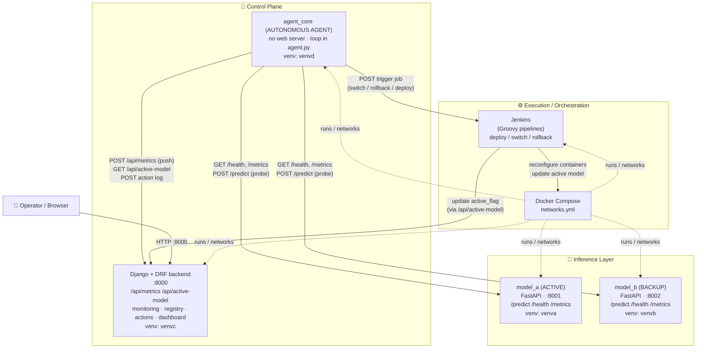

# System Architecture — Autonomous ML Monitoring & Auto-Recovery Agent

> **Guiding mantra:** *"One repo, many services, many environments, HTTP everywhere."*

This document is the authoritative architectural reference for the **Autonomous ML
Monitoring & Auto-Recovery Agent**. It is written for engineers who will build,
operate, debug, or extend the system. It is intentionally long and concrete: it
references real ports, real endpoint paths, and real module/file names so that the
prose and the code stay in lock-step.

---

## Table of Contents

1. [Purpose & Scope](#1-purpose--scope)
2. [Architectural Principles](#2-architectural-principles)
3. [High-Level System Overview](#3-high-level-system-overview)
4. [The Four Planes / Layers](#4-the-four-planes--layers)
5. [Monorepo Directory Tree (annotated)](#5-monorepo-directory-tree-annotated)
6. [Runtime Topology: Containers, Ports, Networks, Venvs](#6-runtime-topology-containers-ports-networks-venvs)
7. [End-to-End Control & Data Flow (Observe→Detect→Decide→Act→Verify)](#7-end-to-end-control--data-flow)
8. [Component Responsibilities](#8-component-responsibilities)
9. [Technology Choices & Rationale](#9-technology-choices--rationale)
10. [Cross-Cutting Concerns](#10-cross-cutting-concerns)
11. [Trust Boundaries & Failure Isolation](#11-trust-boundaries--failure-isolation)
12. [What Is Intentionally NOT in the Architecture](#12-what-is-intentionally-not-in-the-architecture)

---

## 1. Purpose & Scope

### 1.1 What this system is

The system is a **closed-loop autonomous agent** that continuously watches deployed
machine-learning models, detects when they degrade, **decides** how to respond,
**executes** a recovery action, and **verifies** that the action worked — then loops
forever. It behaves like an **operator that never sleeps**, not like a passive
dashboard a human must stare at.

The agent's heartbeat is a single, continuously repeating control loop:

```
        ┌─────────────────────────────────────────────────────────────┐
        │                                                             │
        ▼                                                             │
   OBSERVE ──▶ DETECT ──▶ DECIDE ──▶ ACT ──▶ VERIFY ──────────────────┘
   (probe)    (drift/    (severity   (recover) (health re-check,
              anomaly/    + policy             rollback guard)
              threshold)  → action)
```

Each pass through the loop is a **cycle**. Cycles run on a fixed cadence (batch /
polling is acceptable; true streaming is optional). The loop lives in
`control-plane/agent_core/agent.py`.

### 1.2 Degradation classes detected

| Class | Meaning | Detector module |
|-------|---------|-----------------|
| **Data drift** | Input distribution shifts away from training distribution | `detection/drift_detector.py` |
| **Concept drift** | Input→output relationship changes (model "right answer" moves) | `detection/drift_detector.py` |
| **Anomalies** | Sudden spikes/outliers in latency, error-rate, or prediction values | `detection/anomaly_detector.py` |
| **Threshold breaches** | Latency / error-rate exceed configured limits | `detection/threshold_detector.py` |

### 1.3 Recovery actions catalogue

Every action is **auditable, reversible, and safe-by-default**:

| Action | Description | Owner module |
|--------|-------------|--------------|
| **no-op** | Keep monitoring; gather more evidence before acting | `actions/no_op.py` |
| **alert-only** | Emit an alert / record the event, change nothing | `actions/alert.py` |
| **rollback** | Roll back to a previous, known-good model version | Jenkins `rollback_model.groovy` |
| **switch traffic** | Promote the backup model (`model_b`) to active | `actions/switch_model.py` → Jenkins `switch_active_model.groovy` |
| **retrain** | Retrain with recent data (simulated in this scope) | Jenkins `deploy_model.groovy` |
| **disable predictions** | Temporarily take the model out of service | Django registry flag + alert |

### 1.4 Explicit scope notes

- **Decisions are rule/statistics based.** This is **not** an LLM agent. There is no
  natural-language reasoning anywhere in the decision path.
- **Data may be simulated.** Training and inference data can be synthetic.
- **Batch is fine.** Real-time streaming is optional; cloud is optional.
- **Correctness over scale.** The design optimizes for *correct, safe behavior*, not
  throughput or horizontal scale.

---

## 2. Architectural Principles

These principles are non-negotiable and explain *why* the repo is shaped the way it is.

### 2.1 Separation of concerns

Each top-level area owns exactly one concern:

- **`model-services/`** — serve predictions. Nothing else.
- **`control-plane/backend/`** — store/serve state (metrics, registry, audit). No
  decision-making.
- **`control-plane/agent_core/`** — think and decide. No persistence of its own, no
  serving of predictions.
- **`devops/`** — execute and orchestrate (Jenkins + Docker). The "hands".

The **brain (agent)** and the **memory (Django)** are deliberately split so the
decision logic stays stateless and testable while durable state lives behind a REST API.

### 2.2 HTTP everywhere

Every cross-service interaction is an **HTTP call** with a documented contract. There
are no shared databases between services, no shared Python imports across service
boundaries, no message brokers. If component A needs something from component B, it
makes an HTTP request to a named endpoint on a known port. This keeps services
independently deployable and replaceable.

### 2.3 Single responsibility per service

A service does one job and exposes a narrow interface:

- `model_a` / `model_b` → `POST /predict`, `GET /health`, `GET /metrics` — and that's it.
- The Django apps each map to one noun: `monitoring_app` (metrics), `registry_app`
  (active model), `actions_app` (audit log), `dashboard_app` (UI).
- The agent's submodules each map to one verb of the loop: `monitoring/` (observe),
  `detection/` (detect), `decision_engine/` (decide), `actions/` (act),
  `verification/` (verify).

### 2.4 Safe-by-default

The **default action is the least destructive one** (`no_op` → `alert`). Destructive
actions (switch / rollback / disable) require an explicit severity classification and a
matching policy rule. A `rollback_guard` in `verification/` prevents the system from
oscillating or pushing the fleet into a worse state. Every action is reversible.

### 2.5 Idempotency & auditability

Actions are designed so that re-issuing the same action is a no-op if the world is
already in the desired state (e.g., "switch to `model_b`" when `model_b` is already
active does nothing). Every decision and its outcome is persisted to
`actions_app` so there is a complete, queryable audit trail.

---

## 3. High-Level System Overview

### 3.1 Component diagram (Mermaid)



### 3.2 ASCII fallback (same topology)

```
                         ┌───────────────────────────────────────────┐
                         │              CONTROL PLANE                 │
                         │                                            │
  ┌──────────────┐ HTTP  │  ┌──────────────┐      ┌────────────────┐ │
  │  Operator /  │──────▶│  │ Django + DRF │◀────▶│   agent_core   │ │
  │   Browser    │ :8000 │  │   backend    │ REST │  (the AGENT)   │ │
  └──────────────┘       │  │    :8000     │      │  agent.py loop │ │
                         │  │ /api/metrics │      │  no web server │ │
                         │  │ /api/active- │      └───────┬────────┘ │
                         │  │    model     │              │          │
                         │  └──────┬───────┘              │ probe    │
                         └─────────┼──────────────────────┼──────────┘
                                   │ active_flag          │ GET /health
                          trigger  │ update               │ GET /metrics
                          job ┌────┘                      │ POST /predict
                              ▼                            ▼
                     ┌─────────────────┐        ┌──────────────────────┐
                     │     Jenkins     │        │    INFERENCE LAYER   │
                     │ deploy/switch/  │───────▶│  model_a :8001 (ACT) │
                     │ rollback (Groovy)│ recfg │  model_b :8002 (BAK) │
                     └─────────────────┘        └──────────────────────┘
                              │
                              ▼
                   ┌────────────────────┐
                   │   Docker Compose   │  ← runs & networks every container
                   │  docker-compose.yml│
                   │     networks.yml   │
                   └────────────────────┘
```

### 3.3 Who talks to whom (link summary)

| From | To | Protocol / Port | Purpose |
|------|----|-----------------|---------|
| `agent_core` | `model_a` :8001 | HTTP GET/POST | Probe health, pull metrics, send probe predictions |
| `agent_core` | `model_b` :8002 | HTTP GET/POST | Probe backup health/metrics |
| `agent_core` | Django :8000 | HTTP REST (`django_client.py`) | Push observed metrics, read active model, write audit log |
| `agent_core` | Jenkins | HTTP REST (`jenkins_client.py`) | Trigger recovery jobs |
| Jenkins | Django :8000 | HTTP REST | Update `active_flag` after switch/rollback |
| Jenkins | Docker | CLI / compose | Recreate / reconfigure containers |
| Operator | Django :8000 | HTTP (browser) | View dashboard, metrics, audit log |

---

## 4. The Four Planes / Layers

The system is organized into four conceptual planes. Each plane maps cleanly onto a
top-level directory in the monorepo.

### 4.1 Inference Layer — `model-services/`

The only part of the system that produces predictions.

- **`model_a`** — the **ACTIVE** model. FastAPI app (`app.py`) loading `model.pkl`,
  exposing:
  - `POST /predict` — run inference on a feature payload.
  - `GET /health` — liveness/readiness probe.
  - `GET /metrics` — per-instance latency and error-rate counters (`metrics.py`).
  - Runs in its own container, on **port 8001**, in the **`venva`** virtualenv.
- **`model_b`** — the **BACKUP / fallback** model. Identical layout and contract, in
  **`venvb`**, on **port 8002**. It sits warm and ready so a "switch traffic" recovery
  is fast.

The inference layer is intentionally **dumb**: it serves predictions and reports its own
metrics. It does **not** know about drift, decisions, or recovery. It never calls
outward — it is purely a server.

### 4.2 Control Plane — `control-plane/`

Two cooperating but separate services:

- **`backend/` (Django + DRF, port 8000)** — the **system of record**. It stores and
  serves state via REST, and renders the UI. Four Django apps:
  - `monitoring_app` → persists latency / error-rate / status time-series; exposes
    `/api/metrics`.
  - `registry_app` → the model registry (`model_name`, `version`, `active_flag`);
    exposes `/api/active-model`.
  - `actions_app` → the agent's decision & audit log (`action`, `severity`, `outcome`).
  - `dashboard_app` → server-rendered observability UI.
- **`agent_core/` (no web server, venv `venvd`)** — the **brain**. A plain Python
  process running a continuous loop. It is **stateless**: any state it needs it reads
  from Django, and any conclusions it reaches it writes back to Django. It owns the
  Observe→Detect→Decide→Act→Verify pipeline.

The split is deliberate: **Django remembers, the agent thinks.** This keeps the decision
logic free of persistence concerns and independently testable.

### 4.3 Execution / Orchestration Layer — `devops/`

The "hands" of the system — the only place allowed to *change the fleet*.

- **`jenkins/`** — CI/CD written in **Groovy** (not Python). It is the **recovery
  executor**. Pipelines:
  - `deploy_model.groovy` — (re)deploy / retrain-and-deploy a model.
  - `switch_active_model.groovy` — flip active traffic from `model_a` to `model_b`.
  - `rollback_model.groovy` — restore a previous known-good version.
  - The agent does **not** mutate containers directly; it *requests* an action and
    Jenkins performs it. This is a critical safety boundary (see §11).
- **`docker/`** — `docker-compose.yml` + `networks.yml` orchestrate and network every
  container.

### 4.4 Observability / UI

Spread across the planes but logically one concern:

- Each model self-reports via `GET /metrics`.
- The agent's `monitoring/` modules collect those metrics and push them to Django's
  `/api/metrics`.
- `monitoring_app` persists them; `actions_app` persists decisions/outcomes.
- `dashboard_app` renders the server-side UI an operator views at
  `http://localhost:8000`.

---

## 5. Monorepo Directory Tree (annotated)

> "One repo, many services, many environments, HTTP everywhere."

```
autonomous-ml-platform/                 # 📦 SINGLE GIT REPO (MONOREPO)
│
├── model-services/                     # 🐳 INFERENCE LAYER
│   │                                   #    (Each runs in its OWN container + Python env)
│   │
│   ├── model_a/                        # 🔵 ACTIVE MODEL
│   │   │                               # Runtime:
│   │   │                               #   - Docker container
│   │   │                               #   - Python env: venva
│   │   │                               #   - Port: 8001
│   │   │
│   │   ├── app.py                      # FastAPI server (POST /predict, GET /health, GET /metrics)
│   │   ├── model.pkl                   # serialized sklearn model
│   │   ├── sample_input.csv            # example feature payload
│   │   ├── metrics.py                  # latency, error-rate tracking
│   │   ├── requirements.txt            # fastapi, sklearn, numpy
│   │   └── Dockerfile                  # creates isolated env
│   │
│   ├── model_b/                        # 🟡 BACKUP MODEL
│   │   │                               # Runtime:
│   │   │                               #   - Docker container
│   │   │                               #   - Python env: venvb
│   │   │                               #   - Port: 8002
│   │   │
│   │   ├── app.py
│   │   ├── model.pkl
│   │   ├── sample_input.csv
│   │   ├── metrics.py
│   │   ├── requirements.txt
│   │   └── Dockerfile
│
│
├── control-plane/                      # 🧠 OBSERVABILITY + BRAIN COORDINATION
│   │
│   ├── backend/                        # 🌐 DJANGO CONTROL PLANE
│   │   │                               # Runtime:
│   │   │                               #   - Docker container
│   │   │                               #   - Python env: venvc
│   │   │                               #   - Port: 8000
│   │   │
│   │   ├── manage.py
│   │   ├── config/
│   │   │   ├── settings.py
│   │   │   ├── urls.py
│   │   │   └── wsgi.py
│   │   │
│   │   ├── monitoring_app/             # 📊 Stores metrics from models
│   │   │   ├── models.py               #    latency, error rate, status
│   │   │   ├── views.py                #    /api/metrics
│   │   │   └── urls.py
│   │   │
│   │   ├── registry_app/               # 📦 Model registry
│   │   │   ├── models.py               #    model_name, version, active_flag
│   │   │   ├── views.py                #    /api/active-model
│   │   │   └── urls.py
│   │   │
│   │   ├── actions_app/                # 🧾 Agent decisions & audit logs
│   │   │   ├── models.py               #    action, severity, outcome
│   │   │   ├── views.py
│   │   │   └── urls.py
│   │   │
│   │   ├── dashboard_app/              # 📈 Server-rendered UI
│   │   │   ├── views.py
│   │   │   └── templates/
│   │   │
│   │   ├── requirements.txt            # django, djangorestframework
│   │   └── Dockerfile
│
│
│   ├── agent_core/                     # 🤖 AUTONOMOUS AGENT
│   │   │                               # Runtime:
│   │   │                               #   - Docker container OR bare Python
│   │   │                               #   - Python env: venvd
│   │   │                               #   - No web server
│   │   │
│   │   ├── agent.py                    # 🔁 Main loop
│   │   │                               #    Observe → Detect → Decide → Act → Verify
│   │   │
│   │   ├── monitoring/                 # 👀 OBSERVE
│   │   │   ├── model_probe.py          #    calls model /health, /metrics
│   │   │   ├── prediction_probe.py     #    calls /predict
│   │   │   └── data_loader.py          #    loads CSV input
│   │   │
│   │   ├── detection/                  # 🚨 DETECT
│   │   │   ├── threshold_detector.py   #    latency/error thresholds
│   │   │   ├── anomaly_detector.py     #    statistical outliers
│   │   │   └── drift_detector.py       #    data / concept drift
│   │   │
│   │   ├── decision_engine/            # 🧠 DECIDE
│   │   │   ├── severity_classifier.py  #    LOW / MEDIUM / HIGH
│   │   │   ├── policy_rules.py         #    maps severity → action
│   │   │   └── decision.py             #    assembles the Decision object
│   │   │
│   │   ├── actions/                    # 🚀 ACT
│   │   │   ├── switch_model.py         #    trigger Jenkins switch
│   │   │   ├── alert.py                #    alert-only
│   │   │   └── no_op.py                #    do nothing (safe default)
│   │   │
│   │   ├── verification/               # ✅ VERIFY
│   │   │   ├── health_check.py         #    re-probe after acting
│   │   │   └── rollback_guard.py       #    prevent oscillation / worse state
│   │   │
│   │   ├── clients/                    # 🔌 OUTBOUND COMMUNICATION
│   │   │   ├── django_client.py        #    REST calls to Django
│   │   │   └── jenkins_client.py       #    REST calls to Jenkins
│   │   │
│   │   ├── schemas.py                  # pydantic models (contracts)
│   │   ├── config.py                   # reads .env (thresholds, URLs, cadence)
│   │   ├── requirements.txt            # requests, pydantic
│   │   └── Dockerfile
│
│
├── devops/                             # ⚙️ EXECUTION & ORCHESTRATION
│   │
│   ├── jenkins/                        # 🧰 CI/CD SYSTEM (RECOVERY EXECUTOR)
│   │   │                               # Runtime:
│   │   │                               #   - Jenkins container
│   │   │                               #   - NOT Python (Groovy)
│   │   │
│   │   ├── Jenkinsfile                 # pipeline definition
│   │   ├── jobs/
│   │   │   ├── deploy_model.groovy     # deploy / retrain-and-deploy
│   │   │   ├── switch_active_model.groovy  # promote backup → active
│   │   │   └── rollback_model.groovy   # restore previous version
│   │
│   ├── docker/
│   │   ├── docker-compose.yml          # orchestrates ALL containers
│   │   └── networks.yml                # network definitions
│
│
├── docs/                               # 📚 DOCUMENTATION
│   ├── architecture.md                 # ← THIS FILE
│   ├── agent_logic.md
│   ├── api_contracts.md
│   └── failure_scenarios.md
│
├── .env                                # shared config (ports, URLs, thresholds)
├── README.md
└── Makefile                            # helper commands
```

---

## 6. Runtime Topology: Containers, Ports, Networks, Venvs

### 6.1 Container & port map

| Service | Container | Port (host) | Web server? | Virtualenv | Image base |
|---------|-----------|-------------|-------------|-----------|------------|
| `model_a` | `model_a` | **8001** | Yes (FastAPI/uvicorn) | **`venva`** | python-slim |
| `model_b` | `model_b` | **8002** | Yes (FastAPI/uvicorn) | **`venvb`** | python-slim |
| Django backend | `backend` | **8000** | Yes (Django/WSGI) | **`venvc`** | python-slim |
| `agent_core` | `agent_core` | — (none) | **No** | **`venvd`** | python-slim |
| Jenkins | `jenkins` | 8080 (typ.) | Yes (Jenkins) | — (JVM/Groovy) | jenkins/jenkins |

Note the **asymmetry**: the agent has **no listening port**. It is a pure *client* — it
reaches out to everyone and nobody reaches in. This shrinks its attack/blast surface to
nothing inbound.

### 6.2 Networking

All containers are wired together by `devops/docker/docker-compose.yml` and
`devops/docker/networks.yml`. Services address each other by **container/service name on
the compose network**, not by `localhost`. Example resolved targets used by the agent:

```
MODEL_A_URL = http://model_a:8001
MODEL_B_URL = http://model_b:8002
DJANGO_URL  = http://backend:8000
JENKINS_URL = http://jenkins:8080
```

These are supplied via the shared **`.env`** and read by `agent_core/config.py`.

### 6.3 The four isolated Python venvs — and why isolation matters

| Venv | Belongs to | Why it must be isolated |
|------|-----------|--------------------------|
| `venva` | `model_a` | Pins `fastapi`, `sklearn`, `numpy`; the sklearn version must match the one that pickled `model.pkl`. |
| `venvb` | `model_b` | Same stack as A but independently versioned, so the backup can run a *different* model/sklearn version safely. |
| `venvc` | Django backend | `django`, `djangorestframework` — a totally different web stack from the models. |
| `venvd` | `agent_core` | Minimal: `requests`, `pydantic`. No heavy ML/web deps at all. |

**Why isolation matters:**

1. **Pickle/version coupling.** A pickled sklearn model is sensitive to the library
   version. Isolating `venva`/`venvb` prevents an upgrade in one model from silently
   breaking the other (or the agent).
2. **Dependency conflict avoidance.** FastAPI's pins, Django's pins, and the agent's
   minimal pins would otherwise fight. Separate venvs guarantee no cross-contamination.
3. **Blast-radius containment.** A bad dependency install only affects one service.
4. **Independent upgrade cadence.** Each service evolves its requirements on its own
   timeline — essential for a backup model that may run an older, more-proven stack.
5. **Honest contracts.** Because there is no shared Python import path between services,
   the *only* coupling is the HTTP contract — which is exactly the design intent.

---

## 7. End-to-End Control & Data Flow

### 7.1 One full cycle (Mermaid sequence diagram)

```mermaid
sequenceDiagram
    autonumber
    participant L as agent.py (loop)
    participant MP as monitoring/* (probes)
    participant MA as model_a :8001
    participant DET as detection/*
    participant DEC as decision_engine/*
    participant ACT as actions/*
    participant DC as clients/django_client.py
    participant DJ as Django :8000
    participant JC as clients/jenkins_client.py
    participant JK as Jenkins
    participant MB as model_b :8002
    participant VER as verification/*

    Note over L: ── OBSERVE ──
    L->>MP: probe_cycle()
    MP->>MA: GET /health
    MA-->>MP: 200 {status:"ok"}
    MP->>MA: GET /metrics
    MA-->>MP: {latency_ms, error_rate, count}
    MP->>MA: POST /predict (sample_input.csv via data_loader)
    MA-->>MP: {prediction, proba}
    MP->>DC: push observations
    DC->>DJ: POST /api/metrics
    DJ-->>DC: 201 Created

    Note over L: ── DETECT ──
    L->>DET: threshold + anomaly + drift checks
    DET-->>L: findings[] (e.g. latency_breach, drift_detected)

    Note over L: ── DECIDE ──
    L->>DEC: severity_classifier.classify(findings)
    DEC-->>L: severity = HIGH
    L->>DEC: policy_rules.resolve(HIGH)
    DEC-->>L: Decision{action: switch_to_backup}

    Note over L: ── ACT ──
    L->>DC: GET active model (pre-check / idempotency)
    DC->>DJ: GET /api/active-model
    DJ-->>DC: {model_name:"model_a", version, active_flag:true}
    L->>ACT: switch_model.execute()
    ACT->>JC: trigger(switch_active_model)
    JC->>JK: POST /job/switch_active_model/buildWithParameters
    JK->>MB: ensure model_b healthy / promote
    JK->>DJ: POST /api/active-model (active_flag → model_b)
    JK-->>JC: build SUCCESS

    Note over L: ── VERIFY ──
    L->>VER: health_check.run()
    VER->>MB: GET /health
    MB-->>VER: 200 {status:"ok"}
    VER->>VER: rollback_guard.evaluate()
    alt verification OK
        VER-->>L: outcome = SUCCESS
    else worse than before
        VER->>JC: trigger(rollback_model)
        JC->>JK: POST /job/rollback_model
        VER-->>L: outcome = ROLLED_BACK
    end

    Note over L: ── AUDIT ──
    L->>DC: log decision + outcome
    DC->>DJ: POST actions (actions_app)
    DJ-->>DC: 201 Created
    Note over L: sleep(cadence) → repeat
```



### 7.2 Phase-by-phase narrative

| Phase | Modules | What happens |
|-------|---------|--------------|
| **Observe** | `monitoring/model_probe.py`, `prediction_probe.py`, `data_loader.py` | Probe `GET /health` and `GET /metrics` on each model; send a `POST /predict` probe using rows from `sample_input.csv`; push the gathered metrics to Django `/api/metrics`. |
| **Detect** | `detection/threshold_detector.py`, `anomaly_detector.py`, `drift_detector.py` | Compare observed latency/error-rate to thresholds; flag statistical anomalies; compute drift. Produce a list of *findings*. |
| **Decide** | `decision_engine/severity_classifier.py`, `policy_rules.py`, `decision.py` | Map findings to a **severity** (LOW/MEDIUM/HIGH); map severity to an **action** via policy rules; assemble a typed `Decision`. |
| **Act** | `actions/no_op.py`, `alert.py`, `switch_model.py` + `clients/jenkins_client.py` | Execute the chosen action. Destructive actions (switch/rollback/retrain) are delegated to Jenkins; safe actions run locally. |
| **Verify** | `verification/health_check.py`, `rollback_guard.py` | Re-probe the (new) active model. If the system is not healthier, the `rollback_guard` triggers a rollback. |
| **Audit** | `clients/django_client.py` → `actions_app` | Persist `{action, severity, outcome}` for a permanent, queryable trail. Then sleep and repeat. |

### 7.3 Representative payloads

**Probe → model (`POST /predict` on :8001):**
```json
{ "features": [5.1, 3.5, 1.4, 0.2] }
```

**Model metrics (`GET /metrics` on :8001):**
```json
{ "latency_ms_p95": 42.0, "error_rate": 0.001, "request_count": 10423, "health_status": "HEALTHY" }
```

**Agent → Django (`POST /api/metrics` on :8000):**
```json
{ "model_name": "model_a", "latency_ms": 42.0, "error_rate": 0.001, "health_status": "HEALTHY", "ts": "2026-05-30T12:00:00Z" }
```

**Active model (`GET /api/active-model` on :8000):**
```json
{ "model_name": "model_a", "version": "1.4.2", "active_flag": true }
```

**Agent → `actions_app` audit record:**
```json
{ "action": "switch_to_backup", "severity": "HIGH", "outcome": "success", "from": "model_a", "to": "model_b" }
```

---

## 8. Component Responsibilities

| Component | Owns (responsibility) | Explicitly does NOT |
|-----------|-----------------------|---------------------|
| `model-services/model_a` (`:8001`, `venva`) | Serve predictions; self-report latency/error-rate; answer `/health`. The ACTIVE model. | Detect drift, decide, or recover. Never calls outward. |
| `model-services/model_b` (`:8002`, `venvb`) | Same contract as A; stays warm as the fallback target for a switch. | Anything beyond serving + self-metrics. |
| `control-plane/backend` Django (`:8000`, `venvc`) | Durable state of record: store metrics (`monitoring_app`), registry (`registry_app`), audit log (`actions_app`); render UI (`dashboard_app`). Expose `/api/metrics`, `/api/active-model`. | Make decisions; probe models; trigger Jenkins. It is passive storage + UI. |
| `control-plane/agent_core` (`venvd`, no port) | Run the Observe→Detect→Decide→Act→Verify loop; the only decision-maker. | Persist its own state; serve HTTP; mutate containers directly. |
| `agent_core/monitoring/*` | Probe models, load sample data, push metrics to Django. | Decide anything. |
| `agent_core/detection/*` | Turn raw metrics into findings (threshold / anomaly / drift). | Choose actions. |
| `agent_core/decision_engine/*` | Classify severity, apply policy rules, emit a `Decision`. | Execute the action. |
| `agent_core/actions/*` | Execute the chosen action (locally or via Jenkins). | Decide which action. |
| `agent_core/verification/*` | Confirm recovery; guard against oscillation/worse-state via rollback. | Choose the original action. |
| `agent_core/clients/*` | The *only* place that knows Django/Jenkins URLs and speaks their REST. | Business logic. |
| `devops/jenkins` (Groovy) | Execute fleet changes: deploy, switch active, rollback. The recovery *executor*. | Decide *whether* to act — it only acts on request. |
| `devops/docker` | Build, run, and network all containers. | Application logic. |

---

## 9. Technology Choices & Rationale

| Choice | Where | Why this technology |
|--------|-------|---------------------|
| **FastAPI** | `model_a`, `model_b` | Minimal, fast, async-capable HTTP layer for ML inference; trivial to expose `/predict`, `/health`, `/metrics`; auto-validates request bodies; tiny footprint per model container. |
| **scikit-learn + pickle** | `model.pkl` | Standard, simple ML stack appropriate for simulated/correctness-focused scope; pickled models are easy to swap during rollback. |
| **Django + DRF** | `control-plane/backend` | Batteries-included control plane: ORM for durable metrics/registry/audit storage, DRF for clean REST endpoints, and built-in templating/admin for the dashboard — all in one service. Ideal "system of record". |
| **Plain Python loop (no framework)** | `agent_core/agent.py` | The agent must be a *long-running decision process*, not a request/response server. A simple loop is the most transparent, testable, and debuggable way to implement Observe→Detect→Decide→Act→Verify. Dependencies stay tiny (`requests`, `pydantic`). |
| **pydantic** | `agent_core/schemas.py` | Typed, validated contracts for metrics/findings/decisions inside the agent — catches malformed data at boundaries. |
| **Jenkins (Groovy pipelines)** | `devops/jenkins` | A real, auditable CI/CD executor. Keeping the *act* in Jenkins gives every recovery a build record, parameters, logs, and a manual override — and keeps destructive operations out of the agent process. |
| **Docker Compose** | `devops/docker` | Simple multi-container orchestration with named networks; perfect for a correctness-focused, single-host deployment. No Kubernetes needed at this scope. |
| **Shared `.env`** | repo root | One source of truth for ports/URLs/thresholds consumed by every service (notably `agent_core/config.py`). |
| **HTTP-only integration** | everywhere | Decouples services; lets any one be replaced, mocked, or restarted independently. |

---

## 10. Cross-Cutting Concerns

### 10.1 Auditability

Every decision and its outcome is written to **`actions_app`** (`action`, `severity`,
`outcome`, plus context like `from`/`to` model). The metrics that *justified* the
decision live in **`monitoring_app`**. Together they give a complete, replayable history:
*what was observed → what was decided → what happened*.

### 10.2 Reversibility

Each action has an inverse:

- `switch_to_backup` (A→B) is reversed by another switch (B→A).
- `rollback_model` restores a prior `version` from the registry.
- "disable predictions" is reversed by re-enabling the `active_flag`.

Reversibility is what makes aggressive auto-recovery safe: the worst case is "undo it".

### 10.3 Safe-by-default

The **default action is `no_op`**, then `alert`. Destructive actions only fire on an
explicit `severity` + matching `policy_rules` entry. `rollback_guard` in `verification/`
short-circuits any action that didn't actually improve health.

### 10.4 Fault tolerance

- The agent is a **pure client**: if Django or a model is briefly unreachable, the
  probe/observe step fails gracefully and the loop retries next cadence — nothing
  crashes the fleet.
- `model_b` is kept warm so a switch is fast and low-risk.
- Jenkins owns destructive operations, so an agent crash mid-decision leaves the fleet
  in its last good state (no half-applied container surgery).

### 10.5 Idempotency of actions

Actions are written to be idempotent. Before switching, the agent reads
`GET /api/active-model`; if `model_b` is already active, the switch is a no-op. Replaying
the loop, retrying a failed action, or restarting the agent does not cause duplicate or
conflicting fleet changes.

### 10.6 Configuration via `.env`

All ports, service URLs, thresholds, and loop cadence come from the root **`.env`**,
read centrally by `agent_core/config.py` (and the compose files / Django settings). No
hard-coded hosts; the same images run unchanged across environments by swapping `.env`.

---

## 11. Trust Boundaries & Failure Isolation

### 11.1 Trust boundaries

```
┌─────────────────────────── TRUST BOUNDARY: fleet mutation ───────────────────────────┐
│  Only Jenkins may change the running fleet (deploy / switch / rollback).             │
│  The agent can only *request* changes; it has no direct container/registry write.    │
└──────────────────────────────────────────────────────────────────────────────────────┘

┌─────────────────────────── TRUST BOUNDARY: decision authority ───────────────────────┐
│  Only agent_core makes decisions. Models and Django never decide; Jenkins never      │
│  decides — it executes parameterized requests.                                       │
└──────────────────────────────────────────────────────────────────────────────────────┘

┌─────────────────────────── TRUST BOUNDARY: inbound surface ──────────────────────────┐
│  agent_core exposes NO inbound port. Models expose only /predict /health /metrics.   │
│  Django exposes only its /api/* + dashboard. Minimal, explicit surfaces.             │
└──────────────────────────────────────────────────────────────────────────────────────┘
```

### 11.2 Failure isolation matrix

| If this fails… | Direct effect | Isolation / mitigation |
|----------------|---------------|------------------------|
| `model_a` down | Active inference fails | Agent detects via `/health`; decides SWITCH; promotes `model_b`. |
| `model_b` down | Backup unavailable | Switch is blocked; agent falls back to `alert` (safe-by-default); `rollback_guard` prevents promoting an unhealthy target. |
| Django down | No metric/audit persistence; UI down | Models keep serving; agent loop tolerates push failures and retries. No fleet impact. |
| `agent_core` down | No new decisions | Fleet frozen in last good state; Jenkins idle; nothing destructive happens unattended. |
| Jenkins down | Cannot execute switch/rollback | Agent records an `alert` outcome; no partial mutation; human can act. |
| Network partition | Probes/REST fail | Each service is independent (no shared DB); loop degrades to observe-and-alert. |

Because there is **no shared database and no shared Python runtime** across services, a
failure is contained to a single container and surfaced as an HTTP error the caller
handles — rather than cascading.

---

## 12. What Is Intentionally NOT in the Architecture

To keep the system honest, simple, and correct, the following are **out of scope by
design**:

- ❌ **No chatbot / conversational interface.** The dashboard is a read-only
  observability UI, not a chat surface.
- ❌ **No LLM reasoning anywhere.** All decisions are **rule/statistics based**
  (`severity_classifier.py` + `policy_rules.py`). There is no model-in-the-loop for
  *deciding*.
- ❌ **No over-engineered data pipelines.** Input may be a `sample_input.csv`; data may
  be simulated. No Spark/Flink/Airflow DAG sprawl.
- ❌ **No full-scale MLOps platform.** No feature store, no experiment tracker, no model
  marketplace. Jenkins + a tiny Django registry are sufficient.
- ❌ **No mandatory streaming.** Batch/polling on a cadence is the baseline; real-time
  streaming is optional.
- ❌ **No mandatory cloud / Kubernetes / autoscaling.** Docker Compose on a single host
  is the target; the focus is **correct behavior, not scale**.
- ❌ **No cross-service shared databases or shared code imports.** HTTP contracts only.

This restraint is itself an architectural decision: the value of this project is a
*correct, auditable, safe closed-loop recovery agent* — not a platform.

---

*End of architecture document. See also: `docs/agent_logic.md` (decision internals),
`docs/api_contracts.md` (endpoint schemas), `docs/failure_scenarios.md` (runbooks).*
