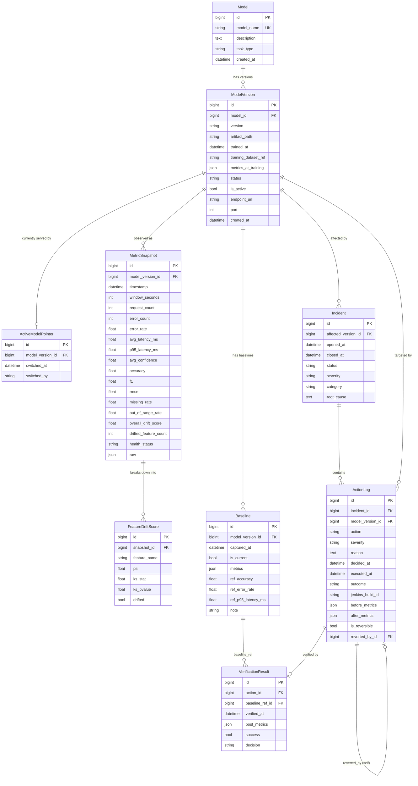

# Data Model & Database Schema — Django Control Plane

> **Scope of this document.** This is the authoritative reference for the **persistence
> layer** of the Django control plane (`control-plane/backend/`, port `8000`). It defines
> every table, every field, every constraint, the entity relationships, the Django model
> code, indexes, query patterns, retention, migrations, and the data-layer guarantees that
> make the system *auditable* and *reversible*.
>
> It is written to stay in lock-step with `docs/architecture.md` (component map),
> `docs/api_contracts.md` (REST request/response shapes), `docs/monitoring_and_metrics.md`
> (the `MetricSnapshot` field set), and `docs/agent_logic.md` (the Decision/Action vocabulary).
> Field names here are chosen to match those documents exactly so that a row in the DB and a
> JSON body on the wire are trivially mappable.

---

## Table of Contents

1. [Overview & Design Goals](#1-overview--design-goals)
2. [Entity-Relationship Diagram](#2-entity-relationship-diagram)
3. [`registry_app` Tables](#3-registry_app-tables)
   - [3.1 Model](#31-model)
   - [3.2 ModelVersion](#32-modelversion)
   - [3.3 ActiveModelPointer](#33-activemodelpointer)
4. [`monitoring_app` Tables](#4-monitoring_app-tables)
   - [4.1 MetricSnapshot](#41-metricsnapshot)
   - [4.2 FeatureDriftScore](#42-featuredriftscore)
   - [4.3 Baseline](#43-baseline)
5. [`actions_app` Tables](#5-actions_app-tables)
   - [5.1 Incident](#51-incident)
   - [5.2 ActionLog](#52-actionlog)
   - [5.3 VerificationResult](#53-verificationresult)
6. [Indexes & Query Patterns](#6-indexes--query-patterns)
7. [Retention & Migrations](#7-retention--migrations)
8. [Auditability & Reversibility Guarantees](#8-auditability--reversibility-guarantees)
9. [Enum / Choices Reference](#9-enum--choices-reference)

---

## 1. Overview & Design Goals

### 1.1 Database choice

The control plane uses the **Django ORM** as its single persistence abstraction. The same
model code runs against two backends without modification:

| Environment | Engine | Setting (`config/settings.py`) | Why |
|-------------|--------|--------------------------------|-----|
| **Development / demo / CI** | **SQLite** | `django.db.backends.sqlite3`, file `db.sqlite3` | Zero-config, single file, perfect for a correctness-focused, single-host project. Ships in the repo. |
| **Production-ish** | **PostgreSQL** | `django.db.backends.postgresql` via `DATABASE_URL` in `.env` | Real concurrency, real `JSONB`, real partial/unique indexes, robust transactions. |

Everything in this schema is written to be **Postgres-compatible while degrading
gracefully on SQLite**:

- `JSONField` maps to native `JSONB` on Postgres and to a `TEXT`-backed JSON column on
  SQLite (Django ≥ 3.1 supports `models.JSONField` on both).
- We avoid Postgres-only column types (no array columns, no `tsvector`). Where we want a
  "list", we use a child table (e.g. `FeatureDriftScore`) or a `JSONField`.
- The one place we rely on a database-enforced *partial* uniqueness ("only one active
  version") is implemented with a dedicated single-row pointer table
  (`ActiveModelPointer`) so the invariant holds identically on SQLite and Postgres. See
  [§3.3](#33-activemodelpointer).

> **No shared database.** Per `architecture.md` §2.2, *only* the Django backend touches
> this database. The agent, the models, and Jenkins reach this data exclusively over the
> `/api/*` REST surface. There are no cross-service DB connections.

### 1.2 Design goals

| Goal | How the schema delivers it |
|------|----------------------------|
| **History** | `MetricSnapshot`, `FeatureDriftScore`, `ActionLog`, `VerificationResult`, and `Baseline` are **append-only time-series**. Rows are never updated in place to "fix" history; they accrete. |
| **Auditability** | Every agent decision becomes one immutable `ActionLog` row carrying `reason`, `before_metrics`, `after_metrics`, `decided_at`, `executed_at`, and `outcome`. Grouped under an `Incident`. |
| **Reversibility** | `ActionLog.is_reversible` + `ActionLog.reverted_by` (self-FK) explicitly link a corrective action back to the action it undid. Registry `status` carries a terminal `ROLLED_BACK` state. |
| **Referential integrity** | All time-series rows carry a `ModelVersion` FK; all `ActionLog` rows carry an `Incident` FK; `VerificationResult` carries an `ActionLog` FK. `on_delete` policies (below) prevent orphans. |
| **Simplicity** | Three apps, nine tables, no over-engineering. No feature store, no separate event bus, no soft-delete framework — just clean, queryable history. |

### 1.3 App → table ownership map

```
control-plane/backend/
├── registry_app/      # WHAT models exist and which one serves traffic
│   ├── Model                 (registry_model)
│   ├── ModelVersion          (registry_modelversion)
│   └── ActiveModelPointer    (registry_activemodelpointer)   ← single row
│
├── monitoring_app/    # WHAT we observed over time (the "Observe" output)
│   ├── MetricSnapshot        (monitoring_metricsnapshot)
│   ├── FeatureDriftScore     (monitoring_featuredriftscore)
│   └── Baseline              (monitoring_baseline)
│
└── actions_app/       # WHAT we decided/did and whether it worked (Decide→Act→Verify)
    ├── Incident              (actions_incident)
    ├── ActionLog             (actions_actionlog)
    └── VerificationResult    (actions_verificationresult)
```

`dashboard_app` owns **no tables** — it is read-only and queries the three apps above to
render the operator UI.

### 1.4 Cross-cutting conventions

- **Timestamps.** Stored as timezone-aware `DateTimeField` (`USE_TZ = True`). All API I/O
  is ISO-8601 UTC (e.g. `2026-05-30T12:00:00Z`).
- **Primary keys.** Implicit `BigAutoField` `id` on every table
  (`DEFAULT_AUTO_FIELD = "django.db.models.BigAutoField"`).
- **Money/ratios.** Rates (`error_rate`, `missing_rate`, drift fractions) are stored as
  `FloatField` in `[0.0, 1.0]`. Latency is milliseconds (`FloatField`).
- **`*_metrics` snapshots.** `before_metrics`, `after_metrics`, `metrics_at_training`, and
  the `Baseline` numeric block, plus the raw probe payload, are stored as `JSONField` so
  the schema does not have to change when the metric set evolves. The *first-class*
  columns (latency, error_rate, accuracy, …) are duplicated out of the JSON for indexing
  and dashboard queries.

---

## 2. Entity-Relationship Diagram



**Cardinality summary**

- `Model` **1 — \*** `ModelVersion` (a logical model has many versioned artifacts).
- `ModelVersion` **1 — 0..1** `ActiveModelPointer` (at most one version is the live pointer; the pointer table holds exactly one row at all times).
- `ModelVersion` **1 — \*** `MetricSnapshot` / `Baseline` / `Incident` / `ActionLog`.
- `MetricSnapshot` **1 — \*** `FeatureDriftScore` (per-feature breakdown of one snapshot).
- `Incident` **1 — \*** `ActionLog` (an incident may require several actions before resolution).
- `ActionLog` **1 — 0..1** `VerificationResult` (each executed action gets at most one verdict).
- `ActionLog` **0..1 — 0..1** `ActionLog` via `reverted_by` (a self-relation linking an action to the action that reverted it).
- `Baseline` **1 — \*** `VerificationResult` (a baseline is the comparison reference for many verifications).

---

## 3. `registry_app` Tables

> **Purpose of the app.** The model registry answers two questions: *"what models/versions
> exist?"* and *"which version is serving traffic right now?"* It backs `GET /api/active-model`
> and the model-list endpoints.

### 3.1 Model

**Purpose.** A *logical* model identity (e.g. `model_a`, `model_b`). It owns many concrete
`ModelVersion`s over its lifetime. `model_name` is the stable handle used everywhere in the
APIs and audit logs.

#### Field table

| Field | Django field | DB type (Postgres / SQLite) | Constraints | Description |
|-------|--------------|-----------------------------|-------------|-------------|
| `id` | `BigAutoField` | `bigint` / `INTEGER` | **PK**, auto | Surrogate primary key. |
| `model_name` | `CharField(max_length=64)` | `varchar(64)` | **unique**, indexed, not null | Stable logical name: `model_a`, `model_b`. Used in API payloads & audit logs. |
| `description` | `TextField(blank=True)` | `text` | null="" (blank ok) | Human description of the model's job. |
| `task_type` | `CharField(max_length=32, choices=TASK_TYPES, default="binary_classification")` | `varchar(32)` | not null, default | ML task. This project: `binary_classification`. |
| `created_at` | `DateTimeField(auto_now_add=True)` | `timestamptz` / `datetime` | not null, indexed | Row creation time. |

#### Django model

```python
# registry_app/models.py
from django.db import models


class Model(models.Model):
    """A logical model identity (e.g. 'model_a'). Owns many versions."""

    TASK_TYPES = [
        ("binary_classification", "Binary classification"),
        ("multiclass_classification", "Multiclass classification"),
        ("regression", "Regression"),
    ]

    model_name = models.CharField(max_length=64, unique=True, db_index=True)
    description = models.TextField(blank=True, default="")
    task_type = models.CharField(
        max_length=32, choices=TASK_TYPES, default="binary_classification"
    )
    created_at = models.DateTimeField(auto_now_add=True, db_index=True)

    class Meta:
        ordering = ["model_name"]
        verbose_name = "model"
        verbose_name_plural = "models"

    def __str__(self) -> str:
        return self.model_name
```

#### Example rows

```json
[
  {
    "id": 1,
    "model_name": "model_a",
    "description": "Primary tabular binary classifier (active).",
    "task_type": "binary_classification",
    "created_at": "2026-01-10T09:00:00Z"
  },
  {
    "id": 2,
    "model_name": "model_b",
    "description": "Warm backup classifier, promoted on switch.",
    "task_type": "binary_classification",
    "created_at": "2026-01-10T09:00:05Z"
  }
]
```

---

### 3.2 ModelVersion

**Purpose.** A *concrete, deployable artifact* of a `Model`: a specific `version`, its
pickled artifact, the dataset it was trained on, the metrics it scored at training time,
its lifecycle `status`, and its serving endpoint. This is the row a `MetricSnapshot`,
`Incident`, or `ActionLog` points at, and the row the active pointer references.

#### Field table

| Field | Django field | DB type | Constraints | Description |
|-------|--------------|---------|-------------|-------------|
| `id` | `BigAutoField` | `bigint` | **PK** | Surrogate key. |
| `model` | `ForeignKey(Model, on_delete=PROTECT, related_name="versions")` | `bigint` FK | **FK→Model**, not null, indexed | Parent logical model. `PROTECT` so a model with versions cannot be silently deleted. |
| `version` | `CharField(max_length=32)` | `varchar(32)` | not null, **unique with `model`** | Semantic version string, e.g. `1.4.2`. |
| `artifact_path` | `CharField(max_length=255)` | `varchar(255)` | not null | Path/URI to `model.pkl` (e.g. `model-services/model_a/model.pkl`). |
| `trained_at` | `DateTimeField(null=True, blank=True)` | `timestamptz` | nullable | When the artifact was trained. |
| `training_dataset_ref` | `CharField(max_length=255, blank=True)` | `varchar(255)` | nullable("") | Reference/hash of the training dataset (e.g. `dataset:tab_v3@sha256:…`). |
| `metrics_at_training` | `JSONField(default=dict, blank=True)` | `jsonb` / `text` | not null (default `{}`) | Frozen training metrics: `{accuracy, f1, rmse, …}`. |
| `status` | `CharField(max_length=16, choices=VERSION_STATUS, default="CANDIDATE")` | `varchar(16)` | not null, indexed | Lifecycle: `CANDIDATE/STABLE/ACTIVE/DEPRECATED/ROLLED_BACK`. |
| `is_active` | `BooleanField(default=False)` | `boolean` | not null, indexed | Convenience flag: is this the live version? Kept consistent with `ActiveModelPointer` (see §3.3). |
| `endpoint_url` | `CharField(max_length=255, blank=True)` | `varchar(255)` | nullable("") | Serving base URL, e.g. `http://model_a:8001`. |
| `port` | `PositiveIntegerField(null=True, blank=True)` | `integer` | nullable | Serving port, e.g. `8001` / `8002`. |
| `created_at` | `DateTimeField(auto_now_add=True)` | `timestamptz` | not null | Registry insertion time. |

#### Django model

```python
# registry_app/models.py (continued)
class ModelVersion(models.Model):
    """A concrete versioned artifact of a Model."""

    VERSION_STATUS = [
        ("CANDIDATE", "Candidate"),     # built, not yet trusted for traffic
        ("STABLE", "Stable"),           # known-good, eligible to be promoted
        ("ACTIVE", "Active"),           # currently serving production traffic
        ("DEPRECATED", "Deprecated"),   # superseded, retained for history/rollback
        ("ROLLED_BACK", "Rolled back"), # was active, reverted by a recovery action
    ]

    model = models.ForeignKey(
        Model, on_delete=models.PROTECT, related_name="versions"
    )
    version = models.CharField(max_length=32)
    artifact_path = models.CharField(max_length=255)
    trained_at = models.DateTimeField(null=True, blank=True)
    training_dataset_ref = models.CharField(max_length=255, blank=True, default="")
    metrics_at_training = models.JSONField(default=dict, blank=True)
    status = models.CharField(
        max_length=16, choices=VERSION_STATUS, default="CANDIDATE", db_index=True
    )
    is_active = models.BooleanField(default=False, db_index=True)
    endpoint_url = models.CharField(max_length=255, blank=True, default="")
    port = models.PositiveIntegerField(null=True, blank=True)
    created_at = models.DateTimeField(auto_now_add=True)

    class Meta:
        ordering = ["model__model_name", "-created_at"]
        constraints = [
            models.UniqueConstraint(
                fields=["model", "version"], name="uq_modelversion_model_version"
            ),
            # At most ONE active version per logical model (partial unique index).
            models.UniqueConstraint(
                fields=["model"],
                condition=models.Q(is_active=True),
                name="uq_one_active_version_per_model",
            ),
        ]
        indexes = [
            models.Index(fields=["status"], name="idx_mv_status"),
            models.Index(fields=["is_active"], name="idx_mv_is_active"),
        ]

    def __str__(self) -> str:
        return f"{self.model.model_name}@{self.version} [{self.status}]"
```

> **Note on the partial unique constraint.** `uq_one_active_version_per_model` is a partial
> unique index (`WHERE is_active = TRUE`) and is enforced natively on **Postgres**. On
> **SQLite** Django also emits a partial index (supported since SQLite 3.8). If you must
> support an ancient SQLite, the `ActiveModelPointer` table is the authoritative source of
> truth and the flag is advisory — see §3.3.

#### Example rows

```json
[
  {
    "id": 11, "model": 1, "version": "1.4.2",
    "artifact_path": "model-services/model_a/model.pkl",
    "trained_at": "2026-01-09T22:00:00Z",
    "training_dataset_ref": "dataset:tab_v3@sha256:9f1c…",
    "metrics_at_training": {"accuracy": 0.942, "f1": 0.931, "rmse": 0.211},
    "status": "ACTIVE", "is_active": true,
    "endpoint_url": "http://model_a:8001", "port": 8001,
    "created_at": "2026-01-10T09:01:00Z"
  },
  {
    "id": 21, "model": 2, "version": "1.3.0",
    "artifact_path": "model-services/model_b/model.pkl",
    "trained_at": "2025-12-20T18:00:00Z",
    "training_dataset_ref": "dataset:tab_v2@sha256:4ab0…",
    "metrics_at_training": {"accuracy": 0.928, "f1": 0.915, "rmse": 0.244},
    "status": "STABLE", "is_active": false,
    "endpoint_url": "http://model_b:8002", "port": 8002,
    "created_at": "2026-01-10T09:01:05Z"
  }
]
```

---

### 3.3 ActiveModelPointer

**Purpose.** A **single-row** table that names *the one version currently serving traffic*.
It is the canonical answer to `GET /api/active-model` and the atomic switch target. Keeping
"who is active" in a dedicated one-row pointer (rather than relying solely on a boolean
scattered across `ModelVersion`) gives a single place to lock and flip, and a clean audit of
*when* and *by whom* traffic last switched.

#### Field table

| Field | Django field | DB type | Constraints | Description |
|-------|--------------|---------|-------------|-------------|
| `id` | `BigAutoField` | `bigint` | **PK** | Surrogate key. Enforced to always be the row with `pk=1` (singleton). |
| `model_version` | `OneToOneField(ModelVersion, on_delete=PROTECT, related_name="active_pointer")` | `bigint` FK, **unique** | **FK→ModelVersion**, not null | The version that is live. `PROTECT` so the live version can never be deleted. |
| `switched_at` | `DateTimeField(auto_now=True)` | `timestamptz` | not null | Updated every time the pointer moves. |
| `switched_by` | `CharField(max_length=64, default="agent")` | `varchar(64)` | not null | Who flipped it: `agent`, `jenkins`, `operator`. |

#### Django model

```python
# registry_app/models.py (continued)
from django.db import transaction


class ActiveModelPointer(models.Model):
    """Singleton row: the single ModelVersion currently serving traffic."""

    model_version = models.OneToOneField(
        ModelVersion, on_delete=models.PROTECT, related_name="active_pointer"
    )
    switched_at = models.DateTimeField(auto_now=True)
    switched_by = models.CharField(max_length=64, default="agent")

    class Meta:
        verbose_name = "active model pointer"

    def save(self, *args, **kwargs):
        # Enforce singleton: there is exactly one pointer row, always pk=1.
        self.pk = 1
        super().save(*args, **kwargs)

    def __str__(self) -> str:
        return f"ACTIVE → {self.model_version}"

    @classmethod
    @transaction.atomic
    def switch_to(cls, version: "ModelVersion", by: str = "agent") -> "ActiveModelPointer":
        """Atomically promote `version` to active and demote the previous one.

        All writes happen in ONE transaction so a crash can never leave two
        versions flagged active or zero versions active.
        """
        # 1) Lock & demote whichever version is currently active for this model.
        (ModelVersion.objects
            .select_for_update()
            .filter(model=version.model, is_active=True)
            .exclude(pk=version.pk)
            .update(is_active=False, status="STABLE"))
        # 2) Promote the new version.
        version.is_active = True
        version.status = "ACTIVE"
        version.save(update_fields=["is_active", "status"])
        # 3) Move the singleton pointer.
        pointer, _ = cls.objects.get_or_create(
            pk=1, defaults={"model_version": version, "switched_by": by}
        )
        pointer.model_version = version
        pointer.switched_by = by
        pointer.save()  # auto_now refreshes switched_at
        return pointer
```

#### How the active flag flips *atomically*

The switch is a **single database transaction** (`switch_to`):

1. `SELECT … FOR UPDATE` locks the rows so concurrent switches serialize (Postgres). The
   previously-active version of that logical model is set `is_active=False, status=STABLE`.
2. The incoming version is set `is_active=True, status=ACTIVE`.
3. The singleton `ActiveModelPointer` row (`pk=1`) is repointed at the new version, and
   `switched_at` / `switched_by` are stamped.

Because all three steps are inside `@transaction.atomic`, the system can never observe a
window with **two** active versions or **zero** active versions. If Jenkins or the agent
crashes mid-switch, the transaction rolls back and the previous active version is intact —
this is the data-layer half of the "safe-by-default / reversible" guarantee. The partial
unique index `uq_one_active_version_per_model` is the belt-and-braces check that backs the
application logic.

#### Example row

```json
{
  "id": 1,
  "model_version": 11,
  "switched_at": "2026-05-30T11:59:30Z",
  "switched_by": "jenkins"
}
```

`GET /api/active-model` resolves this row and joins through `ModelVersion → Model` to return:

```json
{ "model_name": "model_a", "version": "1.4.2", "active_flag": true,
  "endpoint_url": "http://model_a:8001", "port": 8001 }
```

---

## 4. `monitoring_app` Tables

> **Purpose of the app.** Persist the **Observe** output of the agent loop: time-series of
> health/quality/drift metrics pushed to `POST /api/metrics`, the per-feature drift
> breakdown, and the reference baselines used by the **Verify** phase. The field set of
> `MetricSnapshot` mirrors `monitoring_and_metrics.md` exactly.

### 4.1 MetricSnapshot

**Purpose.** One aggregated observation of a single `ModelVersion` over a time `window`. It
is the central time-series row the dashboard plots and the detectors read. It carries
*health* (latency/errors), *quality* (accuracy/f1/rmse/confidence), *data quality*
(missing/out-of-range rates), and *drift* (overall score + drifted feature count), plus the
raw probe payload as JSON for full fidelity.

#### Field table

| Field | Django field | DB type | Constraints | Description |
|-------|--------------|---------|-------------|-------------|
| `id` | `BigAutoField` | `bigint` | **PK** | Surrogate key. |
| `model_version` | `ForeignKey(ModelVersion, on_delete=CASCADE, related_name="snapshots")` | `bigint` FK | **FK**, not null, indexed | Which version this observation is of. `CASCADE`: deleting a version purges its history. |
| `timestamp` | `DateTimeField(db_index=True)` | `timestamptz` | not null, indexed | Observation time (UTC). Matches `ts` on the wire. |
| `window_seconds` | `PositiveIntegerField(default=60)` | `integer` | not null | Aggregation window length in seconds. |
| `request_count` | `PositiveIntegerField(default=0)` | `integer` | not null | Requests seen in the window. |
| `error_count` | `PositiveIntegerField(default=0)` | `integer` | not null | Errored requests in the window. |
| `error_rate` | `FloatField(default=0.0)` | `double precision` | not null, `[0,1]` | `error_count / request_count`. |
| `avg_latency_ms` | `FloatField(default=0.0)` | `double precision` | not null | Mean request latency (ms). |
| `p95_latency_ms` | `FloatField(default=0.0)` | `double precision` | not null | 95th-percentile latency (ms). |
| `avg_confidence` | `FloatField(null=True, blank=True)` | `double precision` | nullable, `[0,1]` | Mean predicted-class probability. |
| `accuracy` | `FloatField(null=True, blank=True)` | `double precision` | nullable, `[0,1]` | Classification accuracy (if labels available). |
| `f1` | `FloatField(null=True, blank=True)` | `double precision` | nullable, `[0,1]` | F1 score. |
| `rmse` | `FloatField(null=True, blank=True)` | `double precision` | nullable | RMSE (for regression-style probes). |
| `missing_rate` | `FloatField(default=0.0)` | `double precision` | not null, `[0,1]` | Fraction of feature values missing. |
| `out_of_range_rate` | `FloatField(default=0.0)` | `double precision` | not null, `[0,1]` | Fraction of feature values outside expected bounds. |
| `overall_drift_score` | `FloatField(default=0.0)` | `double precision` | not null | Aggregate drift score across features (e.g. mean PSI). |
| `drifted_feature_count` | `PositiveIntegerField(default=0)` | `integer` | not null | Number of features flagged as drifted. |
| `health_status` | `CharField(max_length=16, choices=HEALTH_STATUS, default="HEALTHY", db_index=True)` | `varchar(16)` | not null, indexed | `HEALTHY/DEGRADED/UNHEALTHY/UNKNOWN`. |
| `raw` | `JSONField(default=dict, blank=True)` | `jsonb` / `text` | not null (default `{}`) | Full raw payload from the model `/metrics` + probe, for replay/debug. |

#### Django model

```python
# monitoring_app/models.py
from django.db import models
from registry_app.models import ModelVersion


class MetricSnapshot(models.Model):
    """One aggregated observation of a ModelVersion over a time window."""

    HEALTH_STATUS = [
        ("HEALTHY", "Healthy"),
        ("DEGRADED", "Degraded"),
        ("UNHEALTHY", "Unhealthy"),
        ("UNKNOWN", "Unknown"),
    ]

    model_version = models.ForeignKey(
        ModelVersion, on_delete=models.CASCADE, related_name="snapshots"
    )
    timestamp = models.DateTimeField(db_index=True)
    window_seconds = models.PositiveIntegerField(default=60)

    # --- health ---
    request_count = models.PositiveIntegerField(default=0)
    error_count = models.PositiveIntegerField(default=0)
    error_rate = models.FloatField(default=0.0)
    avg_latency_ms = models.FloatField(default=0.0)
    p95_latency_ms = models.FloatField(default=0.0)

    # --- quality ---
    avg_confidence = models.FloatField(null=True, blank=True)
    accuracy = models.FloatField(null=True, blank=True)
    f1 = models.FloatField(null=True, blank=True)
    rmse = models.FloatField(null=True, blank=True)

    # --- data quality ---
    missing_rate = models.FloatField(default=0.0)
    out_of_range_rate = models.FloatField(default=0.0)

    # --- drift ---
    overall_drift_score = models.FloatField(default=0.0)
    drifted_feature_count = models.PositiveIntegerField(default=0)

    health_status = models.CharField(
        max_length=16, choices=HEALTH_STATUS, default="HEALTHY", db_index=True
    )
    raw = models.JSONField(default=dict, blank=True)

    class Meta:
        ordering = ["-timestamp"]
        get_latest_by = "timestamp"
        indexes = [
            # The hot path: "latest snapshot(s) for a given version".
            models.Index(
                fields=["model_version", "-timestamp"],
                name="idx_snap_version_ts",
            ),
            models.Index(fields=["health_status"], name="idx_snap_health"),
        ]

    def __str__(self) -> str:
        return f"{self.model_version} @ {self.timestamp:%Y-%m-%d %H:%M:%S} [{self.health_status}]"
```

#### Example row

```json
{
  "id": 90817,
  "model_version": 11,
  "timestamp": "2026-05-30T12:00:00Z",
  "window_seconds": 60,
  "request_count": 1240,
  "error_count": 7,
  "error_rate": 0.0056,
  "avg_latency_ms": 31.4,
  "p95_latency_ms": 42.0,
  "avg_confidence": 0.88,
  "accuracy": 0.939,
  "f1": 0.928,
  "rmse": null,
  "missing_rate": 0.004,
  "out_of_range_rate": 0.002,
  "overall_drift_score": 0.12,
  "drifted_feature_count": 1,
  "health_status": "HEALTHY",
  "raw": {
    "source": "model_a:8001",
    "latency_ms_p95": 42.0,
    "status": "ok",
    "predictions_sampled": 200
  }
}
```

---

### 4.2 FeatureDriftScore

**Purpose.** The **per-feature** drift breakdown of one `MetricSnapshot`. Storing drift per
feature (rather than only the aggregate on the snapshot) lets the dashboard show *which*
features moved and lets `agent_logic.md`'s drift detector reason about specific columns. The
`MetricSnapshot.overall_drift_score` and `drifted_feature_count` are derived from this child
set.

#### Field table

| Field | Django field | DB type | Constraints | Description |
|-------|--------------|---------|-------------|-------------|
| `id` | `BigAutoField` | `bigint` | **PK** | Surrogate key. |
| `snapshot` | `ForeignKey(MetricSnapshot, on_delete=CASCADE, related_name="feature_drift")` | `bigint` FK | **FK**, not null, indexed | Parent snapshot. `CASCADE`: deleting a snapshot purges its feature rows. |
| `feature_name` | `CharField(max_length=128)` | `varchar(128)` | not null | Name of the input feature/column. |
| `psi` | `FloatField(null=True, blank=True)` | `double precision` | nullable | Population Stability Index vs. baseline. |
| `ks_stat` | `FloatField(null=True, blank=True)` | `double precision` | nullable | Kolmogorov–Smirnov statistic. |
| `ks_pvalue` | `FloatField(null=True, blank=True)` | `double precision` | nullable | KS test p-value. |
| `drifted` | `BooleanField(default=False)` | `boolean` | not null, indexed | Whether this feature crossed the drift threshold. |

#### Django model

```python
# monitoring_app/models.py (continued)
class FeatureDriftScore(models.Model):
    """Per-feature drift breakdown of a single MetricSnapshot."""

    snapshot = models.ForeignKey(
        MetricSnapshot, on_delete=models.CASCADE, related_name="feature_drift"
    )
    feature_name = models.CharField(max_length=128)
    psi = models.FloatField(null=True, blank=True)
    ks_stat = models.FloatField(null=True, blank=True)
    ks_pvalue = models.FloatField(null=True, blank=True)
    drifted = models.BooleanField(default=False, db_index=True)

    class Meta:
        ordering = ["snapshot", "feature_name"]
        constraints = [
            models.UniqueConstraint(
                fields=["snapshot", "feature_name"],
                name="uq_drift_snapshot_feature",
            ),
        ]
        indexes = [
            models.Index(fields=["snapshot", "drifted"], name="idx_drift_snap_flag"),
            models.Index(fields=["feature_name"], name="idx_drift_feature"),
        ]

    def __str__(self) -> str:
        flag = "DRIFTED" if self.drifted else "ok"
        return f"{self.feature_name} (psi={self.psi}) [{flag}]"
```

#### Example rows

```json
[
  {"id": 5001, "snapshot": 90817, "feature_name": "age",
   "psi": 0.31, "ks_stat": 0.18, "ks_pvalue": 0.002, "drifted": true},
  {"id": 5002, "snapshot": 90817, "feature_name": "balance",
   "psi": 0.04, "ks_stat": 0.05, "ks_pvalue": 0.41, "drifted": false},
  {"id": 5003, "snapshot": 90817, "feature_name": "tenure",
   "psi": 0.07, "ks_stat": 0.06, "ks_pvalue": 0.33, "drifted": false}
]
```

---

### 4.3 Baseline

**Purpose.** A captured **reference set of metrics** for a `ModelVersion`, taken when it was
known-healthy. The **Verify** phase (`verification/rollback_guard.py`) compares post-action
metrics against the *current* baseline to decide KEEP / REVERT / ESCALATE. Baselines are
append-only history; the live one is marked `is_current=True`.

#### Field table

| Field | Django field | DB type | Constraints | Description |
|-------|--------------|---------|-------------|-------------|
| `id` | `BigAutoField` | `bigint` | **PK** | Surrogate key. |
| `model_version` | `ForeignKey(ModelVersion, on_delete=CASCADE, related_name="baselines")` | `bigint` FK | **FK**, not null, indexed | Version this baseline describes. |
| `captured_at` | `DateTimeField(auto_now_add=True)` | `timestamptz` | not null | When the baseline was captured. |
| `is_current` | `BooleanField(default=True)` | `boolean` | not null, indexed | Is this the active reference for VERIFY? At most one per version. |
| `metrics` | `JSONField(default=dict)` | `jsonb` / `text` | not null | Full baseline metric block (mirrors MetricSnapshot fields). |
| `ref_accuracy` | `FloatField(null=True, blank=True)` | `double precision` | nullable | Denormalized baseline accuracy for fast comparison. |
| `ref_error_rate` | `FloatField(null=True, blank=True)` | `double precision` | nullable | Denormalized baseline error rate. |
| `ref_p95_latency_ms` | `FloatField(null=True, blank=True)` | `double precision` | nullable | Denormalized baseline p95 latency. |
| `note` | `CharField(max_length=255, blank=True)` | `varchar(255)` | nullable("") | Why captured (e.g. `post-deploy 1.4.2`). |

#### Django model

```python
# monitoring_app/models.py (continued)
class Baseline(models.Model):
    """A known-good reference metric set for a ModelVersion (used by VERIFY)."""

    model_version = models.ForeignKey(
        ModelVersion, on_delete=models.CASCADE, related_name="baselines"
    )
    captured_at = models.DateTimeField(auto_now_add=True)
    is_current = models.BooleanField(default=True, db_index=True)
    metrics = models.JSONField(default=dict)
    ref_accuracy = models.FloatField(null=True, blank=True)
    ref_error_rate = models.FloatField(null=True, blank=True)
    ref_p95_latency_ms = models.FloatField(null=True, blank=True)
    note = models.CharField(max_length=255, blank=True, default="")

    class Meta:
        ordering = ["-captured_at"]
        constraints = [
            # Only one current baseline per version.
            models.UniqueConstraint(
                fields=["model_version"],
                condition=models.Q(is_current=True),
                name="uq_one_current_baseline_per_version",
            ),
        ]
        indexes = [
            models.Index(
                fields=["model_version", "-captured_at"], name="idx_baseline_ver_ts"
            ),
        ]

    def __str__(self) -> str:
        tag = " (current)" if self.is_current else ""
        return f"baseline {self.model_version} @ {self.captured_at:%Y-%m-%d}{tag}"
```

#### Example row

```json
{
  "id": 301,
  "model_version": 11,
  "captured_at": "2026-01-10T10:00:00Z",
  "is_current": true,
  "metrics": {"accuracy": 0.942, "f1": 0.931, "error_rate": 0.004,
              "p95_latency_ms": 40.0, "overall_drift_score": 0.03},
  "ref_accuracy": 0.942,
  "ref_error_rate": 0.004,
  "ref_p95_latency_ms": 40.0,
  "note": "post-deploy baseline for model_a@1.4.2"
}
```

---

## 5. `actions_app` Tables

> **Purpose of the app.** The auditable, reversible **Decide → Act → Verify** trail. An
> `Incident` groups the work; each `ActionLog` is one immutable decision-and-outcome record;
> each `VerificationResult` is the post-action verdict. This is the heart of the project's
> auditability requirement.

### 5.1 Incident

**Purpose.** A correlation envelope: a *degradation episode* affecting one `ModelVersion`.
It opens when the detectors first flag a problem, accumulates one or more `ActionLog`s as
the agent responds, and closes when the system is verified healthy (or escalated to a human).

#### Field table

| Field | Django field | DB type | Constraints | Description |
|-------|--------------|---------|-------------|-------------|
| `id` | `BigAutoField` | `bigint` | **PK** | Surrogate key. |
| `affected_version` | `ForeignKey(ModelVersion, on_delete=PROTECT, related_name="incidents")` | `bigint` FK | **FK**, not null, indexed | The version the incident concerns. `PROTECT` to preserve audit history. |
| `opened_at` | `DateTimeField(auto_now_add=True)` | `timestamptz` | not null, indexed | When the incident opened. |
| `closed_at` | `DateTimeField(null=True, blank=True)` | `timestamptz` | nullable | When it resolved/escalated. |
| `status` | `CharField(max_length=16, choices=INCIDENT_STATUS, default="OPEN", db_index=True)` | `varchar(16)` | not null, indexed | `OPEN/RECOVERING/VERIFYING/RESOLVED/ESCALATED`. |
| `severity` | `CharField(max_length=8, choices=SEVERITY, default="LOW", db_index=True)` | `varchar(8)` | not null, indexed | Worst severity seen: `LOW/MEDIUM/HIGH/CRITICAL`. |
| `category` | `CharField(max_length=24, choices=CATEGORY, default="UNKNOWN")` | `varchar(24)` | not null | Root-cause class: `DATA_DRIFT/CONCEPT_DRIFT/ANOMALY/THRESHOLD/AVAILABILITY/UNKNOWN`. |
| `root_cause` | `TextField(blank=True)` | `text` | nullable("") | Free-text root-cause notes. |

#### Django model

```python
# actions_app/models.py
from django.db import models
from registry_app.models import ModelVersion


class Incident(models.Model):
    """A degradation episode affecting one ModelVersion; groups ActionLogs."""

    INCIDENT_STATUS = [
        ("OPEN", "Open"),
        ("RECOVERING", "Recovering"),
        ("VERIFYING", "Verifying"),
        ("RESOLVED", "Resolved"),
        ("ESCALATED", "Escalated"),
    ]
    SEVERITY = [
        ("LOW", "Low"), ("MEDIUM", "Medium"),
        ("HIGH", "High"), ("CRITICAL", "Critical"),
    ]
    CATEGORY = [
        ("DATA_DRIFT", "Data drift"),
        ("CONCEPT_DRIFT", "Concept drift"),
        ("ANOMALY", "Anomaly"),
        ("THRESHOLD", "Threshold breach"),
        ("AVAILABILITY", "Availability / health"),
        ("UNKNOWN", "Unknown"),
    ]

    affected_version = models.ForeignKey(
        ModelVersion, on_delete=models.PROTECT, related_name="incidents"
    )
    opened_at = models.DateTimeField(auto_now_add=True, db_index=True)
    closed_at = models.DateTimeField(null=True, blank=True)
    status = models.CharField(
        max_length=16, choices=INCIDENT_STATUS, default="OPEN", db_index=True
    )
    severity = models.CharField(
        max_length=8, choices=SEVERITY, default="LOW", db_index=True
    )
    category = models.CharField(max_length=24, choices=CATEGORY, default="UNKNOWN")
    root_cause = models.TextField(blank=True, default="")

    class Meta:
        ordering = ["-opened_at"]
        indexes = [
            models.Index(fields=["status", "-opened_at"], name="idx_inc_status_ts"),
            models.Index(fields=["affected_version", "-opened_at"], name="idx_inc_ver_ts"),
        ]

    def __str__(self) -> str:
        return f"Incident #{self.pk} {self.affected_version} [{self.status}/{self.severity}]"
```

#### Example row

```json
{
  "id": 42,
  "affected_version": 11,
  "opened_at": "2026-05-30T11:58:00Z",
  "closed_at": "2026-05-30T12:03:00Z",
  "status": "RESOLVED",
  "severity": "HIGH",
  "category": "DATA_DRIFT",
  "root_cause": "PSI spike on feature 'age'; accuracy fell below 0.90 threshold."
}
```

---

### 5.2 ActionLog

**Purpose.** The **append-only audit record** of one agent decision and its execution.
This is *the* auditable, reversible trail. Each row captures *what* was decided
(`action`, `severity`, `reason`), *when* (`decided_at`, `executed_at`), *what happened*
(`outcome`, `jenkins_build_id`), the *evidence* (`before_metrics`, `after_metrics`), and the
*reversibility linkage* (`is_reversible`, `reverted_by`).

#### Field table

| Field | Django field | DB type | Constraints | Description |
|-------|--------------|---------|-------------|-------------|
| `id` | `BigAutoField` | `bigint` | **PK** | Surrogate key. |
| `incident` | `ForeignKey(Incident, on_delete=PROTECT, related_name="actions")` | `bigint` FK | **FK**, not null, indexed | Owning incident. `PROTECT` preserves the trail. |
| `model_version` | `ForeignKey(ModelVersion, on_delete=PROTECT, related_name="actions")` | `bigint` FK | **FK**, not null, indexed | Target version the action acted on. |
| `action` | `CharField(max_length=16, choices=ACTION, db_index=True)` | `varchar(16)` | not null, indexed | `NO_OP/ALERT/SWITCH/ROLLBACK/RETRAIN/DISABLE`. |
| `severity` | `CharField(max_length=8, choices=SEVERITY)` | `varchar(8)` | not null | Severity that triggered the action. |
| `reason` | `TextField()` | `text` | not null | Human-readable justification (findings summary). |
| `decided_at` | `DateTimeField(auto_now_add=True)` | `timestamptz` | not null, indexed | When the decision was made. |
| `executed_at` | `DateTimeField(null=True, blank=True)` | `timestamptz` | nullable | When execution completed (null until done). |
| `outcome` | `CharField(max_length=8, choices=OUTCOME, default="PENDING", db_index=True)` | `varchar(8)` | not null, indexed | `PENDING/SUCCESS/FAILED/REVERTED`. |
| `jenkins_build_id` | `CharField(max_length=64, blank=True)` | `varchar(64)` | nullable("") | Jenkins build number/URL for delegated actions. |
| `before_metrics` | `JSONField(default=dict, blank=True)` | `jsonb` / `text` | not null (`{}`) | Snapshot of metrics *before* the action. |
| `after_metrics` | `JSONField(default=dict, blank=True)` | `jsonb` / `text` | not null (`{}`) | Snapshot of metrics *after* the action. |
| `is_reversible` | `BooleanField(default=True)` | `boolean` | not null | Can this action be undone? (`NO_OP`/`ALERT` are trivially reversible no-ops.) |
| `reverted_by` | `ForeignKey('self', on_delete=SET_NULL, null=True, blank=True, related_name='reverts')` | `bigint` FK | **self-FK**, nullable | The later action that undid this one (links a revert to its original). |

#### Django model

```python
# actions_app/models.py (continued)
class ActionLog(models.Model):
    """Immutable, append-only audit record of one decision + its execution."""

    ACTION = [
        ("NO_OP", "No-op"),
        ("ALERT", "Alert only"),
        ("SWITCH", "Switch active model"),
        ("ROLLBACK", "Rollback version"),
        ("RETRAIN", "Retrain"),
        ("DISABLE", "Disable predictions"),
    ]
    SEVERITY = Incident.SEVERITY
    OUTCOME = [
        ("PENDING", "Pending"),
        ("SUCCESS", "Success"),
        ("FAILED", "Failed"),
        ("REVERTED", "Reverted"),
    ]

    incident = models.ForeignKey(
        Incident, on_delete=models.PROTECT, related_name="actions"
    )
    model_version = models.ForeignKey(
        ModelVersion, on_delete=models.PROTECT, related_name="actions"
    )
    action = models.CharField(max_length=16, choices=ACTION, db_index=True)
    severity = models.CharField(max_length=8, choices=SEVERITY)
    reason = models.TextField()
    decided_at = models.DateTimeField(auto_now_add=True, db_index=True)
    executed_at = models.DateTimeField(null=True, blank=True)
    outcome = models.CharField(
        max_length=8, choices=OUTCOME, default="PENDING", db_index=True
    )
    jenkins_build_id = models.CharField(max_length=64, blank=True, default="")
    before_metrics = models.JSONField(default=dict, blank=True)
    after_metrics = models.JSONField(default=dict, blank=True)
    is_reversible = models.BooleanField(default=True)
    reverted_by = models.ForeignKey(
        "self", on_delete=models.SET_NULL, null=True, blank=True,
        related_name="reverts",
    )

    class Meta:
        ordering = ["-decided_at"]
        indexes = [
            models.Index(fields=["incident", "decided_at"], name="idx_act_incident_ts"),
            models.Index(fields=["action", "outcome"], name="idx_act_action_outcome"),
            models.Index(fields=["model_version", "-decided_at"], name="idx_act_ver_ts"),
        ]

    def __str__(self) -> str:
        return f"ActionLog #{self.pk} {self.action} [{self.outcome}] inc#{self.incident_id}"
```

> **Append-only discipline.** Rows are inserted once. The only fields ever *updated* are the
> lifecycle fields that complete the record: `executed_at`, `outcome`, `jenkins_build_id`,
> `after_metrics`, and `reverted_by`. The *decision* fields (`action`, `severity`, `reason`,
> `before_metrics`, `decided_at`) are never rewritten — a different decision is a *new* row.

#### Example rows (an action and the revert that undid it)

```json
[
  {
    "id": 7001, "incident": 42, "model_version": 11,
    "action": "SWITCH", "severity": "HIGH",
    "reason": "Data drift (PSI 0.31 on 'age') + accuracy 0.882 < 0.90. Promote model_b.",
    "decided_at": "2026-05-30T11:58:30Z",
    "executed_at": "2026-05-30T11:59:30Z",
    "outcome": "REVERTED",
    "jenkins_build_id": "switch_active_model#318",
    "before_metrics": {"accuracy": 0.882, "error_rate": 0.031, "p95_latency_ms": 88.0},
    "after_metrics":  {"accuracy": 0.870, "error_rate": 0.040, "p95_latency_ms": 120.0},
    "is_reversible": true,
    "reverted_by": 7002
  },
  {
    "id": 7002, "incident": 42, "model_version": 21,
    "action": "ROLLBACK", "severity": "HIGH",
    "reason": "Verify failed: model_b worse than baseline. Roll back to model_a@1.4.2.",
    "decided_at": "2026-05-30T12:01:00Z",
    "executed_at": "2026-05-30T12:01:40Z",
    "outcome": "SUCCESS",
    "jenkins_build_id": "rollback_model#119",
    "before_metrics": {"accuracy": 0.870, "error_rate": 0.040, "p95_latency_ms": 120.0},
    "after_metrics":  {"accuracy": 0.939, "error_rate": 0.006, "p95_latency_ms": 42.0},
    "is_reversible": true,
    "reverted_by": null
  }
]
```

---

### 5.3 VerificationResult

**Purpose.** The **Verify** verdict for one executed `ActionLog`: did the action actually
make things better, measured against a `Baseline`? Drives the KEEP / REVERT / ESCALATE
decision that `rollback_guard.py` enforces.

#### Field table

| Field | Django field | DB type | Constraints | Description |
|-------|--------------|---------|-------------|-------------|
| `id` | `BigAutoField` | `bigint` | **PK** | Surrogate key. |
| `action` | `OneToOneField(ActionLog, on_delete=CASCADE, related_name="verification")` | `bigint` FK, **unique** | **FK**, not null | The executed action being verified (one verdict per action). |
| `baseline_ref` | `ForeignKey(Baseline, on_delete=PROTECT, related_name="verifications", null=True)` | `bigint` FK | **FK**, nullable | Baseline used as the comparison reference. |
| `verified_at` | `DateTimeField(auto_now_add=True)` | `timestamptz` | not null | When verification ran. |
| `post_metrics` | `JSONField(default=dict)` | `jsonb` / `text` | not null | Metrics observed after the action settled. |
| `success` | `BooleanField()` | `boolean` | not null | Did post-metrics meet/beat baseline? |
| `decision` | `CharField(max_length=8, choices=VERIFY_DECISION)` | `varchar(8)` | not null | `KEEP/REVERT/ESCALATE`. |

#### Django model

```python
# actions_app/models.py (continued)
from monitoring_app.models import Baseline


class VerificationResult(models.Model):
    """The VERIFY-phase verdict for one executed ActionLog."""

    VERIFY_DECISION = [
        ("KEEP", "Keep"),
        ("REVERT", "Revert"),
        ("ESCALATE", "Escalate"),
    ]

    action = models.OneToOneField(
        ActionLog, on_delete=models.CASCADE, related_name="verification"
    )
    baseline_ref = models.ForeignKey(
        Baseline, on_delete=models.PROTECT, related_name="verifications",
        null=True, blank=True,
    )
    verified_at = models.DateTimeField(auto_now_add=True)
    post_metrics = models.JSONField(default=dict)
    success = models.BooleanField()
    decision = models.CharField(max_length=8, choices=VERIFY_DECISION)

    class Meta:
        ordering = ["-verified_at"]
        indexes = [
            models.Index(fields=["decision"], name="idx_verify_decision"),
        ]

    def __str__(self) -> str:
        return f"Verify(action#{self.action_id}) success={self.success} → {self.decision}"
```

#### Example row

```json
{
  "id": 9001,
  "action": 7001,
  "baseline_ref": 301,
  "verified_at": "2026-05-30T12:00:45Z",
  "post_metrics": {"accuracy": 0.870, "error_rate": 0.040, "p95_latency_ms": 120.0},
  "success": false,
  "decision": "REVERT"
}
```

---

## 6. Indexes & Query Patterns

The schema is indexed for the handful of queries the agent loop and dashboard actually run.

| # | Query (intent) | ORM sketch | Supporting index |
|---|----------------|-----------|------------------|
| Q1 | **Latest snapshot for a version** (detectors, dashboard tiles) | `MetricSnapshot.objects.filter(model_version=v).latest("timestamp")` | `idx_snap_version_ts (model_version, -timestamp)` |
| Q2 | **Time-series for a version over a window** (dashboard charts) | `MetricSnapshot.objects.filter(model_version=v, timestamp__gte=t0).order_by("timestamp")` | `idx_snap_version_ts` |
| Q3 | **All currently unhealthy snapshots** (overview banner) | `MetricSnapshot.objects.filter(health_status="UNHEALTHY")` | `idx_snap_health (health_status)` |
| Q4 | **Drifted features for a snapshot** | `snapshot.feature_drift.filter(drifted=True)` | `idx_drift_snap_flag (snapshot, drifted)` |
| Q5 | **Drift history of one feature across snapshots** | `FeatureDriftScore.objects.filter(feature_name="age").select_related("snapshot")` | `idx_drift_feature (feature_name)` |
| Q6 | **Current active model** (`GET /api/active-model`) | `ActiveModelPointer.objects.select_related("model_version__model").get(pk=1)` | PK lookup + FK indexes |
| Q7 | **Action history for an incident** (audit drill-down) | `incident.actions.order_by("decided_at")` | `idx_act_incident_ts (incident, decided_at)` |
| Q8 | **Open incidents, newest first** (ops queue) | `Incident.objects.filter(status="OPEN").order_by("-opened_at")` | `idx_inc_status_ts (status, -opened_at)` |
| Q9 | **Recent destructive actions and outcomes** (audit report) | `ActionLog.objects.filter(action__in=["SWITCH","ROLLBACK","DISABLE"]).filter(outcome="SUCCESS")` | `idx_act_action_outcome (action, outcome)` |
| Q10 | **Current baseline for a version** (VERIFY) | `Baseline.objects.get(model_version=v, is_current=True)` | `uq_one_current_baseline_per_version` + `idx_baseline_ver_ts` |
| Q11 | **Verifications that decided REVERT** | `VerificationResult.objects.filter(decision="REVERT")` | `idx_verify_decision (decision)` |
| Q12 | **An action and the action that reverted it** | `action.reverts.all()` / `action.reverted_by` | self-FK (`reverted_by_id`) |

**General indexing rules applied here**

- Every FK column is indexed by Django automatically — explicit composite indexes above add
  the *second* sort/filter column (usually `timestamp`/`decided_at` descending) so the hot
  "latest-N for X" queries are covered without a filesort.
- Low-cardinality status/enum columns used in `WHERE` (`health_status`, `status`, `outcome`,
  `action`) carry their own single-column or composite indexes.
- We deliberately do **not** index high-write JSON blobs (`raw`, `before_metrics`, …); they
  are read by PK/FK only.

---

## 7. Retention & Migrations

### 7.1 Retention (keep it simple)

The two high-volume tables are `MetricSnapshot` and its child `FeatureDriftScore`.
Everything in `actions_app` and the registry is **kept forever** (it is the audit record).

| Table | Policy | Mechanism |
|-------|--------|-----------|
| `MetricSnapshot` (+ `FeatureDriftScore` via cascade) | Keep raw snapshots for **N days** (default 30, from `.env` `METRIC_RETENTION_DAYS`) | A management command `prune_metrics` deletes `timestamp < now()-Nd`; child drift rows cascade. |
| `Baseline` | Keep all; only one `is_current=True` per version | Never auto-deleted (small, audit-relevant). |
| `Incident`, `ActionLog`, `VerificationResult` | **Never auto-deleted** | These are the immutable audit trail. |

```python
# monitoring_app/management/commands/prune_metrics.py
from datetime import timedelta
from django.core.management.base import BaseCommand
from django.utils import timezone
from django.conf import settings
from monitoring_app.models import MetricSnapshot


class Command(BaseCommand):
    help = "Delete MetricSnapshots older than METRIC_RETENTION_DAYS."

    def handle(self, *args, **opts):
        days = getattr(settings, "METRIC_RETENTION_DAYS", 30)
        cutoff = timezone.now() - timedelta(days=days)
        deleted, _ = MetricSnapshot.objects.filter(timestamp__lt=cutoff).delete()
        self.stdout.write(self.style.SUCCESS(f"Pruned {deleted} old metric rows."))
```

Run via cron / a Jenkins housekeeping job: `python manage.py prune_metrics`.
(Optional: keep a downsampled hourly rollup before deleting — out of scope for v1.)

### 7.2 Migrations

Standard Django migration workflow, one migrations package per app:

```bash
# After editing any models.py
python manage.py makemigrations registry_app monitoring_app actions_app
python manage.py migrate
```

- Migrations are committed to git (`registry_app/migrations/`, etc.) and are the source of
  truth for schema evolution across SQLite (dev) and Postgres (prod).
- The partial `UniqueConstraint`s (`uq_one_active_version_per_model`,
  `uq_one_current_baseline_per_version`) are emitted as partial indexes by Django on both
  backends.
- New metric fields are added as **nullable** or **with a default** so migrations are
  zero-downtime and don't require backfilling historical rows.

### 7.3 Seeding the registry on bootstrap

The registry must contain `model_a` (active) and `model_b` (backup) before the agent loop
starts. Provide a data migration **or** a `seed_registry` management command:

```python
# registry_app/management/commands/seed_registry.py
from django.core.management.base import BaseCommand
from django.utils import timezone
from registry_app.models import Model, ModelVersion, ActiveModelPointer


class Command(BaseCommand):
    help = "Seed model_a (active) and model_b (backup) into the registry. Idempotent."

    def handle(self, *args, **opts):
        a, _ = Model.objects.get_or_create(
            model_name="model_a",
            defaults={"description": "Primary tabular binary classifier."},
        )
        b, _ = Model.objects.get_or_create(
            model_name="model_b",
            defaults={"description": "Warm backup classifier."},
        )
        av, _ = ModelVersion.objects.get_or_create(
            model=a, version="1.4.2",
            defaults={
                "artifact_path": "model-services/model_a/model.pkl",
                "endpoint_url": "http://model_a:8001", "port": 8001,
                "status": "ACTIVE", "is_active": True,
                "trained_at": timezone.now(),
                "metrics_at_training": {"accuracy": 0.942, "f1": 0.931},
            },
        )
        ModelVersion.objects.get_or_create(
            model=b, version="1.3.0",
            defaults={
                "artifact_path": "model-services/model_b/model.pkl",
                "endpoint_url": "http://model_b:8002", "port": 8002,
                "status": "STABLE", "is_active": False,
                "trained_at": timezone.now(),
                "metrics_at_training": {"accuracy": 0.928, "f1": 0.915},
            },
        )
        ActiveModelPointer.switch_to(av, by="bootstrap")
        self.stdout.write(self.style.SUCCESS("Registry seeded: model_a active, model_b backup."))
```

Invoked once after `migrate` (e.g. in the backend container entrypoint or the Makefile
`make seed`). It is **idempotent** (`get_or_create` + `switch_to`), so re-running on restart
is safe.

---

## 8. Auditability & Reversibility Guarantees

These guarantees are enforced **at the data layer**, not merely by convention.

### 8.1 Append-only audit trail

- `ActionLog` rows are inserted once and never semantically rewritten. Only completion
  fields (`executed_at`, `outcome`, `after_metrics`, `jenkins_build_id`, `reverted_by`) are
  updated to *close out* a record; the decision fields are frozen.
- `Incident`, `ActionLog`, and `VerificationResult` use `on_delete=PROTECT` on their
  FKs to `ModelVersion`/`Incident`, so you **cannot delete a model version or an incident
  that has audit history** — the trail cannot be silently severed.
- The high-volume monitoring tables use `CASCADE` (history is expendable); the audit tables
  use `PROTECT` (history is sacred). This split is intentional.

### 8.2 Status enums make state machines explicit

Every lifecycle is a constrained enum, so illegal states are not representable as free text:

- `ModelVersion.status`: `CANDIDATE → STABLE → ACTIVE → DEPRECATED`, plus the terminal
  `ROLLED_BACK` for a version a recovery undid.
- `Incident.status`: `OPEN → RECOVERING → VERIFYING → {RESOLVED | ESCALATED}`.
- `ActionLog.outcome`: `PENDING → {SUCCESS | FAILED | REVERTED}`.
- `VerificationResult.decision`: `KEEP | REVERT | ESCALATE`.

Application code (and DRF serializers) validate against `choices`; the DB column stores only
permitted values.

### 8.3 Before/after evidence

Every `ActionLog` carries `before_metrics` and `after_metrics` JSON snapshots, and every
`VerificationResult` carries `post_metrics` plus the `baseline_ref` it compared against. An
auditor can answer *"what did the system see, what did it do, and did it help?"* from a
single joined query — without trusting any external system.

### 8.4 Reversibility linkage

- `ActionLog.is_reversible` flags whether an action *can* be undone.
- `ActionLog.reverted_by` is a **self-referential FK**: when a corrective action (e.g. a
  `ROLLBACK`) undoes an earlier action (e.g. a `SWITCH`), the earlier row's `reverted_by`
  points at the corrective row and the earlier row's `outcome` becomes `REVERTED`. The
  reverse accessor `action.reverts` lists everything an action undid.
- The registry mirrors this: a reverted version's `status` becomes `ROLLED_BACK`, and
  `ActiveModelPointer.switch_to` re-points the singleton back to the prior good version —
  all in one transaction (see §3.3).

### 8.5 Atomic, race-free active flip

The "exactly one active version" invariant is protected by **two** independent mechanisms:
the `@transaction.atomic` `switch_to` flow with `select_for_update`, and the partial unique
index `uq_one_active_version_per_model`. A crash mid-switch rolls back cleanly; a concurrent
double-switch is rejected by the DB.

---

## 9. Enum / Choices Reference

A single place listing every constrained field and its permitted values. Keep API
serializers and the agent's `schemas.py` aligned with this table.

### `Model.task_type`

| Value | Meaning |
|-------|---------|
| `binary_classification` | **This project's task.** Tabular binary classification. |
| `multiclass_classification` | (reserved) |
| `regression` | (reserved; RMSE-relevant) |

### `ModelVersion.status`

| Value | Meaning |
|-------|---------|
| `CANDIDATE` | Built, not yet trusted for traffic. |
| `STABLE` | Known-good; eligible to be promoted / a rollback target. |
| `ACTIVE` | Currently serving production traffic (exactly one per model). |
| `DEPRECATED` | Superseded; retained for history/rollback. |
| `ROLLED_BACK` | Was active; reverted by a recovery action (terminal). |

### `MetricSnapshot.health_status`

| Value | Meaning |
|-------|---------|
| `HEALTHY` | Within all thresholds. |
| `DEGRADED` | Soft breach (e.g. latency/error elevated, drift rising). |
| `UNHEALTHY` | Hard breach / failing probes. |
| `UNKNOWN` | Could not be determined (probe failed). |

### `Incident.status`

| Value | Meaning |
|-------|---------|
| `OPEN` | Detected, not yet acted on. |
| `RECOVERING` | An action is executing. |
| `VERIFYING` | Action done; VERIFY phase running. |
| `RESOLVED` | Verified healthy; incident closed. |
| `ESCALATED` | Could not auto-recover; handed to a human. |

### `Incident.severity` / `ActionLog.severity`

| Value | Meaning |
|-------|---------|
| `LOW` | Informational; typically `NO_OP`/`ALERT`. |
| `MEDIUM` | Watch / alert; may pre-warm backup. |
| `HIGH` | Destructive recovery warranted (switch/rollback). |
| `CRITICAL` | Severe; immediate recovery + escalation. |

### `Incident.category`

| Value | Meaning |
|-------|---------|
| `DATA_DRIFT` | Input distribution shifted. |
| `CONCEPT_DRIFT` | Input→output relationship changed. |
| `ANOMALY` | Latency/error/value spike/outlier. |
| `THRESHOLD` | Configured latency/error threshold breached. |
| `AVAILABILITY` | Health-probe failure / model down. |
| `UNKNOWN` | Unclassified. |

### `ActionLog.action`

| Value | Reversible? | Owner (per architecture.md) |
|-------|-------------|------------------------------|
| `NO_OP` | n/a (no change) | `actions/no_op.py` |
| `ALERT` | n/a (no change) | `actions/alert.py` |
| `SWITCH` | Yes (switch back) | `actions/switch_model.py` → Jenkins `switch_active_model.groovy` |
| `ROLLBACK` | Yes (re-deploy) | Jenkins `rollback_model.groovy` |
| `RETRAIN` | Yes (rollback) | Jenkins `deploy_model.groovy` |
| `DISABLE` | Yes (re-enable flag) | registry flag + alert |

### `ActionLog.outcome`

| Value | Meaning |
|-------|---------|
| `PENDING` | Decided/executing; not yet confirmed. |
| `SUCCESS` | Executed and verified good. |
| `FAILED` | Execution failed (e.g. Jenkins build failed). |
| `REVERTED` | Was applied, then undone by a later action (see `reverted_by`). |

### `VerificationResult.decision`

| Value | Meaning |
|-------|---------|
| `KEEP` | Post-metrics meet/beat baseline; retain the change. |
| `REVERT` | Worse than baseline; `rollback_guard` triggers an undo. |
| `ESCALATE` | Cannot safely keep or revert; hand to a human. |

### `ActiveModelPointer.switched_by`

| Value | Meaning |
|-------|---------|
| `agent` | Flipped by the autonomous agent. |
| `jenkins` | Flipped by a Jenkins recovery pipeline. |
| `operator` | Manual override by a human. |
| `bootstrap` | Set during initial seeding. |

---

*End of data model document. See also: `docs/architecture.md` (component map & ownership),
`docs/api_contracts.md` (REST shapes that map onto these tables), `docs/monitoring_and_metrics.md`
(the canonical `MetricSnapshot` field set), and `docs/agent_logic.md` (the Decision/Action vocabulary).*
