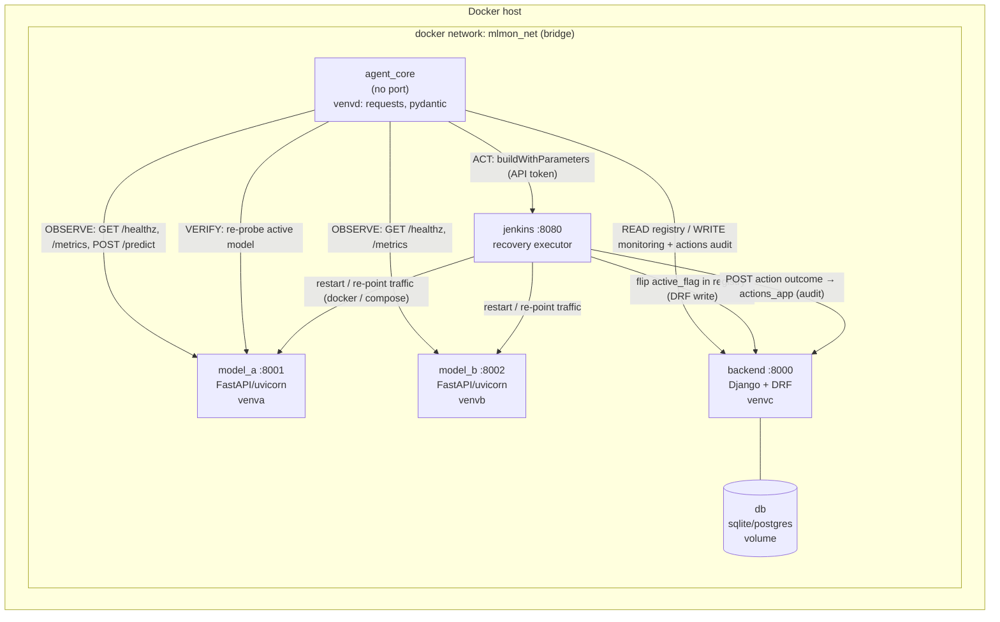
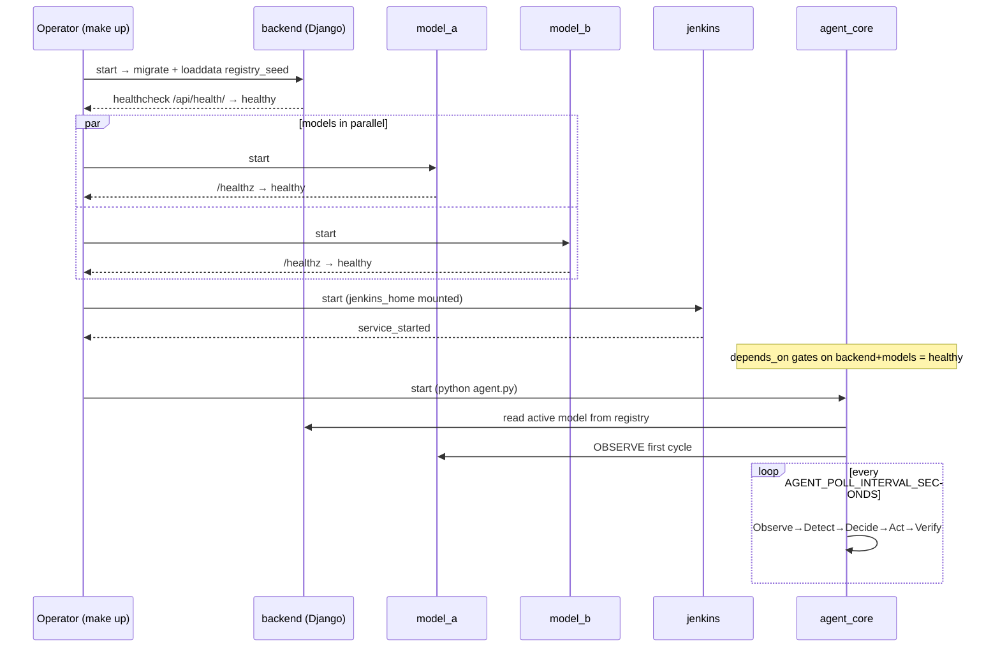

# Deployment, Orchestration & DevOps Guide — Autonomous ML Monitoring & Auto-Recovery Agent

> **Guiding mantra:** *"One repo, many services, many environments, HTTP everywhere."*

This document is the authoritative, implementation-ready guide for **building, wiring,
booting, operating, and recovering** the Autonomous ML Monitoring & Auto-Recovery Agent.
It is deliberately concrete: it names real ports, real container/service names, real
file paths, and provides copy-pasteable `Dockerfile`, `docker-compose.yml`, `.env`,
`Makefile`, `Jenkinsfile`, and Groovy job snippets.

It is a sibling of:

- [`architecture.md`](./architecture.md) — the *why* and the static topology.
- [`api_contracts.md`](./api_contracts.md) — the **HTTP request/response schemas**.
  This guide deliberately does **not** redefine payload schemas; whenever a body shape
  matters (e.g. the Jenkins build trigger, the Django registry flip, the agent's
  verification probe), it **references `api_contracts.md`** and shows only the transport
  mechanics (URLs, headers, build parameters).
- [`agent_logic.md`](./agent_logic.md) — the decision policy that *chooses* which
  recovery action to fire.
- [`failure_scenarios.md`](./failure_scenarios.md) — the failure catalogue that the
  recovery jobs here are designed to remediate.

---

## Table of Contents

1. [Overview & Topology](#1-overview--topology)
2. [Per-Service Containerization](#2-per-service-containerization)
3. [Docker Compose — Wiring Everything Together](#3-docker-compose--wiring-everything-together)
4. [`.env` Configuration](#4-env-configuration)
5. [Makefile — Operator Ergonomics](#5-makefile--operator-ergonomics)
6. [Jenkins as the Recovery Executor](#6-jenkins-as-the-recovery-executor)
7. [Startup / Bootstrap Sequence](#7-startup--bootstrap-sequence)
8. [Local Dev Without Docker (venv-per-service)](#8-local-dev-without-docker-venv-per-service)
9. [Observability, Logs, Restart Policies & Fault Tolerance](#9-observability-logs-restart-policies--fault-tolerance)
10. [Security & Secrets](#10-security--secrets)

---

## 1. Overview & Topology

### 1.1 The deployable units

The system ships as **five containers** plus their backing volumes. Four are Python
services that the monorepo builds; one (Jenkins) is a stock upstream image that we
configure.

| # | Service | Container/service name | Host port | Listens? | Venv | Image base | Role |
|---|---------|------------------------|-----------|----------|------|------------|------|
| 1 | Active model | `model_a` | **8001** | Yes (uvicorn/FastAPI) | `venva` | `python:3.11-slim` | Serves live predictions |
| 2 | Backup model | `model_b` | **8002** | Yes (uvicorn/FastAPI) | `venvb` | `python:3.11-slim` | Hot standby / failover target |
| 3 | Control plane | `backend` | **8000** | Yes (gunicorn/Django) | `venvc` | `python:3.11-slim` | Registry + monitoring + actions audit (DRF) |
| 4 | The agent | `agent_core` | — (none) | **No** | `venvd` | `python:3.11-slim` | Observe→Detect→Decide→Act→Verify loop |
| 5 | Recovery executor | `jenkins` | **8080** (+ 50000 agents) | Yes (Jenkins) | — (JVM/Groovy) | `jenkins/jenkins:lts-jdk17` | Runs deploy/switch/rollback jobs |

The **asymmetry of `agent_core`** is intentional and load-bearing: it has **no inbound
port**. It is a pure HTTP *client* that reaches out to the models, to Django, and to
Jenkins, and nobody reaches into it. Its inbound attack/blast surface is therefore zero.

### 1.2 Topology diagram



ASCII fallback (same topology):

```
                     ┌─────────────────────────────────────────────────────┐
                     │              docker network: mlmon_net               │
                     │                                                       │
  ┌────────────┐     │   ┌────────────┐        ┌────────────┐               │
  │ agent_core │────OBSERVE──▶│ model_a   │◀──ACT/restart──┐                 │
  │ (no port)  │     │   │  :8001     │                 │                    │
  │  venvd     │────OBSERVE──▶│ model_b   │              │                    │
  └─────┬──────┘     │   │  :8002     │                 │                    │
        │            │   └────────────┘                 │                    │
        │ READ/WRITE │                                  │ restart / repoint  │
        ▼            │   ┌────────────┐   flip flag  ┌──┴─────────┐          │
  ┌────────────┐     │   │  backend   │◀────────────│  jenkins   │           │
  │  backend   │◀────┘   │  :8000     │──audit──────│  :8080     │◀──ACT─────┤
  │  :8000 DRF │         │  (Django)  │   write     │ (executor) │  agent     │
  └─────┬──────┘         └─────┬──────┘             └────────────┘  triggers  │
        │                      │                                              │
        ▼                      ▼                                              │
     [ db volume: registry, monitoring, actions ]                            │
                     └──────────────────────────────────────────────────────┘
```

### 1.3 Why "HTTP everywhere" + isolated venv-per-service + container-per-service

These three decisions reinforce one another:

1. **HTTP everywhere.** Services never `import` each other's Python. The *only* coupling
   between any two units is a versioned HTTP contract (see `api_contracts.md`). This
   makes the boundaries honest, language-agnostic, individually testable with `curl`,
   and trivially observable on the network.
2. **Isolated venv-per-service (`venva`/`venvb`/`venvc`/`venvd`).** Each service pins its
   own dependency set:
   - `venva`/`venvb`: `fastapi, uvicorn, scikit-learn, numpy` — and the sklearn version
     **must match** the one that pickled `model.pkl`. Isolation prevents a model-B upgrade
     from silently breaking model-A's unpickling.
   - `venvc`: `django, djangorestframework` — a completely different web stack.
   - `venvd`: minimal `requests, pydantic` — no heavy ML/web deps at all.
   Without isolation, FastAPI's, Django's, and the agent's transitive pins would fight.
3. **Container-per-service.** A Docker image *is* the materialized, frozen venv plus its
   code plus its runtime. Docker gives us the four isolated environments **for free and
   reproducibly**: each `Dockerfile` creates one immutable filesystem with exactly that
   service's `requirements.txt` installed. Blast radius is contained (a bad install
   affects one image), upgrade cadence is independent, and "works on my machine" is
   eliminated.

> **Mental model:** the *venv* is the local-dev incarnation of isolation; the *image* is
> the production incarnation of the same isolation. Section 8 shows the venv path;
> Sections 2–3 show the image path. They are two renderings of one principle.

---

## 2. Per-Service Containerization

Every Python service follows the **same five-step Dockerfile recipe**, differing only in
base port and `CMD`:

1. `FROM python:3.11-slim` — small, predictable, no compiler bloat.
2. Set `WORKDIR /app` and Python-friendly env (`PYTHONUNBUFFERED=1` so logs stream).
3. **Copy `requirements.txt` first, install, then copy code** — this orders Docker layer
   caching so that a code edit does not re-run `pip install`.
4. `EXPOSE <port>` (documentation/intent; publishing happens in compose).
5. `CMD [...]` — the long-running process.

Docker provides the venv isolation: the image's site-packages *is* `venva` (or `venvb`,
`venvc`, `venvd`). There is no shared interpreter across images.

### 2.1 `model_a` — ACTIVE model (`model-services/model_a/Dockerfile`)

`requirements.txt`: `fastapi`, `uvicorn`, `scikit-learn`, `numpy`.

```dockerfile
# model-services/model_a/Dockerfile  (model_b is identical except the port)
FROM python:3.11-slim

ENV PYTHONUNBUFFERED=1 \
    PYTHONDONTWRITEBYTECODE=1 \
    PIP_NO_CACHE_DIR=1

WORKDIR /app

# 1) deps first → cached layer (this image's site-packages == venva)
COPY requirements.txt .
RUN pip install --no-cache-dir -r requirements.txt

# 2) code + artifact + sample
COPY app.py metrics.py model.pkl sample_input.csv ./

# 3) the FastAPI service listens on 8001 inside the container
EXPOSE 8001

# 4) long-running web server
CMD ["uvicorn", "app:app", "--host", "0.0.0.0", "--port", "8001"]
```

> The bundled `model.pkl` is the baked-in default artifact. In production a new artifact
> can be mounted as a volume or pushed in by the Jenkins `deploy_model` job (Section 6).

### 2.2 `model_b` — BACKUP model (`model-services/model_b/Dockerfile`)

Byte-for-byte the same recipe, but `EXPOSE 8002` and `--port 8002`. Its venv is `venvb`,
so it may pin a **different, more-proven** sklearn version than `model_a` — that is the
whole point of a backup.

```dockerfile
FROM python:3.11-slim
ENV PYTHONUNBUFFERED=1 PYTHONDONTWRITEBYTECODE=1 PIP_NO_CACHE_DIR=1
WORKDIR /app
COPY requirements.txt .
RUN pip install --no-cache-dir -r requirements.txt
COPY app.py metrics.py model.pkl sample_input.csv ./
EXPOSE 8002
CMD ["uvicorn", "app:app", "--host", "0.0.0.0", "--port", "8002"]
```

### 2.3 Django backend (`control-plane/backend/Dockerfile`)

`requirements.txt`: `django`, `djangorestframework`, plus `gunicorn` (prod server) and a
DB driver if using Postgres (`psycopg2-binary`). This image's site-packages == `venvc`.

```dockerfile
# control-plane/backend/Dockerfile
FROM python:3.11-slim

ENV PYTHONUNBUFFERED=1 \
    PYTHONDONTWRITEBYTECODE=1 \
    PIP_NO_CACHE_DIR=1 \
    DJANGO_SETTINGS_MODULE=config.settings

WORKDIR /app

COPY requirements.txt .
RUN pip install --no-cache-dir -r requirements.txt

# copy manage.py, config/, and the apps (registry_app, monitoring_app,
# actions_app, dashboard_app)
COPY . .

EXPOSE 8000

# collectstatic + migrate are run as compose `command:`/entrypoint at boot
# (see Section 7); the CMD is the long-running production server.
CMD ["gunicorn", "config.wsgi:application", \
     "--bind", "0.0.0.0:8000", \
     "--workers", "3", "--timeout", "60"]
```

> **Dev vs prod server.** For local container dev you may override the command with
> `python manage.py runserver 0.0.0.0:8000` (auto-reload). Production uses
> **gunicorn + `config.wsgi`**. Both bind `0.0.0.0:8000` so the compose network can reach
> the container as `http://backend:8000`.

### 2.4 `agent_core` — the agent (`control-plane/agent_core/Dockerfile`)

`requirements.txt`: `requests`, `pydantic`. **No `EXPOSE`** — the agent never listens.
This image's site-packages == `venvd`.

```dockerfile
# control-plane/agent_core/Dockerfile
FROM python:3.11-slim

ENV PYTHONUNBUFFERED=1 \
    PYTHONDONTWRITEBYTECODE=1 \
    PIP_NO_CACHE_DIR=1

WORKDIR /app

COPY requirements.txt .
RUN pip install --no-cache-dir -r requirements.txt

# whole agent package: agent.py, config.py, schemas.py, clients/,
# monitoring/, detection/, decision_engine/, actions/, verification/
COPY . .

# No EXPOSE: pure outbound client.
# The loop reads all endpoints/intervals/tokens from env (.env via compose).
CMD ["python", "agent.py"]
```

### 2.5 The four environments at a glance

| Image | Materializes venv | Key pins | `CMD` | Inbound port |
|-------|-------------------|----------|-------|--------------|
| `model_a` | `venva` | fastapi, uvicorn, sklearn, numpy | `uvicorn app:app --port 8001` | 8001 |
| `model_b` | `venvb` | (same stack, indep. version) | `uvicorn app:app --port 8002` | 8002 |
| `backend` | `venvc` | django, drf, gunicorn | `gunicorn config.wsgi:application :8000` | 8000 |
| `agent_core` | `venvd` | requests, pydantic | `python agent.py` | none |

---

## 3. Docker Compose — Wiring Everything Together

`devops/docker/docker-compose.yml` orchestrates **all** containers. Services resolve each
other by **service name** on the shared user-defined bridge network — never `localhost`,
because inside `agent_core` `localhost` would mean the agent's own (empty) network
namespace.

### 3.1 `networks.yml` — the role of the network file

`devops/docker/networks.yml` declares the shared **user-defined bridge network**
(`mlmon_net`) once, so it can be referenced consistently and overridden in CI/dev without
editing the main compose file. A user-defined bridge (as opposed to the default bridge)
is what gives us **automatic DNS by service name** (`http://backend:8000` resolves). It
is consumed via Compose's `include:`/merge mechanism (or simply duplicated as the
canonical definition the main file references).

```yaml
# devops/docker/networks.yml
networks:
  mlmon_net:
    name: mlmon_net
    driver: bridge
```

Bring it in from the main compose file with:

```yaml
# top of docker-compose.yml
include:
  - networks.yml
```

### 3.2 The full annotated `docker-compose.yml`

```yaml
# devops/docker/docker-compose.yml
# All paths are relative to this file (devops/docker/), so build contexts
# climb up to the service directories with ../../.

include:
  - networks.yml          # defines the shared `mlmon_net` bridge (Section 3.1)

services:

  # ---------------------------------------------------------------- backend
  backend:
    build:
      context: ../../control-plane/backend
      dockerfile: Dockerfile
    image: mlmon/backend:latest
    container_name: backend
    env_file: ../../.env          # all config from the single shared .env
    ports:
      - "8000:8000"               # host:container  → http://localhost:8000
    volumes:
      - db_data:/app/data         # sqlite db file (or use the `db` service below)
    # migrate + seed registry, THEN serve (gating, see Section 7)
    command: >
      sh -c "python manage.py migrate --noinput &&
             python manage.py loaddata registry_seed &&
             gunicorn config.wsgi:application --bind 0.0.0.0:8000 --workers 3"
    healthcheck:
      test: ["CMD", "python", "-c",
             "import urllib.request,sys; urllib.request.urlopen('http://localhost:8000/api/health/'); "]
      interval: 10s
      timeout: 5s
      retries: 6
      start_period: 20s
    restart: unless-stopped
    networks: [mlmon_net]

  # ---------------------------------------------------------------- model_a (ACTIVE)
  model_a:
    build:
      context: ../../model-services/model_a
      dockerfile: Dockerfile
    image: mlmon/model_a:latest
    container_name: model_a
    env_file: ../../.env
    ports:
      - "8001:8001"               # → http://localhost:8001
    volumes:
      - model_a_artifacts:/app/artifacts   # deploy_model job can drop new model.pkl here
    healthcheck:
      test: ["CMD", "python", "-c",
             "import urllib.request; urllib.request.urlopen('http://localhost:8001/healthz')"]
      interval: 10s
      timeout: 5s
      retries: 5
      start_period: 15s
    restart: unless-stopped
    networks: [mlmon_net]

  # ---------------------------------------------------------------- model_b (BACKUP)
  model_b:
    build:
      context: ../../model-services/model_b
      dockerfile: Dockerfile
    image: mlmon/model_b:latest
    container_name: model_b
    env_file: ../../.env
    ports:
      - "8002:8002"               # → http://localhost:8002
    volumes:
      - model_b_artifacts:/app/artifacts
    healthcheck:
      test: ["CMD", "python", "-c",
             "import urllib.request; urllib.request.urlopen('http://localhost:8002/healthz')"]
      interval: 10s
      timeout: 5s
      retries: 5
      start_period: 15s
    restart: unless-stopped
    networks: [mlmon_net]

  # ---------------------------------------------------------------- jenkins (RECOVERY EXECUTOR)
  jenkins:
    image: jenkins/jenkins:lts-jdk17
    container_name: jenkins
    env_file: ../../.env
    ports:
      - "8080:8080"               # Jenkins UI → http://localhost:8080
      - "50000:50000"             # inbound build agents (JNLP)
    volumes:
      - jenkins_home:/var/jenkins_home          # persists config, jobs, creds
      # let Jenkins drive sibling containers (restart/repoint) via the host socket:
      - /var/run/docker.sock:/var/run/docker.sock
    restart: unless-stopped
    networks: [mlmon_net]

  # ---------------------------------------------------------------- agent_core (THE AGENT)
  agent_core:
    build:
      context: ../../control-plane/agent_core
      dockerfile: Dockerfile
    image: mlmon/agent_core:latest
    container_name: agent_core
    env_file: ../../.env
    # No ports: pure outbound client.
    depends_on:
      backend:   { condition: service_healthy }
      model_a:   { condition: service_healthy }
      model_b:   { condition: service_healthy }
      jenkins:   { condition: service_started }   # Jenkins HTTP readiness handled in-agent
    restart: unless-stopped
    networks: [mlmon_net]

volumes:
  db_data:
  model_a_artifacts:
  model_b_artifacts:
  jenkins_home:

# (networks: mlmon_net comes from the included networks.yml)
```

### 3.3 Service-to-service URLs (what each container dials)

Because every service is on `mlmon_net`, the **in-cluster** URLs use service names; the
**host** URLs use `localhost` with the published port.

| From → To | In-cluster URL (used by `agent_core`/`jenkins`) | Host URL (browser/curl) |
|-----------|--------------------------------------------------|--------------------------|
| agent → model_a | `http://model_a:8001` | `http://localhost:8001` |
| agent → model_b | `http://model_b:8002` | `http://localhost:8002` |
| agent → backend | `http://backend:8000` | `http://localhost:8000` |
| agent → jenkins | `http://jenkins:8080` | `http://localhost:8080` |
| jenkins → backend | `http://backend:8000` | — |

> **Why `depends_on` + `condition: service_healthy`:** the agent must not start probing
> before the models and registry are actually answering. `depends_on` orders *start*;
> `condition: service_healthy` gates on the **healthcheck**, which is what we actually
> want (a container can be "started" but not yet serving). See Section 7.

---

## 4. `.env` Configuration

A **single shared `.env` at the repo root** is the one source of truth for ports, URLs,
tokens, intervals, and Django settings. Compose injects it into every service via
`env_file: ../../.env`. Inside `agent_core`, `config.py` reads these with `os.environ`
(falling back to sane defaults) and exposes them as typed settings.

### 4.1 Complete example `.env`

```dotenv
# =========================================================================
#  Autonomous ML Monitoring & Auto-Recovery Agent — shared configuration
#  Copy from .env.example, fill secrets, NEVER commit the real file.
# =========================================================================

# ---- Ports (host-side publish; container-internal ports are fixed) -------
MODEL_A_PORT=8001
MODEL_B_PORT=8002
BACKEND_PORT=8000
JENKINS_PORT=8080

# ---- Service base URLs (IN-CLUSTER names; agent_core/config.py reads these)
# For local-dev-without-docker, swap to http://localhost:<port> (Section 8).
MODEL_A_URL=http://model_a:8001
MODEL_B_URL=http://model_b:8002
BACKEND_URL=http://backend:8000
JENKINS_URL=http://jenkins:8080

# ---- Jenkins remote-trigger credentials (Section 6) ----------------------
JENKINS_USER=automation
JENKINS_API_TOKEN=changeme_generate_in_jenkins_ui     # SECRET
# Job names the agent triggers via buildWithParameters:
JENKINS_JOB_DEPLOY=deploy_model
JENKINS_JOB_SWITCH=switch_active_model
JENKINS_JOB_ROLLBACK=rollback_model

# ---- Agent loop tuning (read by agent_core/config.py) --------------------
AGENT_POLL_INTERVAL_SECONDS=30        # one Observe→...→Verify cycle cadence
AGENT_HTTP_TIMEOUT_SECONDS=5          # per-request timeout to models/backend
AGENT_VERIFY_RETRIES=3                # post-action health re-checks
AGENT_VERIFY_BACKOFF_SECONDS=10       # wait between verify re-checks

# ---- Detection thresholds (cross-ref agent_logic.md) ---------------------
DRIFT_THRESHOLD=0.20                  # data-drift score that trips DETECT
LATENCY_P95_THRESHOLD_MS=800          # prediction-probe latency ceiling
ERROR_RATE_THRESHOLD=0.10             # rolling error-rate ceiling
CONSECUTIVE_FAILURES_TO_SWITCH=3      # crashes before failover decision

# ---- Django backend settings (venvc) -------------------------------------
DJANGO_SECRET_KEY=change_me_to_a_long_random_value     # SECRET
DJANGO_DEBUG=0
DJANGO_ALLOWED_HOSTS=backend,localhost,127.0.0.1
# DB: default sqlite (lean); switch to postgres by setting these:
DJANGO_DB_ENGINE=django.db.backends.sqlite3
DJANGO_DB_NAME=/app/data/db.sqlite3
# DJANGO_DB_ENGINE=django.db.backends.postgresql
# DJANGO_DB_NAME=mlmon
# DJANGO_DB_USER=mlmon
# DJANGO_DB_PASSWORD=change_me        # SECRET
# DJANGO_DB_HOST=db
# DJANGO_DB_PORT=5432
```

### 4.2 Precedence & who reads what

Precedence (lowest → highest), so the most specific wins:

1. **Code defaults** — `agent_core/config.py` / Django `config/settings.py` hardcoded
   fallbacks (`os.environ.get("KEY", default)`).
2. **`.env` via `env_file`** — Compose loads these into each container's environment.
3. **`environment:` block** in compose for a specific service (if added) — overrides the
   `.env` for that service only.
4. **Real shell environment** at `docker compose` invocation — highest, useful in CI
   (e.g. `JENKINS_API_TOKEN=$CI_SECRET docker compose up`).

> `agent_core/config.py` is the **only place** the agent reads configuration; all of
> `clients/jenkins_client.py`, `clients/django_client.py`, `monitoring/*`, and
> `decision_engine/*` import from it. This keeps the agent's environment coupling
> in one auditable module.

---

## 5. Makefile — Operator Ergonomics

The root `Makefile` wraps the long compose/django/jenkins incantations into memorable
verbs. It is the recommended human entry point.

```makefile
# Makefile  (repo root)
COMPOSE = docker compose -f devops/docker/docker-compose.yml --env-file .env

.PHONY: build up down logs ps train-models seed-db run-agent test lint simulate-drift

## build all service images
build:
	$(COMPOSE) build

## start the whole stack in the background (respects healthcheck gating)
up:
	$(COMPOSE) up -d

## stop and remove containers (keeps named volumes/data)
down:
	$(COMPOSE) down

## tail logs for everything, or `make logs S=agent_core`
logs:
	$(COMPOSE) logs -f $(S)

## show container + health status
ps:
	$(COMPOSE) ps

## (re)train both demo models → writes model.pkl into each service dir
train-models:
	python model-services/model_a/train.py
	python model-services/model_b/train.py

## migrate Django + load the model registry seed (registry_app)
seed-db:
	$(COMPOSE) run --rm backend sh -c "python manage.py migrate --noinput && \
		python manage.py loaddata registry_seed"

## run the agent loop in the FOREGROUND (debugging the control loop)
run-agent:
	$(COMPOSE) run --rm agent_core python agent.py

## run unit/integration tests for every service in its own image
test:
	$(COMPOSE) run --rm backend    pytest -q
	$(COMPOSE) run --rm agent_core pytest -q
	$(COMPOSE) run --rm model_a    pytest -q

## lint all python
lint:
	ruff check control-plane model-services

## inject synthetic drift into the active model to exercise the recovery loop
##   (POSTs skewed inputs / flips a drift flag the model_probe will catch)
simulate-drift:
	python tools/simulate_drift.py --target http://localhost:8001 --severity high
```

| Target | What it does | When you reach for it |
|--------|--------------|------------------------|
| `build` | Builds all four service images | First run / after dep change |
| `up` / `down` | Start / stop the stack | Daily driving |
| `logs S=…` | Follow logs (optionally one service) | Debugging |
| `ps` | Health + status table | Is everything green? |
| `train-models` | Regenerate `model.pkl` artifacts | Refresh demo models |
| `seed-db` | Migrate + load registry seed | Bootstrap (Section 7) |
| `run-agent` | Foreground agent loop | Watch decisions live |
| `test` / `lint` | Quality gates | CI + pre-commit |
| `simulate-drift` | Trigger a fault on purpose | End-to-end recovery demo |

---

## 6. Jenkins as the Recovery Executor

Jenkins is the **most important DevOps piece**: it is the *hands* of the closed loop. The
agent never mutates the live system directly — it **decides** and then **delegates the
mutation to Jenkins**, which executes a reviewed, idempotent, reversible, audited job.
This separation is what makes recovery *safe-by-default*.

### 6.1 Setting Jenkins up

- **Container:** stock `jenkins/jenkins:lts-jdk17`, on `mlmon_net`, UI on `:8080`,
  agent port `:50000`.
- **Persistence:** the `jenkins_home` named volume holds all config, job definitions,
  build history, and credentials, so the controller survives restarts.
- **Docker access:** the host's `/var/run/docker.sock` is mounted in so jobs can
  `docker restart model_a` / re-point traffic against sibling containers (the "act on the
  models" arrows in Section 1.2).
- **Initial admin:** first boot prints an unlock token to the container log
  (`make logs S=jenkins` → "Please use the following password"). Complete setup, create
  the `automation` user, then **generate an API token** for it
  (*User → Configure → API Token*) and place it in `.env` as `JENKINS_API_TOKEN`.
- **Required plugins:** *Pipeline* (declarative pipelines), *Git*, *Credentials Binding*
  (to inject the Django write token), and *HTTP Request* (to POST audit/flip calls).
- **Agents:** for this lean setup the built-in node executes everything; no external
  build agents are required.
- **Jobs:** three parameterized Pipeline jobs are created, each pointing at the Groovy in
  `devops/jenkins/jobs/`. The umbrella `Jenkinsfile` lives at `devops/jenkins/Jenkinsfile`.

### 6.2 The `Jenkinsfile` (declarative pipeline) — high-level stages

`devops/jenkins/Jenkinsfile` is the shared shape every recovery job follows:

```groovy
// devops/jenkins/Jenkinsfile  (declarative skeleton shared by the jobs)
pipeline {
  agent any
  parameters {
    choice(name: 'ACTION',       choices: ['deploy', 'switch', 'rollback'])
    string(name: 'TARGET_MODEL', defaultValue: 'model_b')   // model_a | model_b
    string(name: 'VERSION',      defaultValue: 'latest')
    string(name: 'CORRELATION_ID', defaultValue: '')        // ties back to agent cycle
  }
  options { timestamps(); disableConcurrentBuilds() }        // idempotency aid
  stages {
    stage('Validate')  { steps { echo "ACTION=${params.ACTION} TARGET=${params.TARGET_MODEL}" } }
    stage('Execute')   { steps { script { dispatch(params) } } }   // → the 3 jobs below
    stage('Verify')    { steps { script { verifyHealthy(params.TARGET_MODEL) } } }
  }
  post {
    always  { script { auditToDjango(params, currentBuild.currentResult) } }  // 6.6
  }
}
```

The three concrete jobs in `devops/jenkins/jobs/` implement the `Execute` step.

### 6.3 `deploy_model.groovy` — build/deploy a model version

**Purpose:** make a specific model **version available and running** in its container
(e.g. drop a new `model.pkl` into the artifact volume and (re)start the service). It does
**not** flip live traffic — that is `switch_active_model`'s job.

**Parameters:** `TARGET_MODEL` (`model_a`|`model_b`), `VERSION`.

**Steps:** fetch/locate the versioned artifact → place it on the target's
`*_artifacts` volume → restart the target container → wait for `/healthz` → register the
new version row in the Django registry (status `STAGED`, see `api_contracts.md`).

```groovy
// devops/jenkins/jobs/deploy_model.groovy
def call(String targetModel, String version) {
  stage("deploy ${targetModel}@${version}") {
    // 1) stage the versioned artifact onto the target's volume (idempotent copy)
    sh "cp /var/artifacts/${targetModel}/${version}/model.pkl " +
       "/var/lib/docker/volumes/${targetModel}_artifacts/_data/model.pkl"
    // 2) restart the container so it loads the new artifact
    sh "docker restart ${targetModel}"
    // 3) wait until it answers healthy
    sh "until curl -sf http://${targetModel}:8001/healthz; do sleep 2; done"
    // 4) record the staged version in the Django registry (see api_contracts.md)
    httpRequest(
      httpMode: 'POST',
      url: "${env.BACKEND_URL}/api/registry/versions/",
      customHeaders: [[name: 'Authorization', value: "Token ${env.DJANGO_WRITE_TOKEN}"]],
      requestBody: "{\"model\":\"${targetModel}\",\"version\":\"${version}\",\"status\":\"STAGED\"}")
  }
}
```

### 6.4 `switch_active_model.groovy` — flip the ACTIVE model (A→B)

**Purpose:** the core failover. Make the backup the active production model by updating
the Django registry `active_flag` and re-pointing/restarting traffic.

**Parameters:** `TARGET_MODEL` (the model to become active, typically `model_b`).

**Steps:** read current active from registry → **set the new target's `active_flag=true`
and the old active's `active_flag=false`** (the registry write — schema in
`api_contracts.md`) → restart/re-point so probes hit the new active → confirm `/healthz`.
Idempotent: switching to the already-active model is a no-op.

```groovy
// devops/jenkins/jobs/switch_active_model.groovy
def call(String targetModel) {
  stage("switch active → ${targetModel}") {
    // 1) flip active_flag in the Django model registry (idempotent PATCH)
    //    request/response body shape: see api_contracts.md (registry_app).
    httpRequest(
      httpMode: 'PATCH',
      url: "${env.BACKEND_URL}/api/registry/active/",
      customHeaders: [[name: 'Authorization', value: "Token ${env.DJANGO_WRITE_TOKEN}"]],
      requestBody: "{\"active_model\":\"${targetModel}\"}")
    // 2) ensure the now-active model is up and serving
    def port = (targetModel == 'model_a') ? '8001' : '8002'
    sh "docker restart ${targetModel} || true"
    sh "until curl -sf http://${targetModel}:${port}/healthz; do sleep 2; done"
  }
}
```

### 6.5 `rollback_model.groovy` — revert to last STABLE version

**Purpose:** undo a bad deploy/switch by reverting to the **last version marked STABLE**
in the registry. This is the reversibility guarantee that makes every other action safe.

**Parameters:** `TARGET_MODEL` (optional; defaults to whatever is currently active).

**Steps:** query the registry for the most recent `status=STABLE` version → re-deploy
that artifact (reusing `deploy_model` logic) → flip active back to it → verify healthy →
mark the failed version `status=ROLLED_BACK`.

```groovy
// devops/jenkins/jobs/rollback_model.groovy
def call(String targetModel) {
  stage("rollback ${targetModel} → last STABLE") {
    // 1) ask the registry for the last known-good version (api_contracts.md)
    def stable = sh(returnStdout: true, script:
      "curl -sf ${env.BACKEND_URL}/api/registry/${targetModel}/last-stable/ | jq -r .version").trim()
    if (!stable) { error("no STABLE version to roll back to for ${targetModel}") }
    // 2) re-deploy the known-good artifact and re-point to it
    deploy_model(targetModel, stable)
    switch_active_model(targetModel)
    // 3) mark the bad version rolled-back for the audit trail
    httpRequest(httpMode: 'PATCH',
      url: "${env.BACKEND_URL}/api/registry/${targetModel}/mark/",
      requestBody: "{\"status\":\"ROLLED_BACK\"}")
  }
}
```

### 6.6 How the agent triggers a job (and polls it)

The agent's `clients/jenkins_client.py` triggers a job via Jenkins' **remote build
trigger**: an authenticated `POST` to `buildWithParameters` using
`JENKINS_USER` + `JENKINS_API_TOKEN` (HTTP Basic). The full request/response/parameter
contract is defined in **`api_contracts.md`**; the transport mechanics are:

```
POST  http://jenkins:8080/job/<JOB_NAME>/buildWithParameters
      ?TARGET_MODEL=model_b&ACTION=switch&VERSION=latest&CORRELATION_ID=<cycle-id>
Auth: Basic base64(JENKINS_USER:JENKINS_API_TOKEN)
→ 201 Created, with a `Location:` header pointing at the queue item.
```

Polling for completion (the "Verify" precondition):

1. `GET <Location>api/json` on the **queue item** until it yields an `executable.url`
   (the actual build URL).
2. `GET <build_url>api/json` and read `building` (bool) and `result`
   (`SUCCESS`/`FAILURE`/`ABORTED`), backing off per `AGENT_VERIFY_BACKOFF_SECONDS`.
3. On `SUCCESS`, the agent runs its **own** independent verification (re-probe the active
   model's `/healthz` + a canary `/predict`) — it never trusts the job's self-report
   alone. See `verification/health_check.py` and `verification/rollback_guard.py`.

If Jenkins is unreachable or the build fails, the agent's decision engine escalates
(e.g. to `actions/alert.py`) rather than leaving the system half-switched.

### 6.7 Safety properties

- **Idempotent jobs.** `disableConcurrentBuilds()`, "copy then restart", and
  "switch-to-already-active = no-op" mean re-running a job converges to the same state
  instead of corrupting it.
- **Reversible.** `rollback_model` exists specifically so any deploy/switch can be
  undone to the last STABLE version. The agent's `rollback_guard` can auto-fire it when
  post-action verification fails.
- **Auditable.** Every job's `post { always { auditToDjango(...) } }` block writes the
  outcome (job, params, build number, result, `CORRELATION_ID`, timestamp) back to the
  Django **`actions_app`**, so there is a durable, queryable record of every mutation the
  system made to itself. The action record schema is in `api_contracts.md`.

---

## 7. Startup / Bootstrap Sequence

Order matters because the agent must not begin acting before the registry and models are
ready, and Jenkins must be reachable before the first recovery is attempted.

### 7.1 Step-by-step

1. **`make build`** — build all four images.
2. **DB migrate + seed registry.** Either via `make seed-db` or the backend's compose
   `command:` (`migrate` → `loaddata registry_seed`). This creates the registry rows that
   declare `model_a` ACTIVE / `model_b` BACKUP. Without the seed the agent has no notion
   of "active".
3. **Models come up** (`model_a:8001`, `model_b:8002`); compose healthchecks gate them to
   `healthy` once `/healthz` answers.
4. **Backend reaches `healthy`** (`/api/health/` answers after migrate+seed).
5. **Jenkins starts**, mounts `jenkins_home`, exposes `:8080`. (Job/credential bootstrap
   per Section 6.1 happens once, then persists on the volume.)
6. **`agent_core` starts last** — its `depends_on … condition: service_healthy` blocks
   it until backend + models are healthy; it then begins its first Observe→…→Verify cycle.

`make up` performs steps 3–6 automatically (the `depends_on`/`healthcheck` graph enforces
the order); steps 1–2 are one-time per environment.

### 7.2 Boot sequence diagram



---

## 8. Local Dev Without Docker (venv-per-service)

For tight inner-loop development you can run each service natively in its own venv. This
is the *local incarnation* of the same isolation Docker enforces. When running this way,
point `.env` URLs at `http://localhost:<port>` instead of the service names.

```bash
# ---- model_a (venva) ----------------------------------------------------
cd model-services/model_a
python -m venv venva && source venva/bin/activate
pip install -r requirements.txt
uvicorn app:app --host 0.0.0.0 --port 8001 --reload
deactivate

# ---- model_b (venvb) ----------------------------------------------------
cd model-services/model_b
python -m venv venvb && source venvb/bin/activate
pip install -r requirements.txt
uvicorn app:app --host 0.0.0.0 --port 8002 --reload
deactivate

# ---- backend (venvc) ----------------------------------------------------
cd control-plane/backend
python -m venv venvc && source venvc/bin/activate
pip install -r requirements.txt
python manage.py migrate
python manage.py loaddata registry_seed
python manage.py runserver 0.0.0.0:8000      # dev server (auto-reload)
deactivate

# ---- agent_core (venvd) -------------------------------------------------
cd control-plane/agent_core
python -m venv venvd && source venvd/bin/activate
pip install -r requirements.txt
# ensure .env URLs use http://localhost:8000/8001/8002/8080 for native runs
python agent.py
deactivate
```

> **Jenkins locally:** even in native dev, run Jenkins from its container
> (`make up` with only the `jenkins` service, or a standalone `docker run`), because it
> is not a Python service and reuses the `jenkins_home` volume.

---

## 9. Observability, Logs, Restart Policies & Fault Tolerance

### 9.1 Logs

- Every Python image sets `PYTHONUNBUFFERED=1`, so stdout/stderr stream live to
  `docker compose logs` (and `make logs`). Use `make logs S=agent_core` to watch the
  control loop narrate each cycle's Observe/Detect/Decide/Act/Verify.
- The Django `actions_app` is the **structured, durable** observability surface: every
  recovery the system performed is a queryable row (who/what/when/result/correlation),
  written by the Jenkins audit step (Section 6.7). The `dashboard_app` renders these.

### 9.2 Restart policies & fault tolerance

- All long-running services use `restart: unless-stopped`. If a container crashes (OOM,
  unhandled exception, bad deploy), Docker restarts it automatically — recovery of the
  *process* is Docker's job; recovery of the *model behaviour* is the agent's job.
- Jenkins and the backend persist state on named volumes (`jenkins_home`, `db_data`), so
  a restart does not lose job definitions, credentials, the registry, or the audit trail.

### 9.3 How a crashed service is detected by the agent

The agent's monitoring layer (`monitoring/model_probe.py`, `monitoring/prediction_probe.py`)
probes each model every `AGENT_POLL_INTERVAL_SECONDS` with an `AGENT_HTTP_TIMEOUT_SECONDS`
timeout:

- **Hard crash / unreachable:** connection refused or timeout → counts toward
  `CONSECUTIVE_FAILURES_TO_SWITCH`. After that many consecutive failures the decision
  engine (`decision_engine/decision.py` + `policy_rules.py`) decides **failover** and the
  agent fires `actions/switch_model.py` → Jenkins `switch_active_model`.
- **Soft degradation:** `/healthz` ok but latency exceeds `LATENCY_P95_THRESHOLD_MS`,
  error rate exceeds `ERROR_RATE_THRESHOLD`, or drift exceeds `DRIFT_THRESHOLD` → the
  detectors (`detection/*`) trip, severity is classified, and the policy may switch,
  redeploy, or just `alert` / `no_op`.
- **Post-action verification:** after any act, `verification/health_check.py` re-probes
  the (new) active model; if it is still unhealthy, `verification/rollback_guard.py`
  triggers the Jenkins `rollback_model` job. This is the loop closing on itself.

> Note the clean division of labour: **Docker** keeps the *containers* alive;
> **the agent + Jenkins** keep the *served model* correct. A model can be perfectly
> "up" (container healthy) yet wrong (drifted) — only the agent catches that.

---

## 10. Security & Secrets

Lean but practical:

- **Secrets live only in `.env`** (`JENKINS_API_TOKEN`, `DJANGO_SECRET_KEY`, any DB
  password, the Django write token used by Jenkins). The real `.env` is **never
  committed** — the repo ships only `.env.example` with placeholders. The repo's
  `.gitignore` already excludes environment files; keep `.env` (and any `*.env`) ignored.
- **Jenkins credentials** for the Django write token should be stored in Jenkins'
  Credentials store (Credentials Binding plugin) and injected into jobs as
  `env.DJANGO_WRITE_TOKEN`, not hardcoded in Groovy.
- **The agent is outbound-only** (no inbound port), minimizing its attack surface; it
  holds the Jenkins API token to trigger jobs but exposes nothing.
- **Least privilege over the Docker socket.** Mounting `/var/run/docker.sock` into
  Jenkins is powerful (it can control sibling containers); keep Jenkins on the internal
  `mlmon_net` and do not expose its `:8080` beyond what local operation needs.
- **Rotate the `JENKINS_API_TOKEN`** from the Jenkins UI if it leaks; update `.env` and
  restart `agent_core`.
- **Production hardening (out of lean scope but noted):** set `DJANGO_DEBUG=0`, a real
  `DJANGO_ALLOWED_HOSTS`, HTTPS termination in front of Jenkins/backend, and a managed
  secret store instead of a flat `.env`.

---

### Appendix — quick reference

| Concern | Where it lives |
|---------|----------------|
| Container/network wiring | `devops/docker/docker-compose.yml`, `devops/docker/networks.yml` |
| Shared config & secrets | `.env` (root), read by `agent_core/config.py` and Django `config/settings.py` |
| Recovery jobs | `devops/jenkins/Jenkinsfile`, `devops/jenkins/jobs/{deploy_model,switch_active_model,rollback_model}.groovy` |
| Agent → Jenkins / Django transport | `agent_core/clients/jenkins_client.py`, `agent_core/clients/django_client.py` |
| HTTP payload schemas | **`api_contracts.md`** (authoritative) |
| Decision policy | `agent_core/decision_engine/*`, see `agent_logic.md` |
| Operator commands | root `Makefile` |
```
