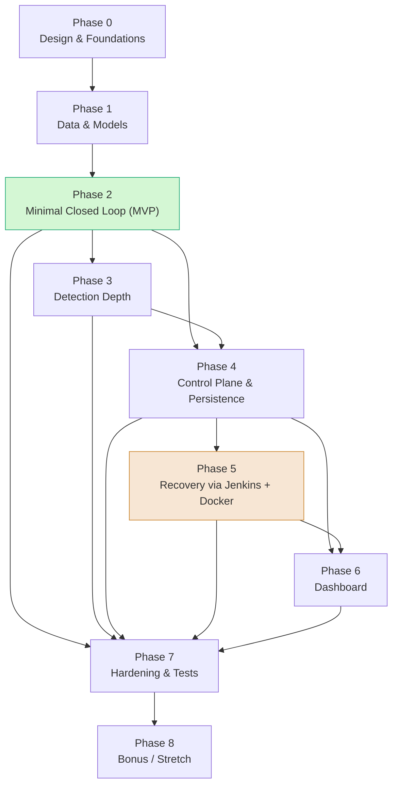

# Implementation Roadmap / Build Plan

**Project:** Autonomous ML Monitoring & Auto-Recovery Agent
**Document status:** Authoritative build plan. Keep consistent with the SHARED PROJECT CONTEXT.
**Audience:** Engineers implementing the project from the current scaffold.

This document tells you **what to build, in what order, and how to know when each step is done.** It does **not** restate the algorithms, schemas, or API shapes — those live in the companion design docs:

| Concern | Companion doc |
|---|---|
| System layout, components, ports, dataflow | `architecture.md` |
| The agent's Observe→Detect→Decide→Act→Verify loop | `agent_logic.md` |
| HTTP request/response shapes between components | `api_contracts.md` |
| Threshold / anomaly / drift algorithms | `detection_methods.md` |
| How to fabricate inputs and induce failures | `data_simulation.md` |
| What we measure and how | `monitoring_and_metrics.md` |
| Django models, audit log, registry schema | `data_model.md` |
| docker-compose, Jenkins, networks, env | `deployment_and_devops.md` |
| Dashboard UI / dashboard_app | `dashboard.md` |
| Canonical failure scenarios (drive E2E tests) | `failure_scenarios.md` |

> **Reading order for a new engineer:** `architecture.md` → `agent_logic.md` → this roadmap → the per-concern doc for the phase you're starting.

---

## 1. Guiding Strategy

The whole repo is currently a **scaffold**: `create_repo_structure.py` generated the folder tree, and every `.py`, `Dockerfile`, `.groovy`, `model.pkl`, and `requirements.txt` is a **0-byte placeholder**. Nothing is implemented. The plan below fills those placeholders in a deliberate order.

Four principles govern the order:

1. **Inward-out.** Build the *core value* — the closed loop (models + agent + a simple action) — **first**, at the center. Add concentric rings of capability outward: persistence, then real recovery infrastructure, then UI, then hardening. The center must work before any ring is added.

2. **Always-working-loop.** At the end of **every** phase the system can still run end-to-end: Observe→Detect→Decide→Act→Verify. We never have a multi-week window where "nothing runs." New capability is added as a *swap-in*, not a *rip-out*. Concretely: the `act` step starts as a **direct HTTP call** to the Django registry to flip the active model, and is *later* swapped behind the same interface for a Jenkins-triggered job — the loop never breaks during the swap.

3. **Design-docs-first.** A phase is not started until the design doc it implements is written. `architecture.md` exists; the others (`agent_logic.md`, `api_contracts.md`, `detection_methods.md`, `data_model.md`, etc.) are being filled in now and gate the corresponding build phase. This avoids re-implementing against a moving spec.

4. **Correctness over scale.** Data may be **simulated**, batch processing is fine, single-process is fine, cloud is optional. We optimize for a *demonstrably correct* closed loop, not throughput. Out of scope (do not build): chatbot, LLM reasoning, full MLOps platform, generic over-engineering.

### The front-loading risk and how we mitigate it

The single biggest schedule risk is **front-loading Jenkins and Docker.** Standing up Jenkins (credentials, job DSL, agents, the `devops/jenkins/jobs/*.groovy` jobs) and a multi-container `devops/docker/docker-compose.yml` is high-effort, high-friction infra work that produces **zero demonstrable agent behavior** on its own. If done first, you spend the early project on plumbing and risk never reaching a working loop.

**Mitigation, baked into the phase order:**

- The agent's action layer is defined behind an **executor interface** (see `agent_logic.md`). The first executor is a **direct Django API call** (`POST /api/active-model`). Jenkins is just *another implementation* of that interface, added in **Phase 5**, not Phase 0.
- Docker/compose is treated as a **packaging concern**, deferred to Phase 5 alongside Jenkins. Everything before that runs from local venvs (`venva`, `venvb`, `venvc`, `venvd`) on localhost ports.
- We reach a complete MVP loop (Section 4) at **Phase 2**, long before any DevOps work. If Jenkins/Docker over-runs, the project still has a working, demoable, testable system.

---

## 2. Phased Plan

Phases are cumulative. Each lists: **Objective**, **Exit criteria**, **Tasks → files**, **Depends on**, **Demo**, **Implements (design doc)**.

> File-path convention: `_files/` directories hold the canonical templates (`agent.py`, `schemas.py`, `config.py`, `manage.py`, `requirements.txt`, `Dockerfile`) that get copied/symlinked into their working location during setup, per `architecture.md`. When a task says "implement `agent_core/_files/agent.py`" it means implement the real module that lands as the agent entrypoint.

---

### Phase 0 — Design & Foundations

- **Objective:** Lock the contracts and make the repo runnable, so later phases build against a stable spec.
- **Exit criteria — done when:**
  - All companion design docs exist and are reviewed (the ones gating Phases 1–6): `agent_logic.md`, `api_contracts.md`, `detection_methods.md`, `data_simulation.md`, `monitoring_and_metrics.md`, `data_model.md`, `deployment_and_devops.md`, `dashboard.md`, `failure_scenarios.md`.
  - Each of the four venvs (`venva`, `venvb`, `venvc`, `venvd`) can be created and the four `requirements.txt` files are populated.
  - `Makefile` and `.env` exist with targets to create venvs and run each component.
- **Tasks → files:**
  - Fill `model-services/model_a/requirements.txt`, `model-services/model_b/requirements.txt` (fastapi, uvicorn, scikit-learn, pandas).
  - Fill `control-plane/backend/_files/requirements.txt` (django, djangorestframework, requests).
  - Fill `control-plane/agent_core/_files/requirements.txt` (requests, pandas, scipy/numpy for detectors).
  - Define shared types in `control-plane/agent_core/_files/schemas.py` and config in `_files/config.py` (URLs, ports, thresholds, poll interval) — match `api_contracts.md`.
  - Author `Makefile` + `.env` (component URLs, ports 8000/8001/8002, poll interval).
- **Depends on:** `architecture.md` (already written).
- **Demo:** `make setup` builds all venvs; `make help` lists run targets. No behavior yet.
- **Implements:** `architecture.md`, `api_contracts.md`, `data_model.md` (schema decisions only).

---

### Phase 1 — Data & Models

- **Objective:** Two working model microservices and the simulated data to drive them.
- **Exit criteria — done when:**
  - `model_a` (port 8001, ACTIVE) and `model_b` (port 8002, BACKUP) both serve `/predict`, `/health`, `/metrics`.
  - A real sklearn `model.pkl` exists for each (trained or fixture), loadable at startup.
  - `sample_input.csv` produces valid predictions through `/predict`.
- **Tasks → files:**
  - Train/persist `model-services/model_a/model.pkl` and `model-services/model_b/model.pkl` (a small sklearn classifier; `model_b` may be an older/weaker variant to make failover meaningful).
  - Implement `model-services/model_a/app.py` and `model_b/app.py`: FastAPI app with `/predict`, `/health`, `/metrics` per `api_contracts.md`.
  - Implement `model-services/model_a/metrics.py` and `model_b/metrics.py`: in-process metric counters (latency, request count, prediction distribution, confidence) per `monitoring_and_metrics.md`.
  - Populate `model-services/{model_a,model_b}/sample_input.csv` with representative rows (and a drift variant for tests) per `data_simulation.md`.
- **Depends on:** Phase 0.
- **Demo:** `curl localhost:8001/predict` and `localhost:8002/predict` return predictions; `/metrics` returns live numbers; `/health` returns OK.
- **Implements:** `api_contracts.md`, `monitoring_and_metrics.md`, `data_simulation.md`.

---

### Phase 2 — Minimal Closed Loop (the MVP — see Section 4)

- **Objective:** First end-to-end Observe→Detect→Decide→Act→Verify, with **no Django persistence and no Jenkins.**
- **Exit criteria — done when:** the agent, in one loop iteration, observes a model's metrics, detects a threshold breach, decides to switch, **acts via a direct API call** to flip the active model, verifies the new active model is healthy, and logs the episode to stdout/file.
- **Tasks → files:**
  - `agent_core/monitoring/model_probe.py`, `prediction_probe.py`, `data_loader.py`: pull `/health` and `/metrics`, feed `sample_input.csv` to `/predict`.
  - `agent_core/detection/threshold_detector.py`: simplest detector only (per `detection_methods.md`). Anomaly/drift stubs return "no signal" for now.
  - `agent_core/decision_engine/severity_classifier.py`, `policy_rules.py`, `decision.py`: minimal rule — breach ⇒ severity ⇒ `switch_to_backup` decision.
  - `agent_core/actions/switch_model.py`, `no_op.py`, `alert.py`: `switch_model` calls the active-model flip directly (for now, target a local stub or the Phase 4 endpoint contract — start with `no_op`/`alert` working and `switch_model` hitting a simple in-memory flag).
  - `agent_core/verification/health_check.py`, `rollback_guard.py`: confirm new active model `/health`; if not healthy, `rollback_guard` reverts.
  - `agent_core/_files/agent.py`: the loop wiring Observe→Detect→Decide→Act→Verify per `agent_logic.md`.
  - `agent_core/clients/django_client.py`: stub here; full impl in Phase 4. `jenkins_client.py` left empty.
- **Depends on:** Phase 1.
- **Demo:** Induce a breach (per `data_simulation.md`), run `make agent`, watch the loop switch active from A→B and verify B healthy, with an audit line printed.
- **Implements:** `agent_logic.md`, `detection_methods.md` (threshold), `failure_scenarios.md` (one scenario).

---

### Phase 3 — Detection Depth

- **Objective:** Real anomaly and drift detection beyond a static threshold.
- **Exit criteria — done when:** `anomaly_detector.py` and `drift_detector.py` produce signals on simulated anomalous/drifted inputs, and the decision engine consumes all three detector signals.
- **Tasks → files:**
  - `agent_core/detection/anomaly_detector.py`: statistical/residual anomaly detection per `detection_methods.md`.
  - `agent_core/detection/drift_detector.py`: distribution drift (e.g. PSI/KS over reference vs. live) per `detection_methods.md`.
  - Extend `decision_engine/severity_classifier.py` + `policy_rules.py` to weigh multiple signals.
  - Enrich `monitoring/prediction_probe.py` / `data_loader.py` to keep a reference window for drift.
- **Depends on:** Phase 2.
- **Demo:** Feed a drifted `sample_input.csv` variant; agent flags drift (distinct from threshold breach) and chooses an appropriate action.
- **Implements:** `detection_methods.md`, `data_simulation.md`.

---

### Phase 4 — Control Plane & Persistence (Django)

- **Objective:** Replace in-memory state with the Django+DRF backend: metrics ingestion, model registry/active flag, persistent audit log.
- **Exit criteria — done when:** the agent reads active model from `registry_app`, posts metrics to `monitoring_app`, writes every action to `actions_app`, and the `switch_to_backup` action flips the active flag via `POST /api/active-model`.
- **Tasks → files:**
  - `backend/config/settings.py`, `config/urls.py`, `config/wsgi.py`, `_files/manage.py`: working Django project (port 8000, `venvc`).
  - `monitoring_app/models.py`, `serializers.py`, `views.py`, `urls.py`: `/api/metrics` ingest/query per `data_model.md` + `api_contracts.md`.
  - `registry_app/models.py`, `serializers.py`, `views.py`, `urls.py`: `/api/active-model` with `active_flag` per `data_model.md`.
  - `actions_app/models.py`, `views.py`, `urls.py`: persistent audit log.
  - `agent_core/clients/django_client.py`: real HTTP client to all three apps.
  - Repoint `actions/switch_model.py` + `verification/*` to read/write through `django_client.py`.
- **Depends on:** Phase 2 (loop), Phase 3 optional but recommended before this.
- **Demo:** Restart everything; the active-model decision and full audit history **survive a restart** and are queryable via `/api/metrics` and `/api/active-model`.
- **Implements:** `data_model.md`, `api_contracts.md`, `monitoring_and_metrics.md`.

---

### Phase 5 — Recovery via Jenkins + Docker (swappable execution backend)

- **Objective:** Swap the direct-API switch for **Jenkins-triggered recovery jobs**, and package components in Docker — **without breaking the loop.**
- **Exit criteria — done when:** `switch_to_backup`/rollback go through `jenkins_client.py` triggering Jenkins jobs, and the full stack runs under `docker-compose`. The direct-API executor remains available as a fallback.
- **Tasks → files:**
  - `devops/jenkins/jobs/deploy_model.groovy`, `switch_active_model.groovy`, `rollback_model.groovy` + `devops/jenkins/_files/Jenkinsfile`: implement the recovery jobs per `deployment_and_devops.md`.
  - `agent_core/clients/jenkins_client.py`: trigger jobs, poll build status.
  - `agent_core/actions/switch_model.py`: select executor (Jenkins | direct-API) via config — same interface, swapped impl.
  - `devops/docker/docker-compose.yml`, `networks.yml` + each `Dockerfile` (`model_a`, `model_b`, `backend/_files`, `agent_core/_files`): containerize per `deployment_and_devops.md`.
- **Depends on:** Phase 4.
- **Demo:** A detection triggers a Jenkins build that performs the switch/rollback; whole system comes up with `docker compose up`.
- **Implements:** `deployment_and_devops.md`.

---

### Phase 6 — Dashboard

- **Objective:** Operator-facing UI for live status, metrics, active model, and audit timeline.
- **Exit criteria — done when:** `dashboard_app` shows current active model, recent metrics/detection signals, and the action audit timeline, refreshing live.
- **Tasks → files:**
  - `backend/dashboard_app/views.py` (+ templates/static as `dashboard.md` specifies): render data from `monitoring_app`, `registry_app`, `actions_app`.
- **Depends on:** Phase 4 (data to display); richer if after Phase 5.
- **Demo:** Open the dashboard; trigger a failure; watch detection → switch → verify update live with the audit timeline.
- **Implements:** `dashboard.md`.

---

### Phase 7 — Hardening & Tests

- **Objective:** Comprehensive automated tests, anti-flapping, resilience.
- **Exit criteria — done when:** unit + integration + E2E scenario tests (Section 6) pass in CI; flapping guard, cooldowns, and retry/backoff are in place.
- **Tasks → files:**
  - Add tests under each component (e.g. `agent_core/.../tests/`, backend app `tests.py`).
  - Add flapping/cooldown logic to `decision_engine/policy_rules.py` and `verification/rollback_guard.py`.
  - Add retry/backoff/timeouts to `clients/django_client.py`, `clients/jenkins_client.py`.
- **Depends on:** Phases 2–6 (tests target whatever exists; ideally all).
- **Demo:** `make test` runs the full matrix green, including each `failure_scenarios.md` scenario as an automated E2E test.
- **Implements:** `failure_scenarios.md`, `detection_methods.md`, `data_simulation.md`.

---

### Phase 8 — Bonus / Stretch (post-MVP)

- **Objective:** Optional enhancements, only after the above is solid. See Section 8.
- **Exit criteria:** any subset of bonus items implemented behind config flags, with tests, not regressing the core loop.
- **Tasks → files:** confidence-based thresholds (`detection/threshold_detector.py`, `decision_engine/severity_classifier.py`); model-version comparison (`registry_app`, `decision_engine/decision.py`); canary/shadow inference (`actions/switch_model.py`, model-service routing); multi-model (`registry_app`, agent monitoring loop).
- **Depends on:** Phase 7.
- **Implements:** bonus items in the problem statement.

---

## 3. Deliverables Mapping

How the **required deliverables** and the **loop stages** map onto the phases.

### Required deliverables → phases

| Required deliverable | Primary phase(s) | Key files |
|---|---|---|
| ML components (model services) | Phase 1 | `model-services/model_a/*`, `model_b/*` |
| Backend system (control plane) | Phase 4 (+ Phase 5 recovery) | `control-plane/backend/**`, `devops/jenkins/**` |
| Agent (the autonomous core) | Phases 2–3 (+ wired in 4–5) | `control-plane/agent_core/**` |
| Dashboard UI | Phase 6 | `backend/dashboard_app/*` |
| Documentation | Phase 0 (ongoing) | `docs/*.md` |
| DevOps / packaging | Phase 5 | `devops/docker/**`, `devops/jenkins/**` |

### Loop stages → phases (where each is first delivered)

| Loop stage | First delivered | Module(s) | Upgraded in |
|---|---|---|---|
| **Observe** | Phase 2 | `monitoring/model_probe.py`, `prediction_probe.py`, `data_loader.py` | Phase 4 (persist via Django) |
| **Detect** | Phase 2 (threshold) | `detection/threshold_detector.py` | Phase 3 (anomaly, drift) |
| **Decide** | Phase 2 | `decision_engine/severity_classifier.py`, `policy_rules.py`, `decision.py` | Phase 3, Phase 7 (flapping) |
| **Act** | Phase 2 (direct API) | `actions/switch_model.py`, `no_op.py`, `alert.py` | Phase 5 (Jenkins executor) |
| **Verify** | Phase 2 | `verification/health_check.py`, `rollback_guard.py` | Phase 4 (persist), Phase 7 |

---

## 4. MVP Definition

**MVP = the smallest end-to-end vertical slice that demonstrates the full loop.** It is the **exit state of Phase 2.**

**MVP scope (what it does):**
- **One** monitored model (`model_a`, port 8001) plus `model_b` (port 8002) as the failover target.
- **Observe:** agent polls `model_a` `/health` and `/metrics` and runs `sample_input.csv` through `/predict`.
- **Detect:** **threshold detection only** (`threshold_detector.py`) — e.g. accuracy/confidence below a configured floor or error rate above a ceiling.
- **Decide:** minimal `policy_rules.py` → breach maps to a `switch_to_backup` decision.
- **Act:** `switch_model.py` flips the active model **via a direct API call / in-memory flag — NOT via Jenkins.**
- **Verify:** `health_check.py` confirms `model_b` is healthy as the new active; `rollback_guard.py` reverts if not.
- **Log:** the episode is written to stdout / a local log line (full persistent audit comes in Phase 4).

**Explicitly deferred from the MVP:**
- Anomaly and drift detection → Phase 3.
- Django persistence, `/api/metrics`, registry `active_flag`, persistent audit log → Phase 4.
- Jenkins recovery jobs and Docker packaging → Phase 5.
- Dashboard UI → Phase 6.
- Flapping guards, retries, full test matrix → Phase 7.
- All bonus items (confidence thresholds, version comparison, canary, shadow, multi-model) → Phase 8.

The MVP is the **always-working core**; every later phase swaps a stub for a richer implementation behind a stable interface.

---

## 5. Dependency Graph & Sequencing

**Sequencing rationale:**
- **P0 → P1 → P2 is the critical path to value.** Get a running loop ASAP. Everything before P2 is the minimum to make a loop possible.
- **P3 and P4 can proceed in parallel** after P2 (different engineers: one on detectors, one on Django). P4 benefits from P3's richer signals but does not strictly require them.
- **P5 (Jenkins/Docker) is deliberately late** — it is the front-loading risk (Section 1). By the time we reach it we already have a complete, demoable, persistent system; if P5 slips, the project is still deliverable.
- **P6 (dashboard) needs P4's data** and is best after P5 so it can show real recovery events.
- **P7 (hardening/tests) spans everything** and is gated last so tests target final behavior; but write unit tests opportunistically during each phase.
- **P8 only after P7** so bonus work never destabilizes a proven core.

---

## 6. Testing Strategy

Tests are organized in three tiers plus a scenario suite. The scenario suite is the acceptance gate.

### Unit tests (per module, fully isolated, mocked I/O)

| Module | What to test |
|---|---|
| `detection/threshold_detector.py` | breach above/below/at boundary; missing metric handling |
| `detection/anomaly_detector.py` | flags injected anomalies; quiet on clean data |
| `detection/drift_detector.py` | flags drifted distribution vs. reference; quiet when distributions match (use `data_simulation.md` generators) |
| `decision_engine/severity_classifier.py` | signal combinations → correct severity |
| `decision_engine/policy_rules.py` | severity → action mapping; **flapping/cooldown** suppression |
| `decision_engine/decision.py` | end-to-end decision object assembly |
| `actions/switch_model.py` | calls correct executor; respects executor config (direct vs Jenkins) |
| `actions/no_op.py`, `alert.py` | side-effect-free / alert emitted |
| `verification/health_check.py` | healthy/unhealthy classification |
| `verification/rollback_guard.py` | reverts on failed verify; no-op on success |
| `clients/django_client.py` | request shaping per `api_contracts.md`; retry/backoff |
| `clients/jenkins_client.py` | job trigger + build-status polling (mocked) |
| `monitoring/*` | metric parsing, reference-window maintenance |
| backend apps (`tests.py`) | model constraints, serializer validation, `/api/active-model` flag flip, audit append |

### Integration tests (real HTTP, two components at a time)

| Pair | Assertion |
|---|---|
| agent ↔ model service | agent reads live `/metrics`, `/health`, `/predict` from a running `model_a` |
| agent ↔ Django | agent posts metrics, reads active model, writes audit; data round-trips |
| Django ↔ Jenkins (Phase 5) | active-model change triggers / is triggered by the right job |

### End-to-end scenario tests — driven by `failure_scenarios.md`

**Each scenario in `failure_scenarios.md` becomes one automated E2E test.** A scenario test: (1) brings up the loop, (2) injects the failure using a `data_simulation.md` generator, (3) asserts the agent detects, decides, acts (switch/rollback/alert), and verifies, and (4) asserts the persisted audit log records the episode. Expected examples (final list lives in `failure_scenarios.md`): active-model accuracy collapse, latency/error-rate spike, input drift, backup also unhealthy (no safe target), and a flapping condition (must NOT oscillate).

**Simulating drift in tests:** reuse the simulated-data generators specified in `data_simulation.md` (e.g. shifted feature distributions, label noise, latency injection). Tests load the drifted `sample_input.csv` variant produced in Phase 1 rather than fabricating data ad hoc, so detector tests and E2E tests share one source of truth.

### Test matrix

| Tier | Phase introduced | Run command (target) | Gate |
|---|---|---|---|
| Unit — detectors | 2–3 | `make test-unit` | PR merge |
| Unit — decision/actions/verify | 2 | `make test-unit` | PR merge |
| Unit — clients | 4–5 | `make test-unit` | PR merge |
| Unit — backend apps | 4 | `manage.py test` | PR merge |
| Integration agent↔model | 2 | `make test-int` | nightly / pre-release |
| Integration agent↔Django | 4 | `make test-int` | nightly / pre-release |
| E2E scenarios | 2 (grows each phase) | `make test-e2e` | release / Definition of Done |

---

## 7. Risks & Mitigations

| Risk | Impact | Mitigation |
|---|---|---|
| **Front-loading Jenkins/Docker** (over-provisioning infra) | Weeks of plumbing, no demoable behavior | Defer all of it to **Phase 5**; reach the MVP loop at Phase 2 via a direct-API executor behind a swappable interface (Section 1). |
| **Jenkins setup overhead** (creds, job DSL, agents) | Phase 5 slips | Keep direct-API executor as permanent fallback; Jenkins is opt-in via config. System ships without it if needed. |
| **Concept-drift "labels"** — no ground truth at inference time | Drift detection unverifiable | Use **distribution drift** (input/prediction distribution vs. reference window) per `detection_methods.md`, not accuracy-vs-labels; simulate ground truth only in tests via `data_simulation.md`. |
| **Flapping** — agent oscillates A↔B | Instability, alert noise | Cooldown + hysteresis + "is backup actually better" check in `policy_rules.py`/`rollback_guard.py`; dedicated anti-flap E2E test (Phase 7). |
| **Scope creep / over-engineering** (chatbot, LLM, full MLOps) | Misses core deliverable | Explicitly out of scope; bonus items quarantined to Phase 8 behind flags. |
| **Moving spec** | Rework across phases | Design-docs-first: a phase starts only after its companion doc is reviewed (Phase 0 gate). |
| **Backup also unhealthy** (no safe target) | Recovery has nowhere to go | Decision engine emits `alert` + `no_op` instead of a blind switch; covered by an E2E scenario. |
| **Simulated data unrealism** | False confidence | Centralize all generators in `data_simulation.md`; same data feeds unit and E2E tests. |

---

## 8. Definition of Done & Bonus Mapping

### Definition of Done (whole project)

The project is **done** when:
1. `model_a` and `model_b` serve `/predict`, `/health`, `/metrics` (Phase 1).
2. The agent runs the **full Observe→Detect→Decide→Act→Verify loop** autonomously (Phases 2–3).
3. Detection covers **threshold, anomaly, and drift** (Phase 3).
4. The Django control plane **persists** metrics, the registry `active_flag`, and a complete **audit log**; agent integrates via HTTP (Phase 4).
5. Recovery executes through **Jenkins jobs**, and the stack runs under **docker-compose** (Phase 5).
6. The **dashboard** shows live status, active model, metrics, and the action timeline (Phase 6).
7. **Every `failure_scenarios.md` scenario passes as an automated E2E test**, plus the unit + integration matrix is green; anti-flapping verified (Phase 7).
8. All companion docs are complete and consistent with the implementation (Phase 0, maintained throughout).

### Bonus items → post-MVP enhancements (Phase 8)

| Bonus item | Where it lands | Notes |
|---|---|---|
| Confidence-based thresholds | `detection/threshold_detector.py`, `decision_engine/severity_classifier.py` | Use model confidence as a detection signal, not just point metrics. |
| Model version comparison | `registry_app`, `decision_engine/decision.py` | Compare candidate vs. active before switching; informs "is backup better." |
| Canary deployment | `actions/switch_model.py`, model-service routing | Route a fraction of traffic to the new model before full switch. |
| Shadow inference | model-service routing, `monitoring/prediction_probe.py` | Run backup in parallel, compare predictions without serving them. |
| Multi-model (>2) | `registry_app`, agent monitoring loop | Generalize the registry and probe loop beyond A/B. |

All bonus items are **flag-gated** and must not regress the Phase 7 baseline.

---

## 9. Per-Phase Kanban Checklists

> Copy each block into your tracker. Check items off in order; do not start a phase until its predecessors' boxes are all checked.

### Phase 0 — Design & Foundations
- [ ] Review `architecture.md`; write/review `agent_logic.md`, `api_contracts.md`, `detection_methods.md`, `data_simulation.md`, `monitoring_and_metrics.md`, `data_model.md`, `deployment_and_devops.md`, `dashboard.md`, `failure_scenarios.md`
- [ ] Fill all four `requirements.txt` (model_a, model_b, backend `_files`, agent_core `_files`)
- [ ] Implement `agent_core/_files/schemas.py` and `_files/config.py`
- [ ] Author `Makefile` (`setup`, `run-*`, `agent`, `test*`) and `.env`
- [ ] `make setup` creates `venva`/`venvb`/`venvc`/`venvd`

### Phase 1 — Data & Models
- [ ] Train + persist `model_a/model.pkl` and `model_b/model.pkl`
- [ ] Implement `model_a/app.py`, `model_b/app.py` (`/predict`, `/health`, `/metrics`)
- [ ] Implement `model_a/metrics.py`, `model_b/metrics.py`
- [ ] Populate `sample_input.csv` (+ drift variant) for both
- [ ] Both services answer on 8001 / 8002

### Phase 2 — Minimal Closed Loop (MVP)
- [ ] `monitoring/model_probe.py`, `prediction_probe.py`, `data_loader.py`
- [ ] `detection/threshold_detector.py` (anomaly/drift = stubs)
- [ ] `decision_engine/severity_classifier.py`, `policy_rules.py`, `decision.py`
- [ ] `actions/switch_model.py` (direct executor), `no_op.py`, `alert.py`
- [ ] `verification/health_check.py`, `rollback_guard.py`
- [ ] `agent_core/_files/agent.py` loop
- [ ] Demo: injected breach ⇒ A→B switch ⇒ verified ⇒ logged

### Phase 3 — Detection Depth
- [ ] `detection/anomaly_detector.py`
- [ ] `detection/drift_detector.py` (reference window)
- [ ] Extend severity/policy for multi-signal input
- [ ] Demo: drifted input flagged distinctly from threshold breach

### Phase 4 — Control Plane & Persistence
- [ ] `backend/config/{settings,urls,wsgi}.py`, `_files/manage.py`
- [ ] `monitoring_app/{models,serializers,views,urls}.py` (`/api/metrics`)
- [ ] `registry_app/{models,serializers,views,urls}.py` (`/api/active-model`, `active_flag`)
- [ ] `actions_app/{models,views,urls}.py` (audit log)
- [ ] `clients/django_client.py` real HTTP
- [ ] Repoint `actions/switch_model.py` + `verification/*` through Django
- [ ] Demo: state + audit survive a restart

### Phase 5 — Recovery via Jenkins + Docker
- [ ] `jenkins/jobs/{deploy_model,switch_active_model,rollback_model}.groovy` + `_files/Jenkinsfile`
- [ ] `clients/jenkins_client.py` (trigger + poll)
- [ ] `actions/switch_model.py` executor selection (Jenkins | direct)
- [ ] `docker/docker-compose.yml`, `networks.yml`, all `Dockerfile`s
- [ ] Demo: detection ⇒ Jenkins build ⇒ switch/rollback; `docker compose up` brings up the stack

### Phase 6 — Dashboard
- [ ] `dashboard_app/views.py` (+ templates/static per `dashboard.md`)
- [ ] Live active-model, metrics, audit timeline
- [ ] Demo: trigger failure, watch UI update live

### Phase 7 — Hardening & Tests
- [ ] Unit tests for every module (Section 6 table)
- [ ] Integration tests (agent↔model, agent↔Django, Django↔Jenkins)
- [ ] One E2E test per `failure_scenarios.md` scenario
- [ ] Flapping/cooldown in `policy_rules.py` / `rollback_guard.py`
- [ ] Retry/backoff/timeouts in both clients
- [ ] `make test` green across the full matrix

### Phase 8 — Bonus / Stretch
- [ ] Confidence-based thresholds
- [ ] Model version comparison
- [ ] Canary deployment
- [ ] Shadow inference
- [ ] Multi-model (>2) registry + loop
- [ ] All behind flags; Phase 7 baseline still green
